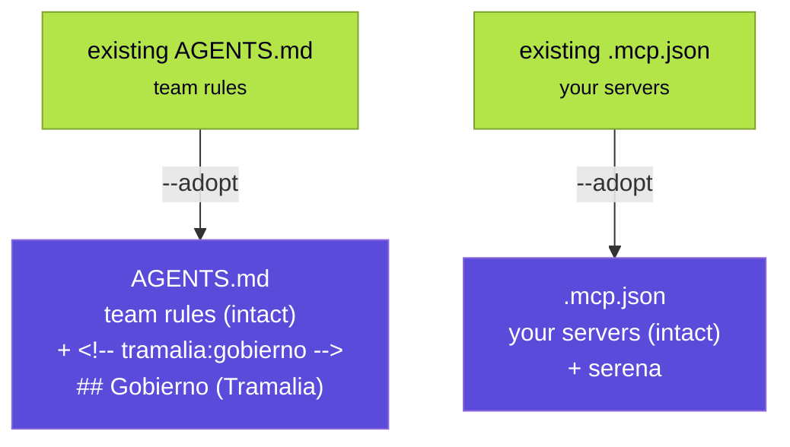

# Adopting an existing repository

`tramalia init` is idempotent: in a new repo it creates the full convention; in one that **already has work** it respects every file that exists. But there are 3 files a project with an agent usually already owns — `AGENTS.md`, `.mcp.json` and `CLAUDE.md` — and they're exactly the ones that wire up governance. For those, `--adopt` **integrates without overwriting**.

```bash
tramalia init --adopt
```

## What `--adopt` does (non-destructive merge)

It uses the *managed block* pattern: it inserts a block delimited by markers. Re-running **replaces the content between markers** without touching a line of yours.

| File | Without `--adopt` | With `--adopt` |
|---|---|---|
| `AGENTS.md` | skipped (`existe`) | **appends** a `## Gobierno (Tramalia)` section between markers (`adaptado`) |
| `.mcp.json` | skipped (`existe`) | **merges** Serena (and Engram/Headroom/Ponytail per flags), keeping your servers (`adaptado`) |
| `CLAUDE.md` | skipped (`existe`) | adds the `@AGENTS.md` import if missing (`adaptado`) |
| everything else | created if missing | same |



## What it guarantees

- **It never overwrites your content.** The governance block lives between `<!-- tramalia:gobierno inicio -->` and `<!-- tramalia:gobierno fin -->`; everything you wrote outside stays put.
- **Idempotent.** Running it twice doesn't duplicate the block; if Tramalia updates the governance text, the next run replaces it in place.
- **It respects your MCP servers.** If you already have a server with the same name, it isn't overwritten.
- **Malformed JSON, untouched.** If your `.mcp.json` isn't valid JSON, it's marked `existe (JSON inválido, sin tocar)` and left as-is.

!!! note "mise.toml is not merged"
    Merging TOML tasks is riskier, so `--adopt` does **not** touch an existing `mise.toml`. If you already have one, add the gates by hand (see [Execution & gates](interop-ejecucion.md)) or rename it and let `init` generate its own.

## Automatic notice

Even without `--adopt`, a normal `init` that **detects an `AGENTS.md` without the governance marker** warns you:

```text
i detecté un AGENTS.md existente: usa `tramalia init --adopt` para
  integrar el gobierno sin pisarlo (merge por marcadores).
```

So the gap is visible: you know the agent doesn't yet have the closing rules, and how to integrate them in one step.

## After adopting

The flow is identical to a new repo — see [Full workflow](flujo-completo.md): `tramalia doctor` to install what's missing, and `tramalia close --task <ID>` for the first governed close.
