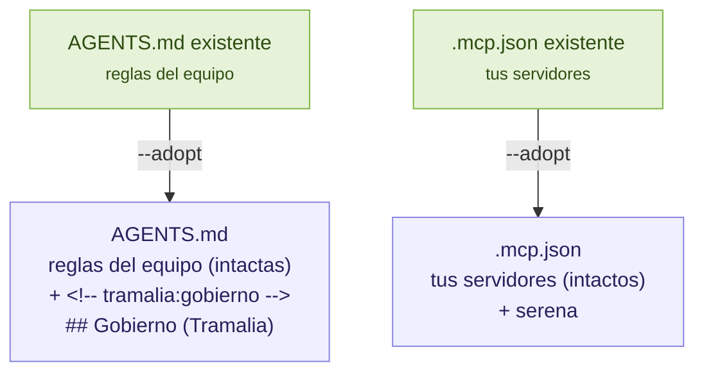

# Adoptar un repositorio existente

`tramalia init` es idempotente: en un repo nuevo crea la convención completa; en uno que **ya tiene trabajo** respeta cada archivo que exista. Pero hay 3 archivos que un proyecto con agente ya suele poseer —`AGENTS.md`, `.mcp.json` y `CLAUDE.md`— y que son justo los que enlazan el gobierno. Para esos, `--adopt` **integra sin pisar**.

```bash
tramalia init --adopt
```

## Qué hace `--adopt` (merge no destructivo)

Usa el patrón *managed block*: inserta un bloque delimitado por marcadores. Re-ejecutar **reemplaza el contenido entre marcadores** sin tocar una línea de lo tuyo.

| Archivo | Sin `--adopt` | Con `--adopt` |
|---|---|---|
| `AGENTS.md` | se salta (`existe`) | **anexa** una sección `## Gobierno (Tramalia)` entre marcadores (`adaptado`) |
| `.mcp.json` | se salta (`existe`) | **fusiona** Serena (y Engram/Headroom/Ponytail según flags) respetando tus servidores (`adaptado`) |
| `CLAUDE.md` | se salta (`existe`) | agrega el import `@AGENTS.md` si no lo tenía (`adaptado`) |
| todo lo demás | se crea si falta | igual |



## Lo que garantiza

- **Nunca pisa tu contenido.** El bloque de gobierno vive entre `<!-- tramalia:gobierno inicio -->` y `<!-- tramalia:gobierno fin -->`; todo lo que escribiste fuera queda igual.
- **Idempotente.** Correrlo dos veces no duplica el bloque; si Tramalia actualiza el texto de gobierno, la próxima corrida lo reemplaza en su sitio.
- **Respeta tus servidores MCP.** Si ya tienes un servidor con el mismo nombre, no lo sobrescribe.
- **JSON malformado, intacto.** Si tu `.mcp.json` no es JSON válido, se marca `existe (JSON inválido, sin tocar)` y no se modifica.

!!! note "mise.toml no se fusiona"
    Fusionar tareas TOML es más riesgoso, así que `--adopt` **no** toca un `mise.toml` existente. Si ya tienes uno, agrega los gates a mano (ver [Ejecución y gates](interop-ejecucion.md)) o renómbralo y deja que `init` genere el suyo.

## Aviso automático

Aunque no uses `--adopt`, un `init` normal que **detecta un `AGENTS.md` sin el marcador de gobierno** te lo avisa:

```text
i detecté un AGENTS.md existente: usa `tramalia init --adopt` para
  integrar el gobierno sin pisarlo (merge por marcadores).
```

Así el hueco es visible: sabes que el agente aún no tiene las reglas de cierre y cómo integrarlas en un paso.

## Después de adoptar

El flujo es idéntico al de un repo nuevo — ver [Flujo completo](flujo-completo.md): `tramalia doctor` para instalar lo que falte, y `tramalia close --task <ID>` para el primer cierre gobernado.
