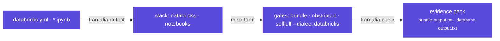

# Analytics projects (Python · Databricks)

Tramalia governs a data project just as well as a software one — and analytics teams are often the ones who **leave the least evidence** (which job ran?, with what validation?, who closed it?). Here the convention + `close` provide exactly that.



## What it detects

| Signal in the repo | Detected stack | Effect |
|---|---|---|
| `pyproject.toml` / `requirements.txt` | `python` | `pytest` + `ruff` gates |
| `databricks.yml` (Asset Bundles) | `databricks` | **`bundle`** gate → `databricks bundle validate` |
| `*.ipynb` | `notebooks` | the lint gate adds **`nbstripout --verify`** |
| `*.sql` / migrations | `postgres`-like | `database` gate → SQLFluff; the dialect (`databricks` when a bundle exists) is written to `.sqlfluff` |

## The data gates, explained

- **`bundle`** (`databricks bundle validate`): validates the bundle definition (jobs, pipelines, targets) *before* deploying — the "does it compile" of the Databricks world. Requires the [Databricks CLI](https://docs.databricks.com/dev-tools/cli/install) (`tramalia doctor` detects it).
- **`nbstripout --verify`**: fails if any notebook has **uncleaned outputs** — dirty outputs break diffs, leak data into git and make review impossible. It's the minimum notebook-hygiene gate.
- **SQLFluff with the databricks dialect**: lints your SQL/queries with the right grammar (Delta, `CREATE TABLE ... USING`, etc.). The dialect is generated in a `.sqlfluff` (`dialect = databricks`); see [Execution & gates → SQLFluff](interop-ejecucion.md#sqlfluff-database-gate).

## Running notebooks as a gate (opt-in)

`nbstripout --verify` only checks **hygiene** (clean outputs) — it doesn't prove the notebook runs. For that there's an opt-in gate that **executes them end to end** (the "build" of analytics):

```bash
tramalia init --with-notebook-exec     # adds the `notebooks` gate
```

Generates in `mise.toml`:

```toml
[tasks.notebooks]
run = "jupyter execute notebooks/*.ipynb"
```

It's **opt-in** on purpose: running notebooks may need data and credentials. If your environment doesn't have them, run it against sample data, or leave it out and use only the hygiene check. Adjust the path if your notebooks don't live in `notebooks/`.

## Metrics and thresholds in the evidence (ML/analytics)

For a data/ML task, "passed the gates" isn't enough: *which data* and *which metrics* matter. Tramalia turns that into **auditable evidence** and, if you want, **enforcement**.

**1 · The agent or pipeline writes `.tramalia/metrics.json`** before closing:

```json
{
  "dataset": { "name": "patients_2026Q3", "hash": "sha256:9f2c…" },
  "metrics": { "accuracy": 0.91, "drift": 0.02 },
  "mlflow_run": "a1b2c3d4"
}
```

On close, `close` preserves its values in the formal pack as `metricas.json`
and records them in `metadatos.json` under `metricas`. The close therefore
records which dataset and numbers produced the result, not just pass/fail.

**2 · (Optional) `.tramalia/thresholds.json` turns a threshold into a gate:**

```json
{ "accuracy": { "min": 0.90 }, "drift": { "max": 0.05 } }
```

If a metric **violates** its threshold (or is missing, since an unmeasured
threshold cannot pass), the close records `estado_cierre: bloqueado` and exits 1,
just like a failed quality gate. `--allow-fail` only proceeds with a complete
exception for the exact control; it records `aprobado_con_excepciones`, never
`aprobado`. Details are written to `umbrales-metricas.txt`, while limits remain
under `metadatos.json → umbrales`.

!!! tip "Why this matters"
    An accuracy regression that **prevents closing the task**, with the dataset hash and the metric as evidence — no `git log` gives you that. It's ML governance, not just code governance.

## The typical flow

```bash
cd my-data-pipeline           # repo with databricks.yml + notebooks/ + src/
pip install tramalia-cli
tramalia init                 # detects python · databricks · notebooks
mise install                  # brings sqlfluff, semgrep… (databricks CLI: official installer)

# you work the task (locally or against the workspace)…
tramalia close TASK-014 --model sonnet
```

A data close's evidence pack ends up with `bundle-output.txt` (the raw bundle validation), `database-output.txt` (SQLFluff), `lint-output.txt` (ruff + notebook verification) — **real audit for pipelines**, something `git log` never gives you.

## Local vs. Databricks

- **Local**: everything above runs without a workspace (validate is static; pytest/ruff/nbstripout are local).
- **Against Databricks**: `bundle validate` uses your CLI auth (`databricks auth login`) — Tramalia never touches credentials, as always.
- The **subagents** apply the same: the `planificador` breaks the pipeline into `specs/tasks.md` tasks, the `ejecutor` implements notebooks/jobs, the `revisor` reads the pack before deploy.

!!! note "What Tramalia does NOT do here"
    It doesn't orchestrate jobs (that's Databricks Workflows/Airflow) nor *run* data-quality validations (that's Great Expectations/dbt tests — you add them as commands in a gate). What it does: **captures their metrics as evidence and makes them enforceable** via `metrics.json`/`thresholds.json` (above). Tramalia governs the **code, the metrics and the close** of the work, with evidence.
