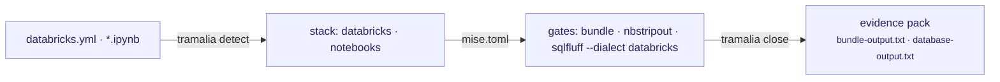

# Analytics projects (Python · Databricks)

Tramalia governs a data project just as well as a software one — and analytics teams are often the ones who **leave the least evidence** (which job ran?, with what validation?, who closed it?). Here the convention + `close` provide exactly that.



## What it detects

| Signal in the repo | Detected stack | Effect |
|---|---|---|
| `pyproject.toml` / `requirements.txt` | `python` | `pytest` + `ruff` gates |
| `databricks.yml` (Asset Bundles) | `databricks` | **`bundle`** gate → `databricks bundle validate` |
| `*.ipynb` | `notebooks` | the lint gate adds **`nbstripout --verify`** |
| `*.sql` / migrations | `postgres`-like | `database` gate → SQLFluff; the dialect (`databricks` when a bundle exists) is written to `.sqlfluff` |

## The data gates, explained

- **`bundle`** (`databricks bundle validate`): validates the bundle definition (jobs, pipelines, targets) *before* deploying — the "does it compile" of the Databricks world. Requires the [Databricks CLI](https://docs.databricks.com/dev-tools/cli/install) (`tramalia doctor` detects it).
- **`nbstripout --verify`**: fails if any notebook has **uncleaned outputs** — dirty outputs break diffs, leak data into git and make review impossible. It's the minimum notebook-hygiene gate.
- **SQLFluff with the databricks dialect**: lints your SQL/queries with the right grammar (Delta, `CREATE TABLE ... USING`, etc.). The dialect is generated in a `.sqlfluff` (`dialect = databricks`); see [Execution & gates → SQLFluff](interop-ejecucion.md#sqlfluff-database-gate).

## The typical flow

```bash
cd my-data-pipeline           # repo with databricks.yml + notebooks/ + src/
pip install tramalia-cli
tramalia init                 # detects python · databricks · notebooks
mise install                  # brings sqlfluff, semgrep… (databricks CLI: official installer)

# you work the task (locally or against the workspace)…
tramalia close TASK-014 --model sonnet
```

A data close's evidence pack ends up with `bundle-output.txt` (the raw bundle validation), `database-output.txt` (SQLFluff), `lint-output.txt` (ruff + notebook verification) — **real audit for pipelines**, something `git log` never gives you.

## Local vs. Databricks

- **Local**: everything above runs without a workspace (validate is static; pytest/ruff/nbstripout are local).
- **Against Databricks**: `bundle validate` uses your CLI auth (`databricks auth login`) — Tramalia never touches credentials, as always.
- The **subagents** apply the same: the `planificador` breaks the pipeline into `specs/tasks.md` tasks, the `ejecutor` implements notebooks/jobs, the `revisor` reads the pack before deploy.

!!! note "What Tramalia does NOT do here"
    It doesn't orchestrate jobs (that's Databricks Workflows/Airflow), and it doesn't validate *data* quality (that's Great Expectations/dbt tests — you can add them as commands in your `mise.toml` `test` gate). Tramalia governs the **code and the close** of the work, with evidence.
