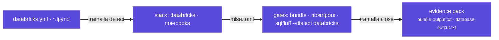

# Proyectos de analítica (Python · Databricks)

Tramalia gobierna igual de bien un proyecto de datos que uno de software — y de hecho los equipos de analítica suelen ser los que **menos evidencia dejan** (¿qué job corrió?, ¿con qué validación?, ¿quién lo cerró?). Aquí la convención + `close` aportan justo eso.



## Qué detecta

| Señal en el repo | Stack detectado | Efecto |
|---|---|---|
| `pyproject.toml` / `requirements.txt` | `python` | gates `pytest` + `ruff` |
| `databricks.yml` (Asset Bundles) | `databricks` | gate **`bundle`** → `databricks bundle validate` |
| `*.ipynb` | `notebooks` | el gate lint agrega **`nbstripout --verify`** |
| `*.sql` / migraciones | `postgres`-like | gate `database` → SQLFluff; el dialecto (`databricks` si hay bundle) se escribe en `.sqlfluff` |

## Los gates de datos, explicados

- **`bundle`** (`databricks bundle validate`): valida la definición del bundle (jobs, pipelines, targets) *antes* de desplegar — el equivalente a "compila" en el mundo Databricks. Requiere el [Databricks CLI](https://docs.databricks.com/dev-tools/cli/install) (`tramalia doctor` lo detecta).
- **`nbstripout --verify`**: falla si algún notebook tiene **outputs sin limpiar** — outputs sucios rompen los diffs, filtran datos a git y hacen imposible la revisión. Es el gate de higiene mínimo de notebooks.
- **SQLFluff con dialecto databricks**: lintea tus SQL/queries con la gramática correcta (Delta, `CREATE TABLE ... USING`, etc.). El dialecto se genera en un `.sqlfluff` (`dialect = databricks`); ver [Ejecución y gates → SQLFluff](interop-ejecucion.md#sqlfluff-gate-de-base-de-datos).

## Ejecutar los notebooks como gate (opt-in)

`nbstripout --verify` solo comprueba **higiene** (outputs limpios) — no prueba que el notebook corra. Para eso hay un gate opt-in que los **ejecuta de punta a punta** (el equivalente a "build" en analítica):

```bash
tramalia init --with-notebook-exec     # agrega el gate `notebooks`
```

Genera en `mise.toml`:

```toml
[tasks.notebooks]
run = "jupyter execute notebooks/*.ipynb"
```

Es **opt-in** a propósito: ejecutar notebooks puede requerir datos y credenciales. Si tu entorno no los tiene, córrelo contra datos de muestra, o déjalo fuera y usa solo la higiene. Ajusta la ruta si tus notebooks no viven en `notebooks/`.

## Métricas y umbrales en la evidencia (ML/analítica)

Para una tarea de datos/ML, "pasó los gates" no basta: importa *con qué datos* y *con qué métricas*. Tramalia lo vuelve **evidencia auditable** y, si quieres, **enforcement**.

**1 · El agente o pipeline escribe `.tramalia/metrics.json`** antes de cerrar:

```json
{
  "dataset": { "name": "pacientes_2026Q3", "hash": "sha256:9f2c…" },
  "metrics": { "accuracy": 0.91, "drift": 0.02 },
  "mlflow_run": "a1b2c3d4"
}
```

Al cerrar, `close` lo **copia crudo al evidence pack** (`metrics.json`, inmutable como toda la evidencia) y lo **incrusta en `metadata.json`** bajo `metrics`. Así el cierre registra qué dataset y qué números produjo, no solo verde/rojo.

**2 · (Opcional) `.tramalia/thresholds.json` convierte un umbral en gate:**

```json
{ "accuracy": { "min": 0.90 }, "drift": { "max": 0.05 } }
```

Si una métrica **incumple** su umbral (o falta, porque no se puede pasar un umbral que no se midió), el cierre se **bloquea** igual que un gate fallido — `status: blocked`, exit 1 — salvo `--allow-fail` (que lo registra como `passed_with_exceptions`, nunca `passed`). El detalle queda en `metrics-thresholds.txt` y en `metadata.json → metric_thresholds`.

!!! tip "Por qué esto importa"
    Una regresión de accuracy que **impide cerrar la tarea**, con el hash del dataset y la métrica como evidencia — eso no lo da ningún `git log`. Es gobierno de ML, no solo de código.

## El flujo tipo

```bash
cd mi-pipeline-datos          # repo con databricks.yml + notebooks/ + src/
pip install tramalia-cli
tramalia init                 # detecta python · databricks · notebooks
mise install                  # trae sqlfluff, semgrep… (databricks CLI: instalador oficial)

# trabajas la tarea (local o contra el workspace)…
tramalia close TASK-014 --model sonnet
```

El evidence pack de un cierre de datos queda con `bundle-output.txt` (la validación cruda del bundle), `database-output.txt` (SQLFluff), `lint-output.txt` (ruff + verificación de notebooks) — **auditoría real para pipelines**, lo que un `git log` nunca te da.

## Entorno local vs. Databricks

- **Local**: todo lo anterior corre sin workspace (validate es estático; pytest/ruff/nbstripout son locales).
- **Contra Databricks**: `bundle validate` usa tu autenticación del CLI (`databricks auth login`) — Tramalia no toca credenciales, como siempre.
- Los **subagentes** aplican igual: el `planificador` descompone el pipeline en tareas de `specs/tasks.md`, el `ejecutor` implementa notebooks/jobs, el `revisor` lee el pack antes del deploy.

!!! note "Qué NO hace Tramalia aquí"
    No orquesta jobs (eso es Databricks Workflows/Airflow) ni *ejecuta* validaciones de calidad de datos (eso es Great Expectations/dbt tests — los agregas como comandos en un gate). Lo que sí hace: **captura sus métricas como evidencia y las hace enforzables** vía `metrics.json`/`thresholds.json` (arriba). Tramalia gobierna el **código, las métricas y el cierre** del trabajo, con evidencia.
