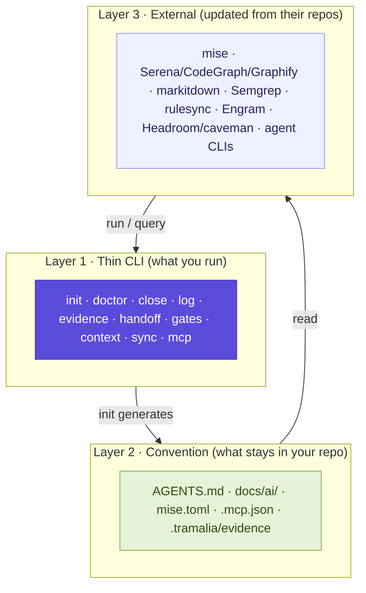
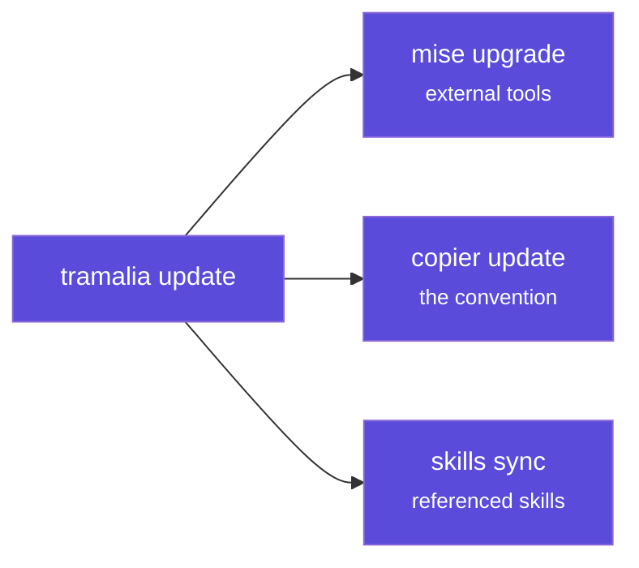
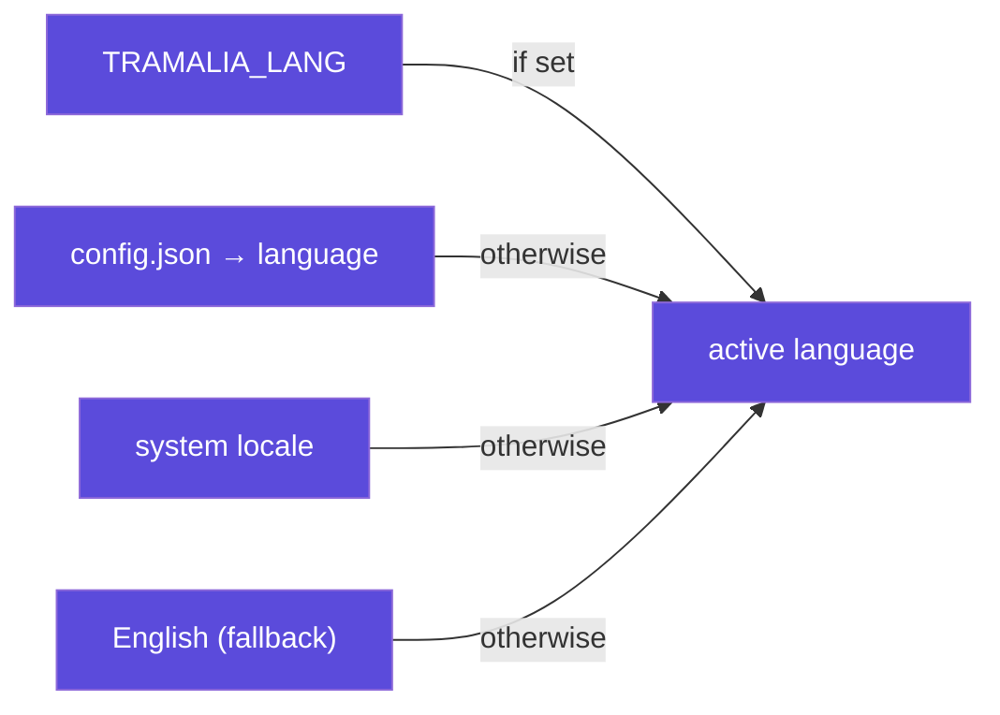

# Architecture

Tramalia is a **thin layer** with a golden rule: *it doesn't implement capabilities, it orchestrates them*. It only builds what nobody else does well (governance, evidence, handoff). Everything else is delegated.

## Guiding principle: Ponytail / YAGNI

Tramalia's philosophy is **minimalism**: do the minimum correct thing and don't rebuild what already exists. This follows the [Ponytail](https://github.com/DietrichGebert/ponytail) principle (and YAGNI). It's not a tool you install: it's a **rule that is read and followed**.

That's why `tramalia init` writes it into your project's `AGENTS.md` (*General rules — Ponytail / YAGNI* section), so that **any agent** working the repo prioritizes the minimal solution, doesn't over-abstract and doesn't duplicate logic. If you prefer it as a versioned skill, it's included as an example in `.tramalia/habilidades.toml`.

## The three layers

1. **Thin CLI** — a single face that does transparent *shell-out* to the real tools. It never hides errors; you can always bypass it (call `mise`/`serena` directly).
2. **Convention** — versioned files, the project's source of truth. **The real value.**
3. **External** — full tools and the agents, updated from their repos.

## Core vs. interop

The most important design distinction: what is **core** (own, standalone, Python only) and what is **interop** (external, optional, degrades gracefully).

=== "Core"

    Works **with Python only**, without depending on anything external.

    - `init` — generates the convention
    - `doctor` — diagnoses
    - `detect` — detects the stack
    - **`close`** — the closing ritual with enforcement
    - **`log`** — the audit trail
    - `evidence` · `handoff` — the traceability pieces
    - `mcp` — the MCP façade

=== "Interop (optional)"

    Delegates to external tools; if missing, records it as a documented exception.

    - `gates` → **mise** (includes `bundle` for Databricks — see [Analytics](analitica.md))
    - `context` → **Serena / Repomix / CodeGraph / codebase-memory-mcp / Graphify / markitdown** (see [selection criterion](interop-contexto.md#the-criterion-which-to-mount-and-which-to-use))
    - `sync` → **rulesync**
    - `skills` → **git**
    - `update` → **mise + copier**
    - N2 memory → **Engram** (or basic-memory / mem0)
    - efficiency → **Ponytail → caveman (`lite`) → Headroom** (in that order; see [criterion](interop-memoria.md#the-criterion-which-to-mount-and-which-to-use))
    - agent CLIs → **informational detection** in `doctor` (claude, codex, antigravity, gemini, opencode — never configured)

## The "manifest + updater" model

Tramalia doesn't copy anyone's code. It **references** it and one command keeps it up to date:

## The MCP façade (level 1)

`tramalia mcp` exposes the same core as native MCP tools (`project_status`, `get_agent_rules`, `get_failed_attempts`, `record_handoff`, `build_evidence`…), so an agent can use them without shelling out. It's a **thin façade**, not a new engine. The 3 memory tiers:

- **N0** — files + CLI (start here, no MCP).
- **N1** — this façade (if you want a native tool).
- **N2** — mount **Engram** / basic-memory / mem0 (serious persistent memory).

## The moat invariant

> The raw `*-output.txt` files and `metadata.json` are the **official** evidence. No derived artifact (Headroom compression, `review-summary.md`) may modify, replace or omit them — only add auxiliary files marked as derived.

This rule lives in the code (`core/governance.py`), in a test (`test_close_conserva_salidas_crudas`) and here. It's what protects auditability when efficiency is added.

## The initialization invariant

> No governance without convention. `close`, `evidence` and `handoff` **block (exit 1)** in a repo without `tramalia init`; a close without gates (`mise` absent) is honestly recorded as `no_gates`, never as `passed`.

This closes a gap that used to exist: a project could "close" tasks without ever running `init` or a single gate, with no trace that the convention was missing. See `core/project.py::is_initialized` and the [initialization guard](interfaz.md#close-tab).

## Interface and internationalization

`tramalia ui` (TUI, Textual) and the CLI share the same core — the interface **has no logic of its own**, it only reads and invokes. It's **bilingual**: catalogs live in `tramalia/i18n/{es,en}.json` (adding a language = adding a JSON, no code changes), with this resolution:

Full detail of every tab: [The interface (TUI)](interfaz.md).

## Planning by horizon

`specs/tasks.md` adds `Estado` (pending · in-progress · closed) and `Horizonte` (now · next · later) to every task. Re-planning is **editing the file** — by hand or via the `planificador` subagent — and it's safe because **closed tasks are immutable through evidence**: their close already lives in `.tramalia/evidence/` + `log`, so the future plan can be rewritten without touching history.

This is the *"divide"* half of the **4 pillars of governance** (plan · divide · verify · rules) — see [How an AI works](como-trabaja-ia.md#the-4-pillars-of-governance).
