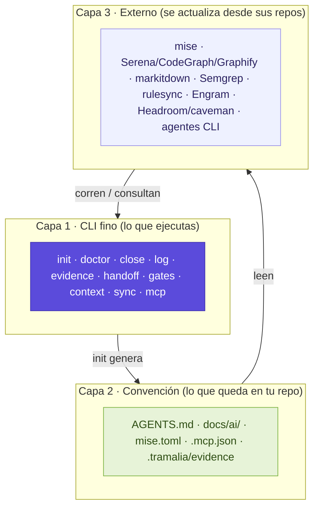
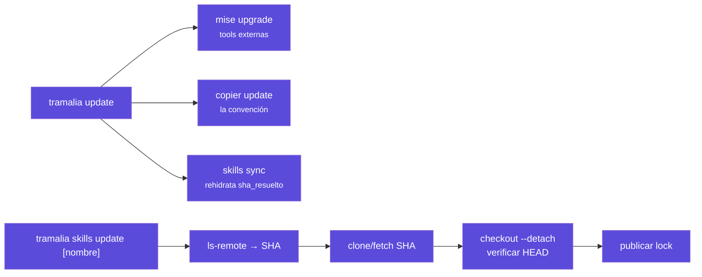
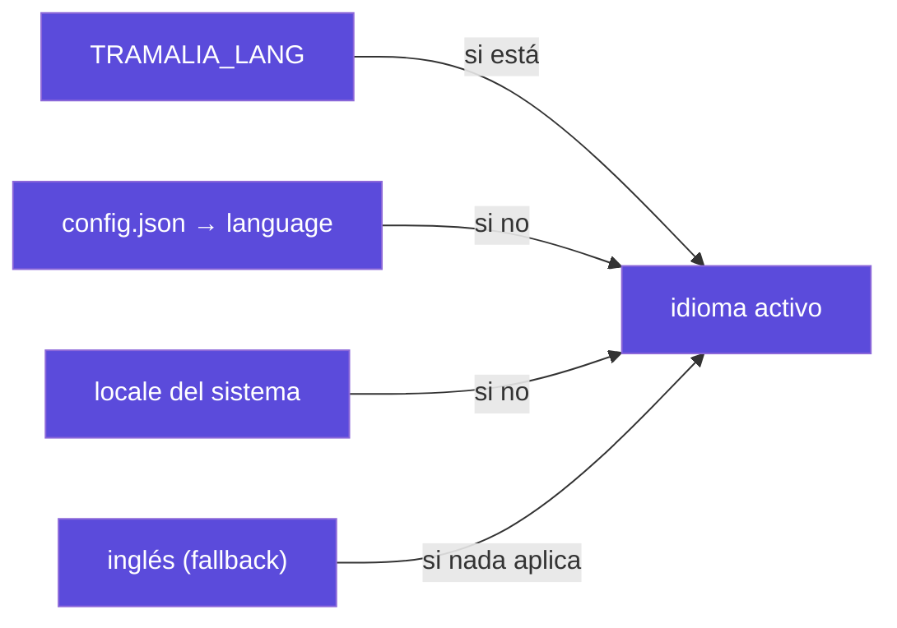

# Arquitectura

Tramalia es una **capa fina** con una regla de oro: *no implementa capacidades, las orquesta*. Solo construye lo que nadie más hace bien (gobierno, evidencia, handoff). Todo lo demás se delega.

## Principio guía: Ponytail / YAGNI

La filosofía de Tramalia es el **minimalismo**: hacer lo mínimo correcto y no reconstruir lo que ya existe. Esto sigue el principio [Ponytail](https://github.com/DietrichGebert/ponytail) (y YAGNI). No es una herramienta que se instale: es una **regla que se lee y se sigue**.

Por eso `tramalia init` lo deja escrito en el `AGENTS.md` de tu proyecto (sección *Reglas generales — Ponytail / YAGNI*), para que **cualquier agente** que trabaje el repo priorice la solución mínima, no abstraiga de más y no duplique lógica. Si lo prefieres como skill versionada, está como ejemplo en `.tramalia/habilidades.toml`.

## Las tres capas

1. **CLI fino** — una sola cara que hace *shell-out* transparente a las herramientas reales. Nunca esconde errores; siempre se puede saltar (llamar a `mise`/`serena` directo).
2. **Convención** — archivos versionados, fuente de verdad del proyecto. **El valor real.**
3. **Externo** — herramientas completas y los agentes, que se actualizan desde sus repos.

## Núcleo vs. interop

La distinción más importante del diseño: qué es **core** (propio, standalone, solo Python) y qué es **interop** (externo, opcional, degrada con gracia).

=== "Núcleo (core)"

    Funciona **solo con Python**, sin depender de nada externo.

    - `init` — genera la convención
    - `doctor` — diagnostica
    - `detect` — detecta el stack
    - **`close`** — el ritual de cierre con enforcement
    - **`log`** — la pista de auditoría
    - `evidence` · `handoff` — las piezas de trazabilidad
    - `mcp` — la fachada MCP

=== "Interop (opcional)"

    Delega en herramientas externas; si faltan, lo registra como excepción documentada.

    - `gates` → **mise** (incluye `bundle` para Databricks — ver [Analítica](analitica.md))
    - `context` → **Serena / Repomix / CodeGraph / codebase-memory-mcp / Graphify / markitdown** (ver [criterio de selección](interop-contexto.md#el-criterio-cual-montar-y-cual-usar))
    - `sync` → **rulesync**
    - `skills` → **git**
    - `update` → **mise + copier**
    - memoria N2 → **Engram** (o basic-memory / mem0)
    - eficiencia → **Ponytail → caveman (`lite`) → Headroom** (en ese orden; ver [criterio](interop-memoria.md#el-criterio-cual-montar-y-cual-usar))
    - agentes CLI → **detección informativa** en `doctor` (claude, codex, antigravity, gemini, opencode — nunca los configura)

## El modelo "manifiesto + lock + actualización explícita"

El manifiesto canónico usa `[[habilidad]]` con `nombre`/`fuente`/`referencia`; el lock fija el SHA reproducible. `tramalia update` sólo rehidrata ese SHA. Para avanzar uno o todos los bloqueos Team se usa explícitamente `tramalia skills update [nombre]`; Team verifica un checkout detached y nunca usa `git pull`:

## La fachada MCP (nivel 1)

`tramalia mcp` expone el mismo core como herramientas MCP nativas (`project_status`, `get_agent_rules`, `get_failed_attempts`, `record_handoff`, `build_evidence`…), para que un agente las use sin shell-out. Es una **fachada delgada**, no un motor nuevo. Los 3 niveles de memoria:

- **N0** — archivos + CLI (empieza aquí, sin MCP).
- **N1** — esta fachada (si quieres tool nativa).
- **N2** — montar **Engram** / basic-memory / mem0 (memoria persistente seria).

## Invariante del moat

> Los `*-output.txt` crudos y `metadata.json` son la evidencia **oficial**. Ningún artefacto derivado (compresión de Headroom, `review-summary.md`) puede modificarlos, reemplazarlos ni omitirlos — solo agregar archivos auxiliares marcados como derivados.

Esta regla está en el código (`core/governance.py`), en un test (`test_close_conserva_salidas_crudas`) y aquí. Es lo que protege la auditabilidad cuando se suma eficiencia.

## Invariante de inicialización

> No hay gobierno sin convención. `close`, `evidence` y `handoff` **se bloquean (exit 1)** en un repo sin `tramalia init`; un cierre sin gates (`mise` ausente) se registra honestamente como `no_gates`, nunca como `passed`.

Esto cierra el hueco que existía antes: un proyecto podía "cerrar" tareas sin haber corrido `init` ni un solo gate, sin dejar rastro de que faltaba convención. Ver `core/project.py::is_initialized` y la [guardia de inicialización](interfaz.md#pestana-cierre).

## Interfaz e internacionalización

`tramalia ui` (TUI, Textual) y el CLI comparten el mismo core — la interfaz **no tiene lógica propia**, solo lee e invoca. Es **bilingüe**: los catálogos viven en `tramalia/i18n/{es,en}.json` (agregar un idioma = agregar un JSON, sin tocar código), con esta resolución:

Detalle completo de cada pestaña: [La interfaz (TUI)](interfaz.md).

## Planificación por horizontes

`specs/tasks.md` agrega `Estado` (pendiente · en-progreso · cerrada) y `Horizonte` (ahora · próximo · después) a cada tarea. Re-planificar es **editar el archivo** — a mano o vía el subagente `planificador` — y es seguro porque las tareas **cerradas son inmutables por evidencia**: su cierre ya vive en `.tramalia/evidence/` + `log`, así que el plan futuro se puede reescribir sin tocar la historia.

Esta es la mitad de *"divide"* de los **4 pilares del gobierno** (planea · divide · verifica · reglas) — ver [Cómo trabaja una IA](como-trabaja-ia.md#los-4-pilares-del-gobierno).
