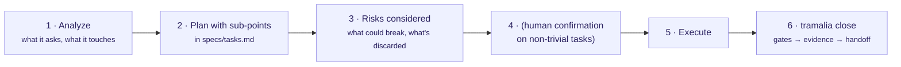

# How an AI works with Tramalia

Tramalia doesn't type for the agent or reason for it: it **governs how it works**. The central rule that `init` writes into your `AGENTS.md` is **analyze and plan before touching code** — agentic work must be deliberate and auditable, not reactive.

## The principle: analyze → plan → consider → execute → close



Before writing code, the agent **always** produces, in its reply:

1. **Analysis** — what the task asks and which files/modules/data it touches.
2. **Plan with sub-points** — the concrete steps, written in `specs/tasks.md` (the `01-spec-governance` skill anchors it there).
3. **Risks considered** — what could break, which alternatives are discarded and why.

On non-trivial tasks, it waits for **human confirmation** before touching code. This isn't a technical enforcement (Tramalia doesn't lock your keyboard) — it's a **convention every agent reads** in `AGENTS.md`, and the value of it being a convention is that it works with any host (Claude Code, Codex, Cursor…).

## New project

```bash
pip install tramalia-cli
tramalia init          # creates the convention (AGENTS.md, docs/ai 00–13, specs, 16 skills…)
tramalia doctor        # what's missing; generates .tramalia/context/tools.json for the agent
```

When it opens the repo, the agent reads `AGENTS.md` and follows the mandatory order:
it reads `docs/ai/00` and `01`, consults `tools.json` before invoking tools, and for the
**first feature** produces analysis + plan in `specs/tasks.md` before writing anything.

## Existing project

```bash
tramalia init --adopt  # integrates governance without overwriting your AGENTS.md/.mcp.json
tramalia doctor
```

On top of the above, in a repo with history the agent:

- Reads `docs/ai/01-arquitectura.md` (boundaries not to cross) and `06-intentos-fallidos.md`
  (what was already discarded — so as not to repeat it).
- Applies the `11-legacy-modernization` skill: small changes, with a test safety net, not
  touching code outside the task's scope.
- The explicit plan matters **more** here: the analysis must identify what could break in
  what already works.

## What's left as evidence

Each task closes with `tramalia close`, which leaves in `.tramalia/evidence/`:
the executed plan (`summary.md`), the raw gate outputs, the risks (`risks.md`) and the
handoff. So the **analysis and plan aren't lost**: they stay auditable in `tramalia log`.
See [Full workflow](flujo-completo.md).

!!! tip "Why 'analyze first' is part of the product"
    An agent's default mode is reactive: gets a request, writes code. Tramalia inverts that —
    the request first produces a verifiable plan. It's the difference between "it did something"
    and "it did the right thing, and there's proof it thought it through".
