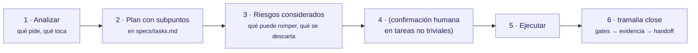

# Cómo trabaja una IA con Tramalia

Tramalia no teclea por el agente ni razona por él: **gobierna cómo trabaja**. La regla central que `init` deja escrita en tu `AGENTS.md` es **analizar y planificar antes de intervenir código** — el trabajo agéntico debe ser deliberado y auditable, no reactivo.

## El principio: análisis → plan → considerar → ejecutar → cerrar



Antes de escribir código, el agente **siempre** produce, en su respuesta:

1. **Análisis** — qué pide la tarea y qué archivos/módulos/datos toca.
2. **Plan con subpuntos** — los pasos concretos, escritos en `specs/tasks.md` (la skill `01-spec-governance` lo ancla ahí).
3. **Riesgos considerados** — qué podría romperse, qué alternativas se descartan y por qué.

En tareas no triviales, espera la **confirmación humana** antes de tocar el código. Esto no es un enforcement técnico (Tramalia no bloquea tu teclado) — es una **convención que todos los agentes leen** en `AGENTS.md`, y el valor de que sea convención es que funciona con cualquier host (Claude Code, Codex, Cursor…).

## Proyecto nuevo

```bash
pip install tramalia-cli
tramalia init          # crea la convención (AGENTS.md, docs/ai 00–13, specs, 16 skills…)
tramalia doctor        # qué falta; genera .tramalia/context/tools.json para el agente
```

El agente, al abrir el repo, lee `AGENTS.md` y sigue el orden obligatorio:
lee `docs/ai/00` y `01`, consulta `tools.json` antes de invocar herramientas, y para
la **primera feature** produce análisis + plan en `specs/tasks.md` antes de escribir nada.

## Proyecto existente

```bash
tramalia init --adopt  # integra el gobierno sin pisar tu AGENTS.md/.mcp.json
tramalia doctor
```

Además de lo anterior, en un repo con historia el agente:

- Lee `docs/ai/01-arquitectura.md` (límites que no se cruzan) y `06-intentos-fallidos.md`
  (lo que ya se descartó — para no repetirlo).
- Aplica la skill `11-legacy-modernization`: cambios pequeños, con red de tests, sin
  tocar código fuera del alcance de la tarea.
- El plan explícito importa **más** aquí: el análisis debe identificar qué se puede
  romper en lo que ya funciona.

## Qué queda como evidencia

Cada tarea se cierra con `tramalia close`, que deja en `.tramalia/evidence/`:
el plan ejecutado (`summary.md`), las salidas crudas de los gates, los riesgos
(`risks.md`) y el handoff. Así el **análisis y el plan no se pierden**: quedan
auditables en `tramalia log`. Ver [Flujo completo](flujo-completo.md).

!!! tip "Por qué 'analizar antes' es parte del producto"
    El modo por defecto de un agente es reactivo: recibe pedido, escribe código. Tramalia
    invierte eso — el pedido produce primero un plan verificable. Es la diferencia entre
    "hizo algo" y "hizo lo correcto, y hay prueba de que lo pensó".
