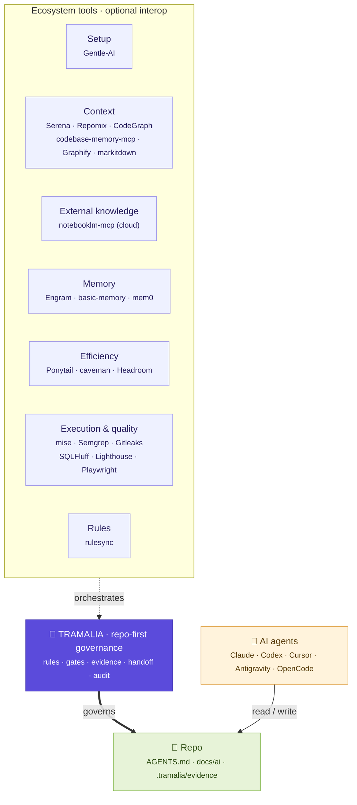

# The ecosystem, with Tramalia at the center

Development with AI agents uses many tools, each great at its own thing. The problem isn't a lack of tools, but that **nobody governs how they work together on a real repo**. That's the gap Tramalia fills.

This page explains **each actor in the ecosystem**, its **scope** (what it does and what it does *not* do), and **how Tramalia contributes** without overlapping.

## Layer map

<small>**Legend:** 🟪 Tramalia (core) · 🟦 tools by role (optional interop) · 🟨 AI agents · 🟩 the repository.</small>

In one line: **Gentle-AI** enables *which* agents to use, **Engram** helps *remember*, **Headroom/caveman** make tokens *cheaper*, **Serena and the code graphs** provide *code intelligence*, **markitdown** ingests documents, and **Tramalia** keeps the repo **controlled, traceable and consistent** — whatever the host (Claude Code, Codex, Antigravity…) or the kind of project (software or [data analytics](analitica.md)).

## The actors and their scopes

### 🧩 Tramalia — the core (governance)

**Scope:** defines the project rules (`AGENTS.md`, `docs/ai/`), runs the gates, **closes tasks with verifiable evidence** (`close`), keeps the **audit trail** (`log`), the **handoff** between agents and the **failed-attempts** memory.

**What it does NOT do:** it doesn't configure agents, it isn't a memory engine, it doesn't compress, it doesn't navigate code itself. It **orchestrates** those who do.

**Unique contribution:** it turns *any* agent's work into something **controlled, traceable and consistent**, versioned in the repo. It's the one thing no other actor covers as a core.

### Gentle-AI — agent environment setup

**Scope:** configures *which* agents you work with: models, skills, profiles, memory, MCP, permissions. It's a "bootstrap" of the AI workstation.

**Relationship with Tramalia:** **external onboarding, not core.** Gentle-AI gets your machine ready; Tramalia governs what those agents do *inside the repo*. Risk to avoid: double ownership of configs/prompts → used separately.

### Engram — persistent memory (N2)

**Scope:** recall across sessions (decisions, observations), SQLite graph, MCP, git-sync. It's Tramalia's **optional N2 memory**.

**Relationship with Tramalia:** optional interop. `tramalia doctor` detects it; `tramalia init` wires it into `.mcp.json` if installed; `close`/`handoff --engram` export the close. **Rule:** opt-in export (never secrets by default).

### Headroom — token compression / efficiency

**Scope:** compresses tool outputs, logs and context before they reach the LLM (60-95% fewer tokens). Library, proxy, wrapper and MCP modes.

**Relationship with Tramalia:** optional efficiency interop. **Hard moat rule:** *compression ≠ evidence*. The raw output is always kept in `.tramalia/evidence/`; Headroom only generates derived views (`review-summary.md`). Because of its proxy mode, it's **never** wired by default: only with `tramalia init --with-headroom`.

### Serena · Repomix · CodeGraph · codebase-memory-mcp · Graphify · markitdown — code intelligence

**Scope:**

- **Serena** — *live* semantic navigation (LSP): the agent reads only the exact symbol it's about to touch.
- **Repomix** — packaged *snapshot* of the repo for AI.
- **CodeGraph** — **pre-indexed** dependency graph with auto-sync (surgical answer in one call, 20+ languages).
- **codebase-memory-mcp** — persistent **structural graph** of the code (158 languages, `get_architecture`, call graphs, impact); ~99% fewer tokens than reading file by file.
- **Graphify** — knowledge graph joining code + docs + schemas (CLI+MCP+skill at once).
- **markitdown** (Microsoft) — **ingestion**: converts PDF/Word/Excel/images to Markdown, to bring into context what doesn't live in code.

**Relationship with Tramalia:** they are the **context** slot that `tramalia context` orchestrates and `doctor` detects. CodeGraph, codebase-memory-mcp and Graphify compete for the same *graph* role — mount **only one**; the [selection criterion](interop-contexto.md#the-criterion-which-to-mount-and-which-to-use) breaks the tie by use case. The ones that auto-configure agents (CodeGraph, codebase-memory-mcp) **must not** step on repo-first governance: install with `--skip-config`, use only their query tools (ADRs live in `docs/ai/05`, rules in `AGENTS.md`).

### notebooklm-mcp — curated external knowledge (cloud)

**Scope:** lets the agent "ask" a Google NotebookLM notebook loaded with third-party documentation — answers grounded in sources, not hallucinated.

**Relationship with Tramalia:** it's a **different** slot from context/memory — *what others documented*, not *your* code or *your* decisions. Hard rule: only public documentation; never private code or repo evidence. It doesn't appear in `doctor` nor in the generated `.mcp.json` (it runs via `npx` and is a cloud service) — wired manually. Detail: [Context & code intelligence](interop-contexto.md#notebooklm-mcp-curated-external-knowledge-mcp-cloud).

### mise — tool execution and gates

**Scope:** manages tool versions, environment variables and **runs the tasks/gates** (`mise run gates`). It's the installer and runner that Tramalia does *not* reimplement.

**Relationship with Tramalia:** `tramalia gates` and `tramalia close` delegate to `mise run`. `tramalia doctor` classifies what's missing and `mise install` brings it. If mise is absent, Tramalia still governs and records "gates not run" as a documented exception.

### Semgrep · Gitleaks · SQLFluff · Lighthouse · Playwright · axe — the gates

**Scope:** the real validations — security (Semgrep/Gitleaks), database (SQLFluff), UX/UI (Lighthouse/Playwright/axe).

**Relationship with Tramalia:** Tramalia defines *which gate applies* (via rules in `docs/ai/`) and **runs them via mise**, capturing their raw output in the evidence pack. It reimplements none; it governs them.

### rulesync — rule fan-out

**Scope:** converts `AGENTS.md` to each agent's format (Cursor, Copilot, Cline…).

**Relationship with Tramalia:** `tramalia sync` delegates to `rulesync convert`. Tramalia keeps **a single source** (`AGENTS.md`); rulesync propagates it. Avoids divergent copies.

## How Tramalia contributes to the whole

| Without Tramalia | With Tramalia at the center |
|---|---|
| Each agent uses its own rules; they contradict each other | **One source** (`AGENTS.md`) propagated with rulesync |
| Nobody knows what ran or how it turned out | **Evidence pack + `metadata.json`** for every close |
| Context is lost between sessions | **Typed handoff** + versioned `docs/ai/` |
| Already-discarded errors get repeated | **Failed-attempts** memory |
| "It works" without proof | **Gates with enforcement**: no close without validating (or a documented exception) |
| Loose tools, no governance | Tramalia **detects, wires and orchestrates** them (optional interop) |
| Too many alternatives, no way to choose | [**Explicit criterion**](interop-contexto.md#the-criterion-which-to-mount-and-which-to-use): what question each one answers, local first, tiebreakers by case |
| Which agent CLIs are installed? | `doctor` **detects** them (claude, codex, antigravity, gemini, opencode) — informational, never configures them |

Tramalia doesn't add *another* tool to the pile: it adds the **layer that makes them work auditably on your repo**.
