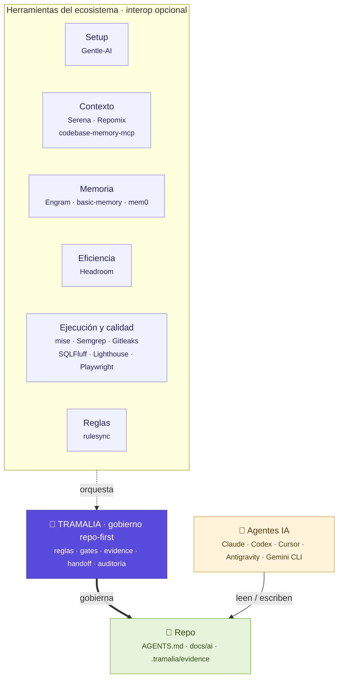

# El ecosistema, con Tramalia en el centro

El desarrollo con agentes IA usa muchas herramientas, cada una excelente en lo suyo. El problema no es la falta de herramientas, sino que **nadie gobierna cómo trabajan juntas sobre un repo real**. Ese es el hueco que llena Tramalia.

Esta página explica **cada actor del ecosistema**, su **alcance** (qué hace y qué *no* hace), y **cómo Tramalia aporta** sin solaparse.

## Mapa de capas

<small>**Leyenda:** 🟪 Tramalia (núcleo) · 🟦 herramientas por rol (interop opcional) · 🟨 agentes IA · 🟩 el repositorio.</small>

## Los actores y sus alcances

### 🧩 Tramalia — el núcleo (gobierno)

**Alcance:** define las reglas del proyecto (`AGENTS.md`, `docs/ai/`), corre los gates, **cierra tareas con evidencia verificable** (`close`), mantiene la **pista de auditoría** (`log`), el **handoff** entre agentes y la memoria de **intentos fallidos**.

**Qué NO hace:** no configura agentes, no es motor de memoria, no comprime, no navega código por sí mismo. **Orquesta** a quienes sí lo hacen.

**Aporte único:** convierte el trabajo de *cualquier* agente en algo **controlado, trazable y consistente**, versionado en el repo. Es lo único que ningún otro actor cubre como núcleo.

### Gentle-AI — preparación del entorno de agentes

**Alcance:** configura *con qué* agentes trabajas: modelos, skills, perfiles, memoria, MCP, permisos. Es un "bootstrap" de la estación de trabajo IA.

**Relación con Tramalia:** **onboarding externo, no núcleo.** Gentle-AI deja tu máquina lista; Tramalia gobierna lo que esos agentes hacen *dentro del repo*. Riesgo a evitar: doble ownership de configs/prompts → se usa por separado.

### Engram — memoria persistente (N2)

**Alcance:** recuerdo entre sesiones (decisiones, observaciones), grafo en SQLite, MCP, git-sync. Es la **memoria N2 opcional** de Tramalia.

**Relación con Tramalia:** interop opcional. `tramalia doctor` la detecta; `tramalia init` la cablea en `.mcp.json` si está instalada; `close`/`handoff --engram` exportan el cierre. **Regla:** export opt-in (nunca secretos por defecto).

### Headroom — compresión / eficiencia de tokens

**Alcance:** comprime tool outputs, logs y contexto antes de llegar al LLM (60-95% menos tokens). Modos librería, proxy, wrapper y MCP.

**Relación con Tramalia:** interop opcional de eficiencia. **Regla dura del moat:** *compresión ≠ evidencia*. El output crudo siempre se conserva en `.tramalia/evidence/`; Headroom solo genera vistas derivadas (`review-summary.md`). Por su modo proxy, **nunca** se cablea por defecto: solo con `tramalia init --with-headroom`.

### Serena · Repomix · codebase-memory-mcp — inteligencia de código

**Alcance:**

- **Serena** — navegación semántica *viva* (LSP): el agente lee solo el símbolo exacto que va a tocar.
- **Repomix** — *snapshot* empaquetado del repo para IA.
- **codebase-memory-mcp** — **grafo estructural** persistente del código (158 lenguajes, `get_architecture`, call graphs, impacto); ~99% menos tokens que leer archivo por archivo.

**Relación con Tramalia:** son el slot de **contexto** que `tramalia context` orquesta. codebase-memory-mcp es una alternativa *más potente* como backend de `context` — pero se usa **solo como servidor MCP de consulta**: sus funciones de `manage_adr` y de auto-configurar agentes **no** deben pisar el gobierno repo-first (ADR viven en `docs/ai/05`, reglas en `AGENTS.md`). Instalar con `--skip-config`.

### mise — ejecución de tools y gates

**Alcance:** gestiona versiones de herramientas, variables de entorno y **corre las tareas/gates** (`mise run gates`). Es el instalador y runner que Tramalia *no* reimplementa.

**Relación con Tramalia:** `tramalia gates` y `tramalia close` delegan en `mise run`. `tramalia doctor` clasifica qué falta y `mise install` lo trae. Si mise no está, Tramalia sigue gobernando y registra "gates no ejecutados" como excepción documentada.

### Semgrep · Gitleaks · SQLFluff · Lighthouse · Playwright · axe — los gates

**Alcance:** las validaciones reales — seguridad (Semgrep/Gitleaks), base de datos (SQLFluff), UX/UI (Lighthouse/Playwright/axe).

**Relación con Tramalia:** Tramalia define *qué gate aplica* (por reglas en `docs/ai/`) y los **ejecuta vía mise**, capturando su salida cruda en el evidence pack. No reimplementa ninguna; las gobierna.

### rulesync — fan-out de reglas

**Alcance:** convierte `AGENTS.md` a los formatos de cada agente (Cursor, Copilot, Cline…).

**Relación con Tramalia:** `tramalia sync` delega en `rulesync convert`. Tramalia mantiene **una sola fuente** (`AGENTS.md`); rulesync la propaga. Evita copias divergentes.

## Cómo Tramalia aporta a todo el conjunto

| Sin Tramalia | Con Tramalia en el centro |
|---|---|
| Cada agente usa sus reglas; se contradicen | **Una fuente** (`AGENTS.md`) propagada con rulesync |
| Nadie sabe qué se ejecutó ni cómo quedó | **Evidence pack + `metadata.json`** por cada cierre |
| El contexto se pierde entre sesiones | **Handoff tipado** + `docs/ai/` versionado |
| Se repiten errores ya descartados | Memoria de **intentos fallidos** |
| "Funciona" sin prueba | **Gates con enforcement**: no se cierra sin validar (o excepción documentada) |
| Herramientas sueltas, sin gobierno | Tramalia las **detecta, cablea y orquesta** (interop opcional) |

Tramalia no añade *otra* herramienta al montón: añade la **capa que las hace trabajar de forma auditable sobre tu repo**.
