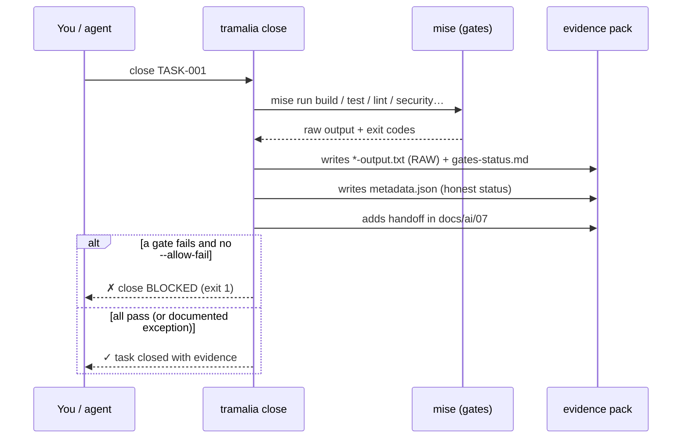

# Full workflow, step by step

This is the real journey of a project governed by Tramalia, from scratch to the auditable close of a task. The recommended path **leads with `tramalia close`**.

Every step has **two equivalent paths**: CLI (scriptable, CI-friendly) or `tramalia ui` (TUI, visual, with prefilled forms). Neither is "the right one" — each step's table shows both; use whichever fits the moment. Full interface detail: [The interface (TUI)](interfaz.md).

## Overview


## The closing ritual, inside



## 1. Install Tramalia (Python only)

```bash
pip install tramalia-cli   # one command: core + colors + menu included
```

Tramalia already runs. No Node, no cloud services.

## 2. Initialize the convention

| CLI | TUI |
|---|---|
| `tramalia init` | **Overview** tab → **⚙ Initialize** button (visible while the repo isn't governed yet) |

Drops into your repo, idempotent (never overwrites existing files):

```text
AGENTS.md              # single rules for all agents
CLAUDE.md              # → @AGENTS.md (no duplication)
docs/ai/               # full convention (14 files, 00-13: architecture, stack-aware rules, deploy, analytics…)
specs/                 # constitution · specification · plan · tasks · checklist
.claude/agents/        # 5 subagents with model routing (planner→opus, executor→inherit…)
mise.toml              # tools + gates tailored to the detected stack
.mcp.json              # Serena (Engram if present; Headroom/Ponytail via --with-*)
.gitignore              # block that excludes external skills from the repo (keeps the own ones)
.tramalia/             # config, version, current-task, skills.toml, 16 skills, context/, evidence/
```

`init` **detects the agent CLIs you already have installed** (Claude, Codex, OpenCode…) and uses them as the default executor/reviewer in `config.json` — not a fixed example. If you have other agents besides Claude Code, it suggests `tramalia sync` to propagate rules to them (step 4).

## 3. See what's missing to install

| CLI | TUI |
|---|---|
| `tramalia doctor` | **Overview** tab, live table — `i` key installs what's missing, `u` checks skill updates |

Classifies into **bootstrap** (mise/git/uv), **stack** (node/dotnet…) and **feature/gate** (semgrep, sqlfluff, lighthouse, engram, headroom…). It flags what requires Node. Once you have `mise`:

```bash
mise install          # installs everything declared in mise.toml
```

## 4. Propagate rules to other agents (interop)

```bash
tramalia sync         # rulesync: AGENTS.md → Cursor, Copilot, Cline…
```

## 5. Choose the context backend and refresh it

| CLI | TUI |
|---|---|
| `tramalia context set <backend>` · `tramalia context` | `b` key (choose) · `i` key (refresh) |

If you have several code-navigation tools installed (Serena, CodeGraph, codebase-memory-mcp, Graphify), **only one** stays active per project (`.tramalia/config.json → context.backend`, default `serena`) — this prevents the agent from alternating between inconsistent indexes. `tramalia context` (no arguments) refreshes the derived snapshot (tech-stack + project-map, via Repomix if present). Detail: [Context & code intelligence](interop-contexto.md).

## 6. Install the skills you need

| CLI | TUI |
|---|---|
| `tramalia skills list` · `tramalia skills enable <n>` + `tramalia skills` | **Skills** tab, Enter on an external one installs it in one step |

The 16 own skills already ship; the external catalog (`skills.toml`) is optional and **isn't committed to the repo** (it's re-hydrated with `tramalia skills` after cloning). Detail: [Skills](skills-guia.md).

## 7. (Optional) Model cap for the subagents

```bash
tramalia agents cap sonnet   # lowers opus/fable to sonnet; keeps haiku and inherit
```

Only if you want to cap which models the 5 governance subagents use (e.g. no opus/fable access). Portable to other hosts as a convention — see [Model cap](multi-host.md#model-cap-portable-across-providers).

With this, you work with your agent (Claude/Codex/…), which reads `AGENTS.md` + `docs/ai/`.

## 8. Close the task (the heart of the product)

| CLI | TUI |
|---|---|
| `tramalia close TASK-001` | **Close** tab: prefilled form (task, agent, reviewer — detected; model, optional) → **▶ Run close** button |

```bash
tramalia close TASK-001    # agent and reviewer: defaults from config.json
```

In the TUI, the form comes prefilled with the project's **real** values: the task comes from `.tramalia/current-task.md` if you declared it, agent/reviewer from `config.json` (the agents `init` detected), and the **model** field is left blank on purpose — it's optional, just so `tramalia log` records which model closed the task; leaving it blank blocks nothing. Full detail: [The interface (TUI) → Close tab](interfaz.md#close-tab).

!!! info "`close` doesn't invoke the agent"
    The agent/reviewer fields are an **audit record** (who did the work, who reviews it) — not a selection. What `close` executes are the **gates** via `mise`; the AI work already happened earlier, with whichever agent you chose.

This, in one step:

1. Runs each gate (`mise run build/test/lint/security/database/ux`).
2. Writes the **raw output** of each into `.tramalia/evidence/<date>-TASK-001/*-output.txt`.
3. Generates **`metadata.json`** with an honest `status`.
4. Adds the **handoff** to `docs/ai/07-handoff-agentes.md`.
5. **Blocks** the close (exit 1) if a gate fails, unless `--allow-fail` with the exception noted in `risks.md`.

Typical pack result:

```text
.tramalia/evidence/2026-06-30-1015-TASK-001/
├── metadata.json        ← structured audit
├── gates-status.md
├── build-output.txt     ← RAW, official
├── test-output.txt      ← RAW, official
├── security-output.txt  ← RAW, official
├── summary.md · risks.md · rollback.md · next-steps.md
```

`metadata.json` looks like this:

```json
{
  "task": "TASK-001",
  "agent": "codex",
  "reviewer": "claude",
  "started_at": "2026-06-30T10:15:00-04:00",
  "closed_at": "2026-06-30T10:22:00-04:00",
  "status": "passed",
  "allow_fail": false,
  "gates_ran": true,
  "gates": { "build": { "status": "passed", "exit_code": 0, "output": "build-output.txt" } },
  "handoff": "docs/ai/07-handoff-agentes.md",
  "evidence_dir": ".tramalia/evidence/2026-06-30-1015-TASK-001"
}
```

!!! warning "Honest status"
    A forced failure with `--allow-fail` is recorded as `passed_with_exceptions`, **never** as `passed`. Without mise, the status is `no_gates`. The audit is not glossed over.

## 9. Review the audit trail

| CLI | TUI |
|---|---|
| `tramalia log` | **Audit** tab: browsable table — Enter on a close shows its full `metadata.json` |

```bash
tramalia log
```

```text
i audit trail — 3 closes (newest first):
✓ 2026-06-30-1015-TASK-001  ·  ✓ passed  ·  codex
⚠ 2026-06-29-1740-TASK-000  ·  ⚠ with exceptions (forced)  ·  claude
○ 2026-06-28-0930-SETUP     ·  ○ no gates
```

**Audit only reads, Close only writes** — they're the two halves of the same cycle: every `close` leaves an evidence pack, and `log`/the Audit tab is how you **come back** to that work later — to review what was done, with which agent/model, and whether it passed clean or with an exception. Full detail, including the comparison table: [The interface (TUI) → Audit vs. Close](interfaz.md#audit-vs-close-two-different-things).

## Re-planning tasks (short · medium · long term)

`specs/tasks.md` is versioned Markdown: **re-planning is editing it**, anytime and via three paths:

- **You by hand** — change scope, order or horizon of any future task.
- **The AI** — ask the `planificador` subagent: *"re-plan tasks 5-10 considering X"* and it edits the file (its role, skill 01).
- **A specific one** — *"adjust only TASK-007"*.

Each task carries `Estado` (pending · in-progress · closed) and `Horizonte` (now · next · later). The rule that makes it safe: **closed tasks are immutable through evidence** — their close lives in `.tramalia/evidence/` + `log`, so editing the future plan never rewrites history.

This full workflow — plan, divide into tasks/horizons, verify with gates, and close, all on top of `AGENTS.md` — is the practical application of the [4 pillars of governance](como-trabaja-ia.md#the-4-pillars-of-governance) (plan · divide · verify · rules).

## 10. Maintenance

Two different commands for two different things — they don't overlap:

| Command | What it updates |
|---|---|
| `tramalia update` | the **orchestrated tools**: `mise upgrade` (build/test/lint versions…) + syncs declared external skills |
| `tramalia upgrade` | **the repo itself**: adds the new convention files your Tramalia version didn't have (after `pip install -U tramalia-cli`), without overwriting anything existing |

```bash
pip install -U tramalia-cli   # 1. update the CLI
tramalia upgrade               # 2. bring your repo's CONVENTION up to date
tramalia update                 # 3. bring the orchestrated TOOLS up to date
```

Detail on `upgrade`: [Commands → upgrade](comandos.md#upgrade-update-an-already-initialized-repo).

## Standalone vs. with tools

The **core** (`init`, `doctor`, `close`, `log`, `evidence`, `handoff`) works **with Python only**. If `mise` and the rest aren't present, Tramalia still governs and records the absences as **documented exceptions**. You can work **with Tramalia alone** or **combine it** with Gentle-AI, Engram, Headroom and the rest of the [ecosystem](ecosistema.md).
