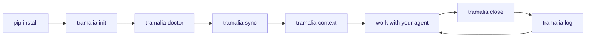
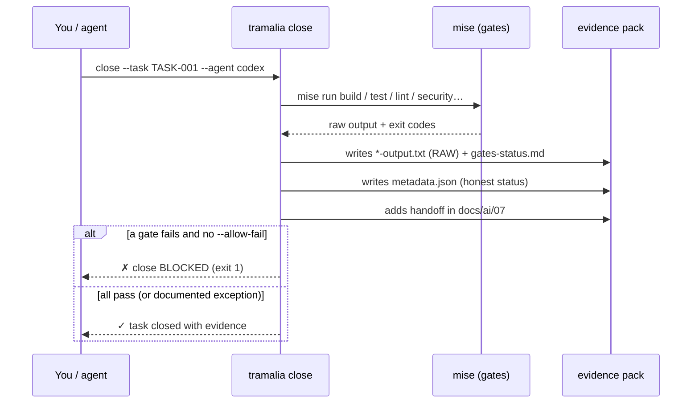

# Full workflow, step by step

This is the real journey of a project governed by Tramalia, from scratch to the auditable close of a task. The recommended path **leads with `tramalia close`**.

## Overview



## The closing ritual, inside



## 1. Install Tramalia (Python only)

```bash
pip install -e ".[pretty]"   # core + pretty mode (Rich + Questionary)
```

Tramalia already runs. No Node, no cloud services.

## 2. Initialize the convention

```bash
tramalia init
```

Drops into your repo, idempotent (never overwrites existing files):

```text
AGENTS.md              # single rules for all agents
CLAUDE.md              # → @AGENTS.md (no duplication)
docs/ai/               # full convention 00-11 (architecture, rules, ADR, handoff…)
specs/                 # constitution · specification · plan · tasks · checklist
mise.toml              # tools + gates tailored to the detected stack
.mcp.json              # Serena (Engram if present; Headroom/Ponytail via --with-*)
.tramalia/             # config, current-task, skills.toml, 13 skills, context/, evidence/
```

## 3. See what's missing to install

```bash
tramalia doctor
```

Classifies into **bootstrap** (mise/git/uv), **stack** (node/dotnet…) and **feature/gate** (semgrep, sqlfluff, lighthouse, engram, headroom…). It flags what requires Node. Once you have `mise`:

```bash
mise install          # installs everything declared in mise.toml
```

## 4. Propagate rules to other agents (interop)

```bash
tramalia sync         # rulesync: AGENTS.md → Cursor, Copilot, Cline…
```

## 5. Refresh context (token saving)

```bash
tramalia context      # tech-stack + project-map (Repomix if present; otherwise stdlib tree)
```

Then you work with your agent (Claude/Codex/…), which reads `AGENTS.md` + `docs/ai/`.

## 6. Close the task (the heart of the product)

```bash
tramalia close --task TASK-001 --agent codex --reviewer claude
```

This, in one step:

1. Runs each gate (`mise run build/test/lint/security/database/ux`).
2. Writes the **raw output** of each into `.tramalia/evidence/<date>-TASK-001/*-output.txt`.
3. Generates **`metadata.json`** with an honest `status`.
4. Adds the **handoff** to `docs/ai/07-handoff-agentes.md`.
5. **Blocks** the close (exit 1) if a gate fails, unless `--allow-fail` with the exception noted in `risks.md`.

Typical pack result:

```text
.tramalia/evidence/2026-06-30-1015-TASK-001/
├── metadata.json        ← structured audit
├── gates-status.md
├── build-output.txt     ← RAW, official
├── test-output.txt      ← RAW, official
├── security-output.txt  ← RAW, official
├── summary.md · risks.md · rollback.md · next-steps.md
```

`metadata.json` looks like this:

```json
{
  "task": "TASK-001",
  "agent": "codex",
  "reviewer": "claude",
  "started_at": "2026-06-30T10:15:00-04:00",
  "closed_at": "2026-06-30T10:22:00-04:00",
  "status": "passed",
  "allow_fail": false,
  "gates_ran": true,
  "gates": { "build": { "status": "passed", "exit_code": 0, "output": "build-output.txt" } },
  "handoff": "docs/ai/07-handoff-agentes.md",
  "evidence_dir": ".tramalia/evidence/2026-06-30-1015-TASK-001"
}
```

!!! warning "Honest status"
    A forced failure with `--allow-fail` is recorded as `passed_with_exceptions`, **never** as `passed`. Without mise, the status is `no_gates`. The audit is not glossed over.

## 7. Review the audit trail

```bash
tramalia log
```

```text
i audit trail — 3 closes (newest first):
✓ 2026-06-30-1015-TASK-001  ·  ✓ passed  ·  codex
⚠ 2026-06-29-1740-TASK-000  ·  ⚠ with exceptions (forced)  ·  claude
○ 2026-06-28-0930-SETUP     ·  ○ no gates
```

## 8. Maintenance

```bash
tramalia update       # mise upgrade + (future) copier update + skills sync
```

## Standalone vs. with tools

The **core** (`init`, `doctor`, `close`, `log`, `evidence`, `handoff`) works **with Python only**. If `mise` and the rest aren't present, Tramalia still governs and records the absences as **documented exceptions**. You can work **with Tramalia alone** or **combine it** with Gentle-AI, Engram, Headroom and the rest of the [ecosystem](ecosistema.md).
