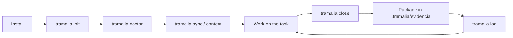
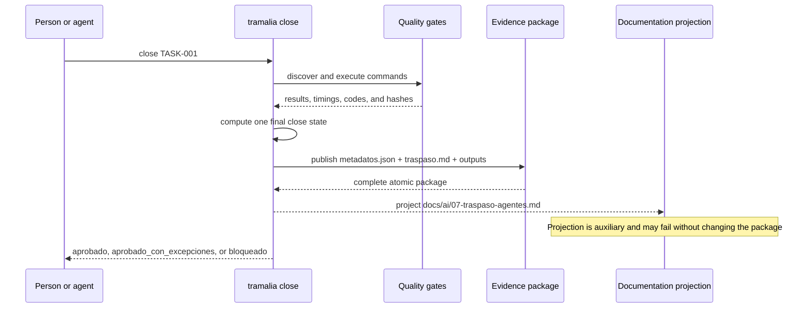

# Full workflow, step by step

This is the recommended path for a Tramalia-governed project: prepare the
repository, work on a task, verify it, and publish an auditable close. The CLI
and `tramalia ui` consume the same core result; the interface does not redefine
policy or recalculate the outcome.

## Overview



## What a quality gate is

A **quality gate** is an automated control that a task must pass before it can
be closed. Examples include compiling, running tests, checking formatting,
scanning for vulnerabilities, or validating a migration. It is not a separate
service: in Tramalia it is an exact command declared in `mise.toml`, recorded
with its duration, exit code, output file, and hash.

Tramalia is **fail-closed**. A failed gate, invalid configuration, unavailable
runner, or complete absence of gates is never interpreted as success. The close
is `bloqueado` unless every failure is covered by a formal, reviewed, current
exception.

The formal aggregate gate states intentionally remain Spanish ASCII values in
every locale because they are part of the v1 data contract:

| Formal state | Meaning |
|---|---|
| `aprobado` | Every required gate completed successfully. |
| `fallido` | At least one gate returned a failed result. |
| `ejecutor_no_disponible` | `mise` or another required runner was unavailable. |
| `sin_configurar` | No gates are declared; this is not approval. |
| `configuracion_invalida` | The gate declaration fails schema validation. |
| `error_ejecucion` | A command could not be launched or controlled. |

The final close state is limited to `aprobado`,
`aprobado_con_excepciones`, or `bloqueado`.

## What happens during a close



## 1. Install Tramalia

```bash
pip install tramalia-cli
```

The core runs with Python. Optional integrations are diagnosed separately and
never hide their failures.

## 2. Initialize the convention

| CLI | TUI |
|---|---|
| `tramalia init` | **Overview** tab → **Initialize** |

Initialization is idempotent and creates, without overwriting existing files:

```text
AGENTS.md
CLAUDE.md
docs/ai/                         # rules and visible transfer projection
specs/                           # constitution, specification, plan, tasks
.claude/agents/                  # governance subagents
mise.toml                        # stack tools and quality gates
.mcp.json
.tramalia/
├── config.json
├── current-task.md
├── context/
├── skills/
└── evidencia/                   # formal packages, ignored by Git
```

`init` detects the stack and available agent CLIs to propose initial values.
`tramalia upgrade` adds new convention files without overwriting project
customizations.

## 3. Diagnose tools

| CLI | TUI |
|---|---|
| `tramalia doctor` | **Overview** tab |

`doctor` distinguishes base tools, stack toolchains, and optional integrations.
When appropriate:

```bash
tramalia doctor --fix
mise install
```

An optional tool is merely a capability that may not have been requested. If a
required gate depends on it and it is unavailable, the close is blocked.

## 4. Propagate rules and build context

```bash
tramalia sync
tramalia context set serena
tramalia context
```

`sync` translates `AGENTS.md` into supported formats. `context set` chooses one
code-navigation backend, and `context` refreshes derived project memory. Neither
command replaces the evidence package.

## 5. Prepare and work on a task

Record tasks in `specs/tasks.md`. To let `close` resolve the ID automatically,
declare the current one in `.tramalia/current-task.md`. IDs allow 1–64 ASCII
letters, digits, dots, hyphens, and underscores; paths, `..`, and reserved system
names are rejected.

Work with any agent you choose. The `agente`, `revisor`, and `modelo` fields are
declared audit data: they are not cryptographic proof of identity, and they do
not make `close` invoke a model.

## 6. Close the task

| CLI | TUI |
|---|---|
| `tramalia close TASK-001` | **Close** tab → **Run close** |

```bash
tramalia close TASK-001
```

The core inspects the project, loads gates, runs commands, evaluates metrics and
thresholds, computes policy once, and publishes the package. Raw outputs remain
separate files; a summary or compressed derivative can never replace them.

An exception is not a generic bypass. To cover a failure it must declare a
reason, accepted risk, affected control, reference, reviewer, and either expiry
or remediation condition. `--allow-fail` remains a compatibility alias, but it
cannot approve a result without those complete fields.

## 7. Understand the formal v1 package

Every operation creates a unique identity and publishes its directory
atomically. A final package never appears half-written:

```text
.tramalia/evidencia/20260713T183012.123456Z-a1b2c3d4/
├── metadatos.json       # structured v1 contract
├── traspaso.md          # canonical transfer for this package
└── test-salida.txt      # raw output, hashed by the formal data
```

`metadatos.json` uses stable Spanish ASCII keys and states in both locales. The
following is abbreviated but includes every required top-level section:

```json
{
  "version_esquema": 1,
  "id_paquete": "20260713T183012.123456Z-a1b2c3d4",
  "id_tarea": "TASK-001",
  "operacion": "cierre",
  "inicio_utc": "2026-07-13T18:30:12.123456Z",
  "fin_utc": "2026-07-13T18:30:18.123456Z",
  "entorno": {
    "tramalia": "0.34.0b1",
    "python": "3.13.5",
    "sistema_operativo": "Windows-11",
    "cadena_herramientas": {"mise": "2026.7.0", "pytest": "9.0.0"}
  },
  "git": {
    "commit": "0123456789abcdef",
    "rama": "main",
    "limpio": false,
    "base_comparacion": "origin/main",
    "rastreados": ["tramalia/core/operaciones.py"],
    "preparados": [],
    "no_rastreados": [],
    "renombrados": [],
    "eliminados": []
  },
  "comandos": [{
    "nombre": "test",
    "comando": ["mise", "run", "test"],
    "estado": "aprobado",
    "inicio_utc": "2026-07-13T18:30:13.000000Z",
    "fin_utc": "2026-07-13T18:30:17.000000Z",
    "duracion_segundos": 4.0,
    "codigo_salida": 0,
    "hash_salida": "0000000000000000000000000000000000000000000000000000000000000000",
    "archivo_salida": "test-salida.txt"
  }],
  "puertas": {
    "estado": "aprobado",
    "descubiertas": ["test"],
    "ejecutadas": ["test"],
    "omitidas": [],
    "fallidas": [],
    "errores_validacion": []
  },
  "estado_cierre": "aprobado",
  "agente": "codex",
  "modelo": null,
  "metricas": {},
  "umbrales": {},
  "errores_validacion": [],
  "excepciones": [],
  "vinculo_traspaso": "traspaso.md"
}
```

Timestamps are UTC and ordered. SHA-256 hashes bind each executed result to its
output. Unsafe paths, non-finite numbers, unknown enums, or truncated structures
make the log entry invalid; Tramalia never guesses a result from Markdown.

## 8. Canonical transfer and visible projection

The transfer that belongs to a close is
`.tramalia/evidencia/<id_paquete>/traspaso.md`. It is the only canonical source:
it contains package and task identity, the already-computed outcome, blockers,
exceptions, agent, and reviewer, without duplicating raw outputs.

`docs/ai/07-traspaso-agentes.md` is a **projection** of the latest transfer. It
contains a relative link to the canonical file, is replaced atomically, and is
best-effort. A permission or write problem under `docs/ai/` does not modify the
package or turn a valid close into a failure.

The public command keeps its historical name for compatibility:

```bash
tramalia handoff TASK-001
```

Documentation and generated files describe the concept as **traspaso**
(*transfer*).

## 9. Read the audit log

| CLI | TUI |
|---|---|
| `tramalia log` | **Audit** tab |

The audit log reads only `.tramalia/evidencia/*/metadatos.json`, sorts by
descending `id_paquete`, and ignores staging directories. It does not rebuild
states from historical documents.

```text
✓ 20260713T183012.123456Z-a1b2c3d4 · aprobado · TASK-001 · codex
⚠ 20260713T170200.654321Z-b2c3d4e5 · aprobado_con_excepciones · TASK-000
✗ paquete-corrupto · invalida · formal data could not be read
```

A corrupt package appears as `invalida` without preventing other entries from
being read. Its safe error message does not expose output content or sensitive
paths.

## 10. Re-plan and maintain

`specs/tasks.md` remains the versioned plan: future tasks may be edited freely,
while a past close remains immutable in its package. To maintain the environment:

```bash
pip install -U tramalia-cli
tramalia upgrade
tramalia update
```

- `upgrade` adds new convention files without overwriting existing ones.
- `update` updates orchestrated tools and declared skills.
- PyPI distributes the package, GitHub Pages publishes the documentation, and
  GitHub releases record versions. They are separate channels and must be
  verified separately.

The core (`init`, `doctor`, `close`, `log`, `evidence`, `handoff`) can run with
Python. Gates and integrations add capabilities, but never change the central
principle: a result is approved only when sufficient formal evidence exists.
