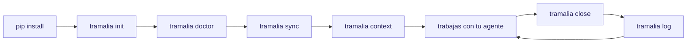
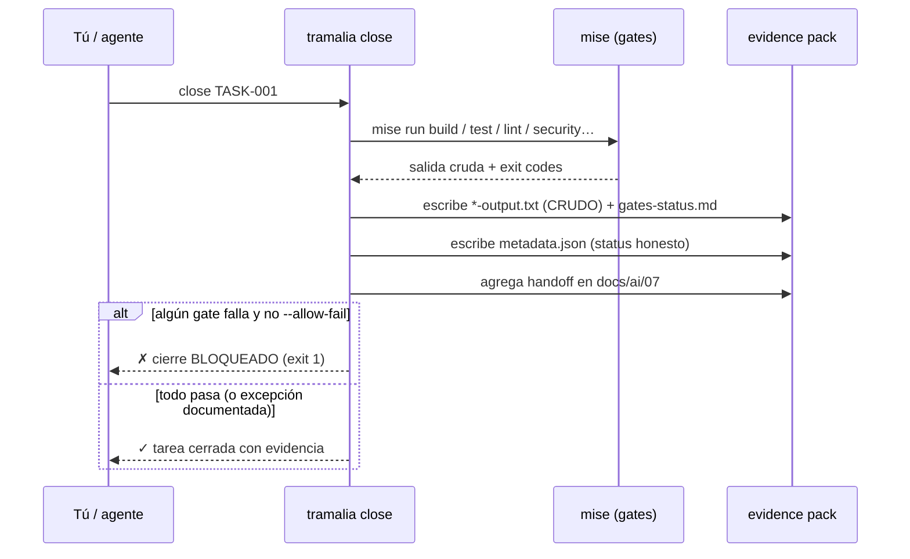

# Flujo completo, paso a paso

Este es el recorrido real de un proyecto gobernado por Tramalia, desde cero hasta el cierre auditable de una tarea. El camino recomendado **lidera con `tramalia close`**.

Cada paso tiene **dos caminos equivalentes**: CLI (scripteable, CI-friendly) o `tramalia ui` (TUI, visual, con formularios prellenados). Ninguno es "el correcto" — la tabla de cada paso muestra ambos; usa el que te acomode en el momento. Detalle completo de la interfaz: [La interfaz (TUI)](interfaz.md).

## Vista general



## El ritual de cierre por dentro



## 1. Instalar Tramalia (solo Python)

```bash
pip install tramalia-cli   # un comando: núcleo + colores + menú incluidos
```

Tramalia ya corre. Sin Node, sin servicios cloud.

## 2. Inicializar la convención

| CLI | TUI |
|---|---|
| `tramalia init` | pestaña **Resumen** → botón **⚙ Inicializar** (visible mientras el repo no esté gobernado) |

Deja en tu repo, idempotente (no pisa lo existente):

```text
AGENTS.md              # reglas únicas para todos los agentes
CLAUDE.md              # → @AGENTS.md (sin duplicar)
docs/ai/               # convención completa (14 archivos, 00-13: arquitectura, reglas por stack, deploy, analítica…)
specs/                 # constitution · specification · plan · tasks · checklist
.claude/agents/        # 5 subagentes con ruteo de modelo (planificador→opus, ejecutor→inherit…)
mise.toml              # tools + gates a la medida del stack detectado
.mcp.json              # Serena (Engram si está; Headroom/Ponytail con --with-*)
.gitignore              # bloque que excluye skills externas del repo (conserva las propias)
.tramalia/             # config, version, current-task, skills.toml, 16 skills, context/, evidence/
```

`init` **detecta los agentes CLI que ya tienes instalados** (Claude, Codex, OpenCode…) y los usa como ejecutor/revisor por defecto en `config.json` — no es un ejemplo fijo. Si tienes otros agentes además de Claude Code, te sugiere `tramalia sync` para propagarles las reglas (paso 4).

## 3. Ver qué falta instalar

| CLI | TUI |
|---|---|
| `tramalia doctor` | pestaña **Resumen**, tabla en vivo — tecla `i` instala lo faltante, `u` revisa updates de skills |

Clasifica en **bootstrap** (mise/git/uv), **stack** (node/dotnet…) y **feature/gate** (semgrep, sqlfluff, lighthouse, engram, headroom…). Marca lo que requiere Node. Una vez que tengas `mise`:

```bash
mise install          # instala todo lo declarado en mise.toml
```

## 4. Propagar reglas a otros agentes (interop)

```bash
tramalia sync         # rulesync: AGENTS.md → Cursor, Copilot, Cline…
```

## 5. Elegir el backend de contexto y refrescarlo

| CLI | TUI |
|---|---|
| `tramalia context set <backend>` · `tramalia context` | tecla **`b`** (elegir) · tecla **`i`** (refrescar) |

Si tienes varias herramientas de navegación de código instaladas (Serena, CodeGraph, codebase-memory-mcp, Graphify), **uno solo** queda activo por proyecto (`.tramalia/config.json → context.backend`, default `serena`) — evita que el agente alterne entre índices inconsistentes. `tramalia context` (sin argumentos) refresca el snapshot derivado (tech-stack + project-map, vía Repomix si está). Detalle: [Contexto e inteligencia de código](interop-contexto.md).

## 6. Instalar las skills que necesites

| CLI | TUI |
|---|---|
| `tramalia skills list` · `tramalia skills enable <n>` + `tramalia skills` | pestaña **Skills**, Enter sobre una externa la instala en un paso |

Las 16 skills propias ya vienen; el catálogo externo (`skills.toml`) es opcional y **no se sube al repo** (se re-hidrata con `tramalia skills` tras clonar). Detalle: [Skills](skills-guia.md).

## 7. (Opcional) Tope de modelos para los subagentes

```bash
tramalia agents cap sonnet   # baja opus/fable a sonnet; conserva haiku e inherit
```

Solo si quieres limitar qué modelos usan los 5 subagentes de gobierno (p. ej. no tienes acceso a opus/fable). Portable a otros hosts como convención — ver [Tope de modelos](multi-host.md#tope-de-modelos-portable-entre-proveedores).

Con esto, trabajas con tu agente (Claude/Codex/…), que lee `AGENTS.md` + `docs/ai/`.

## 8. Cerrar la tarea (el corazón del producto)

| CLI | TUI |
|---|---|
| `tramalia close TASK-001` | pestaña **Cierre**: formulario prellenado (tarea, agente, revisor — detectados; modelo, opcional) → botón **▶ Ejecutar close** |

```bash
tramalia close TASK-001    # agente y revisor: defaults de config.json
```

En la TUI, el formulario ya viene prellenado con los valores **reales** del proyecto: la tarea sale de `.tramalia/current-task.md` si la declaraste, agente/revisor de `config.json` (los agentes detectados en `init`), y el campo **modelo** queda vacío a propósito — es opcional, solo para que quede registrado en `tramalia log` qué modelo cerró la tarea; no bloquea nada si lo dejas así. Detalle pestaña por pestaña: [La interfaz (TUI) → Pestaña Cierre](interfaz.md#pestana-cierre).

Esto, en un paso:

1. Corre cada gate (`mise run build/test/lint/security/database/ux`).
2. Escribe la **salida cruda** de cada uno en `.tramalia/evidence/<fecha>-TASK-001/*-output.txt`.
3. Genera **`metadata.json`** con `status` honesto.
4. Agrega el **handoff** en `docs/ai/07-handoff-agentes.md`.
5. **Bloquea** el cierre (exit 1) si un gate falla, salvo `--allow-fail` con la excepción anotada en `risks.md`.

Resultado típico del pack:

```text
.tramalia/evidence/2026-06-30-1015-TASK-001/
├── metadata.json        ← auditoría estructurada
├── gates-status.md
├── build-output.txt     ← CRUDO, oficial
├── test-output.txt      ← CRUDO, oficial
├── security-output.txt  ← CRUDO, oficial
├── summary.md · risks.md · rollback.md · next-steps.md
```

`metadata.json` se ve así:

```json
{
  "task": "TASK-001",
  "agent": "codex",
  "reviewer": "claude",
  "started_at": "2026-06-30T10:15:00-04:00",
  "closed_at": "2026-06-30T10:22:00-04:00",
  "status": "passed",
  "allow_fail": false,
  "gates_ran": true,
  "gates": { "build": { "status": "passed", "exit_code": 0, "output": "build-output.txt" } },
  "handoff": "docs/ai/07-handoff-agentes.md",
  "evidence_dir": ".tramalia/evidence/2026-06-30-1015-TASK-001"
}
```

!!! warning "Estado honesto"
    Un fallo forzado con `--allow-fail` se registra como `passed_with_exceptions`, **nunca** como `passed`. Sin mise, el estado es `no_gates`. La auditoría no se maquilla.

## 9. Revisar la pista de auditoría

| CLI | TUI |
|---|---|
| `tramalia log` | pestaña **Auditoría**: tabla navegable — Enter sobre un cierre muestra su `metadata.json` completo |

```bash
tramalia log
```

```text
i pista de auditoría — 3 cierres (más reciente primero):
✓ 2026-06-30-1015-TASK-001  ·  ✓ passed  ·  codex
⚠ 2026-06-29-1740-TASK-000  ·  ⚠ con excepciones (forzado)  ·  claude
○ 2026-06-28-0930-SETUP     ·  ○ sin gates
```

**Auditoría solo lee, Cierre solo escribe** — son las dos mitades del mismo ciclo: cada `close` deja un evidence pack, y `log`/la pestaña Auditoría es la forma de **volver** sobre ese trabajo después — para revisar qué se hizo, con qué agente/modelo, y si pasó limpio o con excepción. Ver el detalle completo, incluida la tabla comparativa: [La interfaz (TUI) → Auditoría vs. Cierre](interfaz.md#auditoria-vs-cierre-dos-cosas-distintas).

## Re-planificar tareas (corto · mediano · largo plazo)

`specs/tasks.md` es Markdown versionado: **re-planificar es editarlo**, en cualquier momento y por tres vías:

- **Tú a mano** — cambias alcance, orden u horizonte de cualquier tarea futura.
- **La IA** — pides al subagente `planificador`: *"re-planifica las tareas 5-10 considerando X"* y él edita el archivo (su rol, skill 01).
- **Una específica** — *"ajusta solo TASK-007"*.

Cada tarea lleva `Estado` (pendiente · en-progreso · cerrada) y `Horizonte` (ahora · próximo · después). La regla que lo hace seguro: **las tareas cerradas son inmutables por evidencia** — su cierre vive en `.tramalia/evidence/` + `log`, así que editar el plan futuro jamás reescribe la historia.

Este flujo completo —planificar, dividir en tareas/horizontes, verificar con gates y cerrar, todo sobre `AGENTS.md`— es la aplicación práctica de los [4 pilares del gobierno](como-trabaja-ia.md#los-4-pilares-del-gobierno) (planea · divide · verifica · reglas).

## 10. Mantenimiento

Dos comandos distintos para dos cosas distintas — no se solapan:

| Comando | Qué actualiza |
|---|---|
| `tramalia update` | las **herramientas orquestadas**: `mise upgrade` (versiones de build/test/lint…) + sincroniza las skills externas declaradas |
| `tramalia upgrade` | el **repo mismo**: agrega a tu proyecto los archivos nuevos de la convención que tu versión de Tramalia no tenía (tras `pip install -U tramalia-cli`), sin pisar nada existente |

```bash
pip install -U tramalia-cli   # 1. actualiza el CLI
tramalia upgrade               # 2. pone al día LA CONVENCIÓN de tu repo
tramalia update                 # 3. pone al día las HERRAMIENTAS orquestadas
```

Detalle de `upgrade`: [Comandos → upgrade](comandos.md#upgrade-actualizar-un-repo-ya-inicializado).

## Standalone vs. con herramientas

El **núcleo** (`init`, `doctor`, `close`, `log`, `evidence`, `handoff`) funciona **solo con Python**. Si `mise` y las demás no están, Tramalia sigue gobernando y registra las ausencias como **excepciones documentadas**. Puedes trabajar **solo con Tramalia** o **combinarla** con Gentle-AI, Engram, Headroom y el resto del [ecosistema](ecosistema.md).
