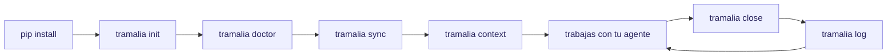
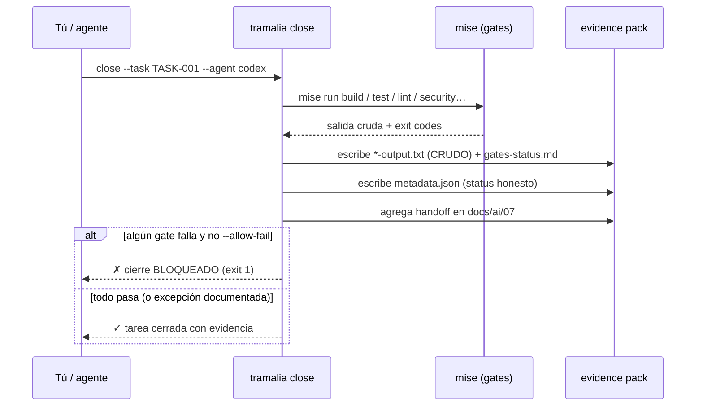

# Flujo completo, paso a paso

Este es el recorrido real de un proyecto gobernado por Tramalia, desde cero hasta el cierre auditable de una tarea. El camino recomendado **lidera con `tramalia close`**.

## Vista general



## El ritual de cierre por dentro



## 1. Instalar Tramalia (solo Python)

```bash
pip install -e ".[pretty]"   # núcleo + modo bonito (Rich + Questionary)
```

Tramalia ya corre. Sin Node, sin servicios cloud.

## 2. Inicializar la convención

```bash
tramalia init
```

Deja en tu repo, idempotente (no pisa lo existente):

```text
AGENTS.md              # reglas únicas para todos los agentes
CLAUDE.md              # → @AGENTS.md (sin duplicar)
docs/ai/               # convención completa 00-11 (arquitectura, reglas, ADR, handoff…)
specs/                 # constitution · specification · plan · tasks · checklist
.claude/agents/        # 5 subagentes con ruteo de modelo (planificador→opus, ejecutor→inherit…)
mise.toml              # tools + gates a la medida del stack detectado
.mcp.json              # Serena (Engram si está; Headroom/Ponytail con --with-*)
.tramalia/             # config, current-task, skills.toml, 13 skills, context/, evidence/
```

## 3. Ver qué falta instalar

```bash
tramalia doctor
```

Clasifica en **bootstrap** (mise/git/uv), **stack** (node/dotnet…) y **feature/gate** (semgrep, sqlfluff, lighthouse, engram, headroom…). Marca lo que requiere Node. Una vez que tengas `mise`:

```bash
mise install          # instala todo lo declarado en mise.toml
```

## 4. Propagar reglas a otros agentes (interop)

```bash
tramalia sync         # rulesync: AGENTS.md → Cursor, Copilot, Cline…
```

## 5. Refrescar contexto (ahorro de tokens)

```bash
tramalia context      # tech-stack + project-map (Repomix si está; si no, árbol stdlib)
```

Luego trabajas con tu agente (Claude/Codex/…), que lee `AGENTS.md` + `docs/ai/`.

## 6. Cerrar la tarea (el corazón del producto)

```bash
tramalia close --task TASK-001 --agent codex --reviewer claude
```

Esto, en un paso:

1. Corre cada gate (`mise run build/test/lint/security/database/ux`).
2. Escribe la **salida cruda** de cada uno en `.tramalia/evidence/<fecha>-TASK-001/*-output.txt`.
3. Genera **`metadata.json`** con `status` honesto.
4. Agrega el **handoff** en `docs/ai/07-handoff-agentes.md`.
5. **Bloquea** el cierre (exit 1) si un gate falla, salvo `--allow-fail` con la excepción anotada en `risks.md`.

Resultado típico del pack:

```text
.tramalia/evidence/2026-06-30-1015-TASK-001/
├── metadata.json        ← auditoría estructurada
├── gates-status.md
├── build-output.txt     ← CRUDO, oficial
├── test-output.txt      ← CRUDO, oficial
├── security-output.txt  ← CRUDO, oficial
├── summary.md · risks.md · rollback.md · next-steps.md
```

`metadata.json` se ve así:

```json
{
  "task": "TASK-001",
  "agent": "codex",
  "reviewer": "claude",
  "started_at": "2026-06-30T10:15:00-04:00",
  "closed_at": "2026-06-30T10:22:00-04:00",
  "status": "passed",
  "allow_fail": false,
  "gates_ran": true,
  "gates": { "build": { "status": "passed", "exit_code": 0, "output": "build-output.txt" } },
  "handoff": "docs/ai/07-handoff-agentes.md",
  "evidence_dir": ".tramalia/evidence/2026-06-30-1015-TASK-001"
}
```

!!! warning "Estado honesto"
    Un fallo forzado con `--allow-fail` se registra como `passed_with_exceptions`, **nunca** como `passed`. Sin mise, el estado es `no_gates`. La auditoría no se maquilla.

## 7. Revisar la pista de auditoría

```bash
tramalia log
```

```text
i pista de auditoría — 3 cierres (más reciente primero):
✓ 2026-06-30-1015-TASK-001  ·  ✓ passed  ·  codex
⚠ 2026-06-29-1740-TASK-000  ·  ⚠ con excepciones (forzado)  ·  claude
○ 2026-06-28-0930-SETUP     ·  ○ sin gates
```

## 8. Mantenimiento

```bash
tramalia update       # mise upgrade + (futuro) copier update + skills sync
```

## Standalone vs. con herramientas

El **núcleo** (`init`, `doctor`, `close`, `log`, `evidence`, `handoff`) funciona **solo con Python**. Si `mise` y las demás no están, Tramalia sigue gobernando y registra las ausencias como **excepciones documentadas**. Puedes trabajar **solo con Tramalia** o **combinarla** con Gentle-AI, Engram, Headroom y el resto del [ecosistema](ecosistema.md).
