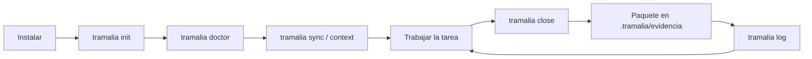
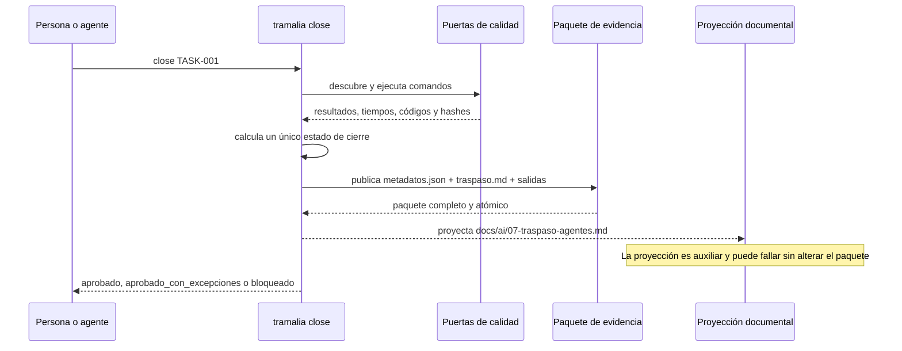

# Flujo completo, paso a paso

Este es el recorrido recomendado de un proyecto gobernado por Tramalia: preparar
el repositorio, trabajar una tarea, verificarla y publicar un cierre auditable.
La CLI y `tramalia ui` consumen el mismo núcleo; la interfaz no redefine las
reglas ni recalcula el resultado.

## Vista general



## Qué es una puerta de calidad (gate)

Una **puerta de calidad** —también llamada *quality gate* o simplemente *gate*—
es un control automatizado que una tarea debe superar antes de cerrarse. Por
ejemplo: compilar, ejecutar tests, revisar formato, buscar vulnerabilidades o
validar una migración. No es un servicio aparte: en Tramalia es un comando
declarado en `mise.toml`, ejecutado con argumentos exactos y registrado con su
duración, código de salida, archivo de salida y hash.

Tramalia aplica una política **cerrada ante fallos** (*fail-closed*): una puerta
fallida, una configuración inválida, la ausencia del ejecutor o la falta total de
puertas nunca se interpreta como éxito. El cierre queda `bloqueado`, salvo que
cada fallo esté cubierto por una excepción formal, revisada y vigente.

Los estados agregados de las puertas son:

| Estado formal | Significado |
|---|---|
| `aprobado` | Todas las puertas requeridas terminaron correctamente. |
| `fallido` | Al menos una puerta terminó con resultado fallido. |
| `ejecutor_no_disponible` | No se pudo usar `mise` u otro ejecutor requerido. |
| `sin_configurar` | No hay puertas declaradas; no equivale a aprobación. |
| `configuracion_invalida` | La declaración de puertas no cumple el esquema. |
| `error_ejecucion` | Ocurrió un error al lanzar o controlar un comando. |

El cierre definitivo sólo usa `aprobado`, `aprobado_con_excepciones` o
`bloqueado`.

## El cierre por dentro



## 1. Instalar Tramalia

```bash
pip install tramalia-cli
```

El núcleo funciona con Python. Las integraciones opcionales se diagnostican por
separado y nunca ocultan sus errores.

## 2. Inicializar la convención

| CLI | TUI |
|---|---|
| `tramalia init` | pestaña **Resumen** → **Inicializar** |

La inicialización es idempotente y crea, sin sobrescribir archivos existentes:

```text
AGENTS.md
CLAUDE.md
docs/ai/                         # reglas y proyección visible del traspaso
specs/                           # constitución, especificación, plan y tareas
.claude/agents/                  # subagentes de gobierno
mise.toml                        # herramientas y puertas del stack
.mcp.json
.tramalia/
├── config.json
├── current-task.md
├── context/
├── habilidades/
└── evidencia/                   # paquetes formales, ignorados por Git
```

`init` detecta el stack y los agentes CLI disponibles para proponer valores
iniciales. `tramalia upgrade` incorpora archivos nuevos de la convención sin
pisar las personalizaciones del proyecto.

## 3. Diagnosticar herramientas

| CLI | TUI |
|---|---|
| `tramalia doctor` | pestaña **Resumen** |

`doctor` distingue herramientas base, toolchains del stack e integraciones
opcionales. Cuando corresponda:

```bash
tramalia doctor --fix
mise install
```

Que una herramienta sea opcional sólo significa que su capacidad puede no haber
sido solicitada. Si una puerta requerida depende de ella y no está disponible,
el cierre se bloquea.

## 4. Propagar reglas y construir contexto

```bash
tramalia sync
tramalia context set serena
tramalia context
```

`sync` traduce `AGENTS.md` a los formatos compatibles. `context set` elige un
único backend de navegación y `context` refresca la memoria derivada del
proyecto. Ninguno de estos comandos sustituye el paquete de evidencia.

## 5. Preparar y trabajar una tarea

Registra las tareas en `specs/tasks.md` y, si quieres que `close` resuelva el ID
automáticamente, declara la actual en `.tramalia/current-task.md`. Los ID admiten
de 1 a 64 caracteres ASCII: letras, números, punto, guion y guion bajo; no se
aceptan rutas, `..` ni nombres reservados del sistema.

Trabaja con el agente que prefieras. Los campos `agente`, `revisor` y `modelo`
son datos de auditoría declarados; no prueban criptográficamente una identidad ni
hacen que `close` invoque un modelo.

## 6. Cerrar la tarea

| CLI | TUI |
|---|---|
| `tramalia close TASK-001` | pestaña **Cierre** → **Ejecutar cierre** |

```bash
tramalia close TASK-001
```

El núcleo inspecciona el proyecto, carga las puertas, ejecuta los comandos,
evalúa métricas y umbrales, calcula el estado una sola vez y publica el paquete.
Las salidas crudas permanecen en archivos separados: el resumen o una
compresión nunca las reemplaza.

Una excepción no es un interruptor genérico. Para cubrir un fallo debe declarar
razón, riesgo aceptado, control afectado, referencia, revisor y una expiración o
condición de remediación. `--allow-fail` se conserva como alias de compatibilidad,
pero no puede aprobar sin esos datos completos.

## 7. Entender el paquete formal v1

Cada operación crea una identidad única y publica el directorio de forma
atómica. Un paquete final nunca aparece a medio escribir:

```text
.tramalia/evidencia/20260713T183012.123456Z-a1b2c3d4/
├── metadatos.json       # contrato estructurado v1
├── traspaso.md          # traspaso canónico de este paquete
└── test-salida.txt      # salida cruda, con hash en los metadatos
```

`metadatos.json` usa claves y estados formales en español ASCII. Ejemplo
abreviado, pero con las secciones obligatorias:

```json
{
  "version_esquema": 1,
  "id_paquete": "20260713T183012.123456Z-a1b2c3d4",
  "id_tarea": "TASK-001",
  "operacion": "cierre",
  "inicio_utc": "2026-07-13T18:30:12.123456Z",
  "fin_utc": "2026-07-13T18:30:18.123456Z",
  "entorno": {
    "tramalia": "0.34.0b1",
    "python": "3.13.5",
    "sistema_operativo": "Windows-11",
    "cadena_herramientas": {"mise": "2026.7.0", "pytest": "9.0.0"}
  },
  "git": {
    "commit": "0123456789abcdef",
    "rama": "main",
    "limpio": false,
    "base_comparacion": "origin/main",
    "rastreados": ["tramalia/core/operaciones.py"],
    "preparados": [],
    "no_rastreados": [],
    "renombrados": [],
    "eliminados": []
  },
  "comandos": [{
    "nombre": "test",
    "comando": ["mise", "run", "test"],
    "estado": "aprobado",
    "inicio_utc": "2026-07-13T18:30:13.000000Z",
    "fin_utc": "2026-07-13T18:30:17.000000Z",
    "duracion_segundos": 4.0,
    "codigo_salida": 0,
    "hash_salida": "0000000000000000000000000000000000000000000000000000000000000000",
    "archivo_salida": "test-salida.txt"
  }],
  "puertas": {
    "estado": "aprobado",
    "descubiertas": ["test"],
    "ejecutadas": ["test"],
    "omitidas": [],
    "fallidas": [],
    "errores_validacion": []
  },
  "estado_cierre": "aprobado",
  "agente": "codex",
  "modelo": null,
  "metricas": {},
  "umbrales": {},
  "errores_validacion": [],
  "excepciones": [],
  "vinculo_traspaso": "traspaso.md"
}
```

Las marcas de tiempo son UTC y deben estar ordenadas. Los hashes SHA-256 enlazan
cada resultado ejecutado con su salida. Rutas inseguras, números no finitos,
enums desconocidos o estructuras truncadas invalidan la entrada; Tramalia no
intenta adivinar el resultado desde Markdown.

## 8. Traspaso canónico y proyección visible

El traspaso que pertenece a un cierre es
`.tramalia/evidencia/<id_paquete>/traspaso.md`. Ésa es la única fuente canónica:
incluye la identidad del paquete y la tarea, el estado ya calculado, bloqueos,
excepciones, agente y revisor, sin copiar las salidas crudas.

`docs/ai/07-traspaso-agentes.md` es una **proyección** del último traspaso y
contiene un enlace relativo al archivo canónico. Se actualiza de forma atómica y
con esfuerzo razonable. Un problema de permisos o de escritura en `docs/ai/` no
modifica el paquete ni convierte un cierre válido en fallo.

El comando público conserva su nombre por compatibilidad:

```bash
tramalia handoff TASK-001
```

En la documentación y los archivos generados, *handoff* se presenta como
**traspaso**.

## 9. Consultar la bitácora

| CLI | TUI |
|---|---|
| `tramalia log` | pestaña **Auditoría** |

La bitácora lee exclusivamente
`.tramalia/evidencia/*/metadatos.json`, ordena por `id_paquete` descendente e
ignora directorios temporales. No reconstruye estados desde documentos
históricos.

```text
✓ 20260713T183012.123456Z-a1b2c3d4 · aprobado · TASK-001 · codex
⚠ 20260713T170200.654321Z-b2c3d4e5 · aprobado_con_excepciones · TASK-000
✗ paquete-corrupto · invalida · metadatos formales no legibles
```

Una entrada corrupta se muestra como `invalida` sin impedir que las demás se
consulten. El mensaje de error es seguro y no expone contenido de salidas ni
rutas sensibles.

## 10. Replanificar y mantener

`specs/tasks.md` sigue siendo el plan versionado: puedes modificar libremente
tareas futuras, pero un cierre pasado permanece inmutable en su paquete. Para
mantener el entorno:

```bash
pip install -U tramalia-cli
tramalia upgrade
tramalia update
# Sólo cuando quieras avanzar explícitamente uno o todos los locks Team:
tramalia skills update [nombre]
```

- `upgrade` incorpora archivos nuevos de la convención sin sobrescribir los
  existentes.
- `update` actualiza mise y rehidrata las skills declaradas en sus SHA fijados; no mueve bloqueos Team.
- `skills update [nombre]` mueve explícitamente uno o todos los bloqueos Team después de verificar el nuevo SHA.
- PyPI distribuye el paquete; GitHub Pages publica la documentación; los releases
  de GitHub registran versiones. Son canales separados y deben verificarse por
  separado.

El núcleo (`init`, `doctor`, `close`, `log`, `evidence`, `handoff`) puede operar
con Python. Las puertas e integraciones amplían sus capacidades, pero nunca
cambian el principio central: un resultado sólo se aprueba cuando existe
evidencia formal suficiente.
