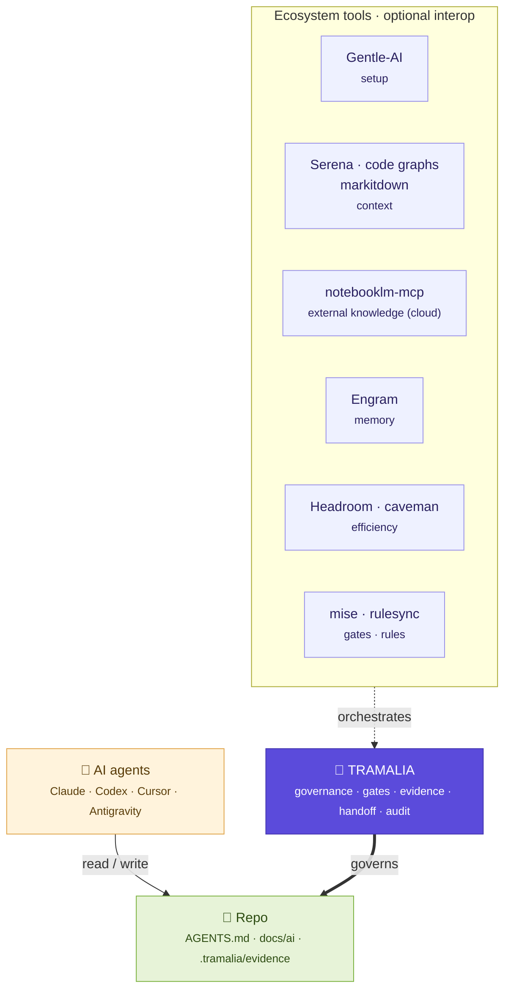

# Tramalia

**Governance and verifiable evidence for building with multiple AI agents. Repo-first.**

!!! quote ""
    **Git governs human collaboration; Tramalia governs agentic collaboration.** It's the change control + audit trail for when several AI agents work on a real project: shared rules, mandatory validations, and verifiable evidence for every close.

Tramalia is a **repo-first layer** that ensures *any* agent (Claude Code, Codex, Cursor, Antigravity…) touching the project works under the same rules, runs validations, documents its decisions, leaves verifiable evidence, and hands off clearly. It does this by **orchestrating external tools** instead of reimplementing them.

-   :material-gavel:{ .lg .middle } __Repo-first governance__

    ---

    Shared rules (`AGENTS.md`), mandatory gates and enforcement at close. All versioned in the repo, not hidden in global configs.

    [:octicons-arrow-right-24: Architecture](arquitectura.md)

-   :material-clipboard-check:{ .lg .middle } __Evidence & audit__

    ---

    `close` leaves an evidence pack with raw outputs + `metadata.json`; `log` is the verifiable audit trail of all agentic work.

    [:octicons-arrow-right-24: Commands](comandos.md)

-   :material-puzzle:{ .lg .middle } __Orchestrates, doesn't reimplement__

    ---

    Delegates to mise, Serena, Repomix, Semgrep, rulesync… The core runs standalone with Python only; external tools are optional interop.

    [:octicons-arrow-right-24: Ecosystem](ecosistema.md)

-   :material-rocket-launch:{ .lg .middle } __Start in 3 commands__

    ---

    `pip install`, `tramalia init`, `tramalia doctor`. No Node or cloud services to govern your repo.

    [:octicons-arrow-right-24: Installation](instalacion.md)

## Tramalia at the center of the ecosystem

Tramalia doesn't compete with the other AI tools: it **governs and orchestrates** them. Each occupies a distinct space; Tramalia is the core that ensures control, traceability and continuity.

<small>**Legend:** 🟪 Tramalia (core) · 🟦 tools (optional interop) · 🟨 AI agents · 🟩 the repository.</small>

In one line: **Gentle-AI** enables *which* agents to use, **Engram** helps *remember*, **Headroom/caveman** make tokens *cheaper*, **Serena and the code graphs** provide *code intelligence*, **markitdown** ingests documents, and **Tramalia** keeps the repo **controlled, traceable and consistent** — whatever the host (Claude Code, Codex, Antigravity…) or the kind of project (software or [data analytics](analitica.md)).

## Start here

- :material-download: [__Installation & requirements__](instalacion.md)
- :material-sitemap: [__Full workflow__](flujo-completo.md)
- :material-school: [__Full example__](ejemplo-completo.md) — a real project end to end: every own option and every third-party tool in action.
- :material-robot: [__How an AI works__](como-trabaja-ia.md) — analyze and plan before touching code; new vs. existing project.
- :material-monitor-dashboard: [__The interface (TUI)__](interfaz.md) — the bilingual (es/en) dashboard, tab by tab.
- :material-tools: [__Tools__](herramientas.md)
- :material-vector-link: [__Integrations__](interop.md)

Multi-host or a data project? See [Models & effort per host](multi-host.md) and [Analytics (Python/Databricks)](analitica.md).
