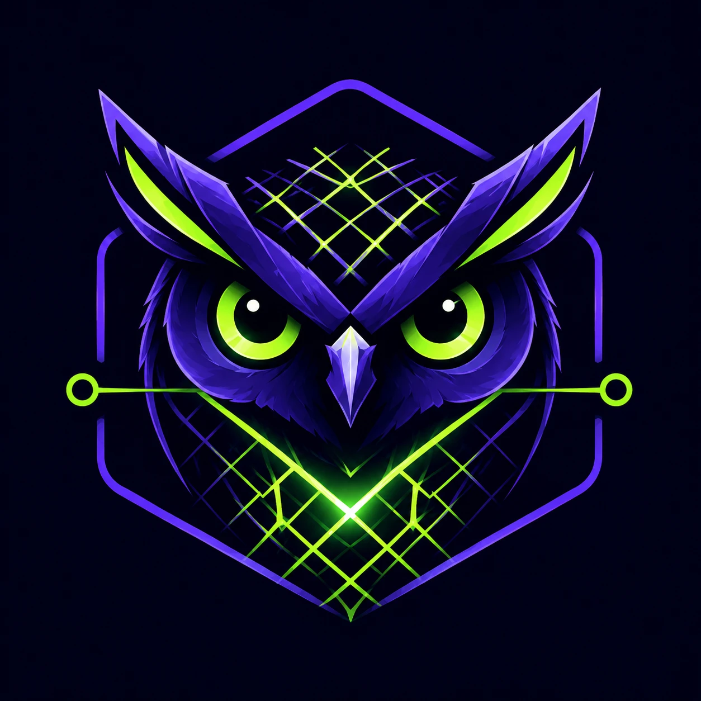
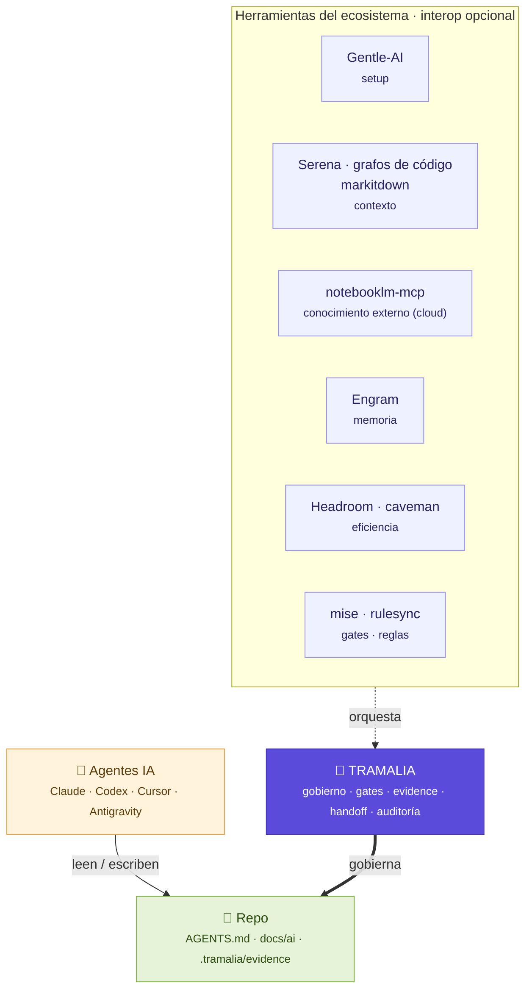

---
hide:
  - toc
---

Gobierno repo-first para agentes IA

# Gobernanza de repositorio para proyectos de IA multi-agente

**Reglas, gates, evidencia verificable y handoffs claros** para que tus agentes (Claude Code, Codex, Cursor, Antigravity…) trabajen alineados, bajo control y sin perder trazabilidad — todo versionado en tu repo, no en configs globales.

[Empezar ahora](instalacion.md){ .md-button .md-button--primary } [Ver arquitectura](arquitectura.md){ .md-button }

!!! quote ""
    **Git gobierna la colaboración humana; Tramalia gobierna la colaboración agéntica.** Es el control de cambios + pista de auditoría para cuando varios agentes IA trabajan un proyecto real: reglas comunes, validaciones obligatorias y evidencia verificable de cada cierre.

Tramalia es una **capa repo-first** que asegura que *cualquier* agente (Claude Code, Codex, Cursor, Antigravity…) que intervenga el proyecto trabaje bajo las mismas reglas, ejecute validaciones, documente sus decisiones, deje evidencia verificable y entregue un handoff claro. Lo hace **orquestando herramientas externas** en vez de reimplementarlas.

-   :material-gavel:{ .lg .middle } __Gobierno repo-first__

    ---

    Reglas comunes (`AGENTS.md`), gates obligatorios y enforcement en el cierre. Todo versionado en el repo, no escondido en configs globales.

    [:octicons-arrow-right-24: Arquitectura](arquitectura.md)

-   :material-clipboard-check:{ .lg .middle } __Evidencia y auditoría__

    ---

    `close` deja un evidence pack con salidas crudas + `metadata.json`; `log` es la pista de auditoría verificable de todo el trabajo agéntico.

    [:octicons-arrow-right-24: Comandos](comandos.md)

-   :material-puzzle:{ .lg .middle } __Orquesta, no reimplementa__

    ---

    Delega en mise, Serena, Repomix, Semgrep, rulesync… El núcleo funciona standalone con solo Python; lo externo es interop opcional.

    [:octicons-arrow-right-24: Ecosistema](ecosistema.md)

-   :material-rocket-launch:{ .lg .middle } __Empieza en 3 comandos__

    ---

    `pip install`, `tramalia init`, `tramalia doctor`. Sin Node ni servicios cloud para gobernar tu repo.

    [:octicons-arrow-right-24: Instalación](instalacion.md)

## Tramalia en el centro del ecosistema

Tramalia no compite con las demás herramientas IA: las **gobierna y orquesta**. Cada una ocupa un espacio distinto; Tramalia es el núcleo que asegura control, trazabilidad y continuidad.

<small>**Leyenda:** 🟪 Tramalia (núcleo) · 🟦 herramientas (interop opcional) · 🟨 agentes IA · 🟩 el repositorio.</small>

En una frase: **Gentle-AI** habilita *con qué* agentes trabajar, **Engram** ayuda a *recordar*, **Headroom/caveman** *abaratan* tokens, **Serena y los grafos de código** dan *inteligencia de código*, **markitdown** ingiere documentos, y **Tramalia** asegura que el repo se mantenga **controlado, trazable y consistente** — sea cual sea el host (Claude Code, Codex, Antigravity…) o el tipo de proyecto (software o [analítica de datos](analitica.md)).

## Empieza aquí

- :material-download: [__Instalación y requisitos__](instalacion.md) — qué instalar y por qué (incluido cuándo necesitas Node).
- :material-sitemap: [__Flujo completo__](flujo-completo.md) — de `init` a `close`, paso a paso con ejemplos.
- :material-school: [__Ejemplo completo__](ejemplo-completo.md) — un proyecto real de punta a punta: cada opción propia y cada herramienta de terceros en acción.
- :material-robot: [__Cómo trabaja una IA__](como-trabaja-ia.md) — los 4 pilares (planea · divide · verifica · reglas); proyecto nuevo vs. existente.
- :material-monitor-dashboard: [__La interfaz (TUI)__](interfaz.md) — el dashboard bilingüe (es/en), pestaña por pestaña.
- :material-tools: [__Herramientas__](herramientas.md) — cada pieza interna y externa, su alcance y licencia.
- :material-vector-link: [__Integraciones__](interop.md) — cómo instalar e integrar cada herramienta con Tramalia.

¿Multi-host o proyecto de datos? Ver [Modelos y esfuerzo por host](multi-host.md) y [Analítica (Python/Databricks)](analitica.md).
