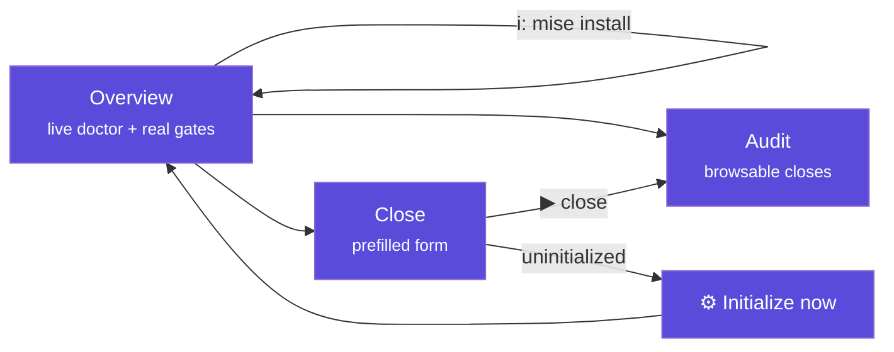

# The interface (TUI) explained

`tramalia ui` opens the terminal dashboard (Textual; the **Tramalia version** shows in the header title). This page explains **every element** of the interface, what it means and what you can do from it.



## Language

The interface shows in **your language** automatically (system locale; Spanish and English included). To force it:

```bash
TRAMALIA_LANG=en tramalia ui        # per session
```

…or permanently per project in `.tramalia/config.json`: `"language": "en"` (or `"es"` / `"auto"`). Adding a new language = adding a JSON in `tramalia/i18n/` — no code changes.

## Global shortcuts

| Key | Action |
|---|---|
| `q` | quit |
| `r` | refresh everything (doctor, audit, form) |
| `i` | **install missing tools** (see below) |
| `s` | **sync declared skills** (Skills tab) |
| `d` | open the selected tool's **documentation** |
| `c` | **cancel** the running install (moves on to the next) |
| `Esc` | **close** the install/skills panel if it's left open |
| `b` | choose the project's active **context backend** (see below) |

## Overview tab

- **Header**: the project's **full path** (so you always know where you are), the detected stack, and the state — `initialized` or `NOT initialized`.
- **Project gates**: the **real** gates read from your `mise.toml` (`build · test · lint · security…`). If there's no `mise.toml`, it tells you to run `init`.
- **Last close**: the most recent one from the audit, with its status.
- **Tools table** (the live doctor), **grouped by domain** — base (bootstrap) · project stack · **context · memory · security · database · UX/UI · analytics** · convention · agent CLIs — with four columns:
  - *tool* — the command.
  - *what for* — its role (security gate, context, agent CLI…).
  - *status* — clearly says installed or not: `✓ installed` (with version) · `○ not installed (optional)` · `✗ not installed (required)`.
  - *detail / how to get it* — detected version or the exact install command.

The table also includes the **agent CLIs detected** on your machine (claude, codex, antigravity, opencode, openclaw, hermes) — detection only: Tramalia never configures them.

### Installing from the interface (`i`)

Press `i` and a **multi-selector** opens with **all** missing tools (space marks, enter confirms). The ones **automatable on your system** appear selectable — each via its best route (winget/brew for binaries, `mise use` for gates, `uv tool` for Python, `npm` only when Node is present); the ones with **only a manual route** (e.g. codegraph, hermes) are listed separately with their command, so none is silently omitted. If the uv PATH needs configuring, the selector also includes that action (`uv tool update-shell`).

**Runtime prerequisites**: some tools only automate with a runtime (e.g. **engram** via `go install` needs **Go**; opencode/repomix via npm need **Node.js**). If that runtime is missing, the tool appears in the manual list marked *“requires Go”* and the selector **offers to install the runtime** (⬇ install Go → enables engram): install it, press `i` again, and the tool becomes automatable. In the doctor table, the *detail* column also marks *“· requires Go/Node”* when the runtime is absent.

Output streams **line by line, live**, in a panel beside the table — if an install gets stuck or asks for permissions, you see it instantly:

- **`c` cancels** the current tool and **moves on to the next** in your selection (a stuck one no longer blocks the rest).
- Each tool has a **time limit**; on expiry the process is terminated and the queue continues.
- If the error smells like permissions (winget/choco), the panel says it plainly: *"seems to need an ADMINISTRATOR terminal"*.

When it finishes, the table refreshes **for real** — the doctor also detects what isn't on PATH:

| Installed via | Why `which` misses it | How the doctor finds it |
|---|---|---|
| **mise** | shims off PATH until `mise activate` | queries `mise which` |
| **uv** | `~/.local/bin` never enters PATH on Windows (even after restart) unless `uv tool update-shell` | checks the folder directly |
| **Serena** (uvx) | never installed: ephemeral | `✓ via uvx — no install needed` |

Per-OS routes: [Installation](instalacion.md#automated-installation-per-system). The **`d`** key opens the selected tool's official documentation in your browser (a brief toast, no panel involved); **Esc** closes the install panel if it's left open.

## Context backend (`b` key)

If you have several code-navigation tools installed (Serena, CodeGraph,
codebase-memory-mcp, Graphify), the `b` key opens a **single-select** picker
(not multi, unlike the installer) with:

- Each one's **scope** (what it actually does) and its **ideal use case**
  (what kind of project it fits), so you choose with information.
- Which is **installed** (`✓`/`○`) and which is **active now** (marked
  "active"). The `✓`/`○` uses the same probe as `doctor`, so Serena —which runs
  ephemerally via `uvx`— shows installed if you have `uv` (not as missing).
- **Esc** closes the picker (same as Cancel).

The choice is **saved in the project** (`.tramalia/config.json →
context.backend`) — it's not a preference on your machine, it travels with
the repo. A line in Overview (*"context backend: X (active)"*) always shows
what's set. If you pick a backend you **don't** have installed, it's set anyway
(it's the project's preference) and Tramalia tells you how to get it. CLI
equivalent: `tramalia context set <backend>` / `context list`.

Repomix and markitdown don't show up in this picker: they're point-in-time
utilities (full snapshot / document ingestion), they don't compete for the
backend role.

## Skills tab

Manage skills without editing files by hand (the visual counterpart of [the skills guide](skills-guia.md)):

- **Grouped table**: the **16 own** skills (repo workflows, with their description) and the **external** ones from the `habilidades.toml` catalog — including the **commented** ones, shown as `○ available`.
- **Enter on an external one**: if it's not there, it **installs** it in one step (declares and clones); if it's already installed, it **updates** it (`git pull` of that one). The legend above recalls the 3 states and what each key does.
- **`s` key** updates **all** declared ones from their repos (`git`), with live results (`clonada` / `actualizada` / `error`) and a `✓ n/total` summary.
- **`u` key** checks the remotes for which skills have a **newer version** (`git ls-remote`) and marks the outdated ones with `⬆ update available`.
- **`d` key** opens the selected skill's docs (its source repo); for own skills, the site's skills guide.
- States: `✓ installed @sha` (folder present + version) · `◍ declared` (in the manifest, not cloned yet) · `○ available` (in the catalog, not even declared).
- If it detects external skills **committed to git** (which shouldn't be uploaded), it **warns** in yellow with the `git rm -r --cached` remedy.

There's also a **URL input**: paste any skill's git URL and Enter adds it to the manifest (then Enter on it, or `s`, clones it).

> External skills are **not committed to the repo** (the `.gitignore` that `init` drops excludes them) but they **aren't lost**: the `habilidades.toml` manifest re-hydrates them with `tramalia skills` after a `git clone`. Details in [the skills guide](skills-guia.md).

CLI equivalents: `tramalia skills list` · `enable <name>` · `disable <name>` · `add <url>` · `sync [<name>]` · `outdated`.

## Audit vs. Close (two different things)

Easy to confuse, but they're complementary opposites:

| | **Close** (Close tab) | **Audit** (Audit tab) |
|---|---|---|
| What it is | an **action**: closing a task | a **read**: the history |
| What it does | runs gates → writes evidence → handoff, and **blocks** if a gate fails | shows past closes (`tramalia log`) for inspection |
| When | when you finish a task | when you want to review what was done and how it turned out |
| Writes | creates a new evidence pack | writes nothing (read-only) |

In one line: **Close produces the evidence; Audit consults it.**

## Audit tab

- **Uninitialized project** → says so explicitly (there's no audit to show) and points you to the Initialize button.
- **No closes** → invites you to close your first task.
- **With closes** → a browsable table (close · status · agent and model); **Enter** on a row shows its full `metadata.json` on the right.

## Close tab

!!! info "First things first: `close` does NOT invoke any agent"
    This is the most common confusion. The *agent* and *reviewer* fields are an **audit record** — they note *who did* the work and *who reviews it*, so it lands in `metadata.json` and the handoff. Tramalia **doesn't pick or run** an AI during the close: what runs are the **gates** (build/test/lint/security…) via `mise`, which are validation tools, not agents. It doesn't matter that you have Claude and Codex installed at the same time: the close doesn't "use" either — you already worked the task with whichever agent you wanted, and here you just declare which one it was.

- **Uninitialized project** → the form hides and the **"⚙ Initialize now"** button appears, which runs the equivalent of `tramalia init` and refreshes. Closing is **blocked** until initialized (governing without a convention makes no sense).
- **Initialized project** → the form comes **prefilled with the project's real values** (not examples):
  - *task* ← the ID from `.tramalia/current-task.md` (if you declared it);
  - *agent* and *reviewer* ← `config.json → agents.primary/reviewer` — which `init` fills with the **agent CLIs it detected installed** on your machine, as a record suggestion (two detected → the first is noted as executor and the second as reviewer; one only → both; none → `codex`/`claude` as an editable example). If you worked this task with a different agent, just type its name — it's free text, not a selection;
  - *model* ← **optional**: the model name you used (e.g. `claude-opus-4-8`), just so it's recorded in `tramalia log` — it doesn't block the close if left empty.
- As you type a task ID, the interface **looks it up in `specs/tasks.md` and shows its description** (scope, applicable gates). If it doesn't exist, it warns you to add it — so the close stays traceable.
- **▶ Run close** runs the full ritual and streams the gate-by-gate output. The final message is honest:
  - `✓ closed with verifiable evidence` — green gates;
  - `○ closed with a documented EXCEPTION` — no mise, gates didn't run (install it for real validation);
  - `✗ BLOCKED` — a gate failed.

## Full walkthrough: from Close to Audit

Here's what it looks like in practice, start to finish — the sequence you'll repeat day to day:

1. **You finished working a task with your agent** (Claude, Codex…) — the code is written, it just needs to be formally closed.
2. **You open `tramalia ui`** and go to the **Close** tab. If the project is initialized, the form already has *agent* and *reviewer* prefilled (whatever `init` detected) — you don't type anything there unless you want to change them for this particular close.
3. **You type the task ID** (e.g. `TASK-007`) into the *task* field. The interface looks that ID up in `specs/tasks.md` **live** and shows its description below — so you confirm you're closing the right task before running anything. If the ID doesn't exist in `specs/tasks.md`, it warns you (add it there first: that way the close stays traceable against a real plan, not loose text).
4. **(Optional) you type the model** you used, only if you care that the audit trail records which model closed this task.
5. **You press ▶ Run close.** You see **live gate-by-gate output** (build, test, lint, security…) — it's not a blind progress bar, it's each tool's real output.
6. **The final message is honest**, one of three:
   - `✓ closed with verifiable evidence` — every gate passed clean.
   - `○ closed with a documented EXCEPTION` — no `mise` was present, so gates didn't run; it's recorded as an exception, **not** as success.
   - `✗ BLOCKED` — a gate failed; the task is **not** considered closed (unless you force it with `--allow-fail` and document why).
7. **You switch to the Audit tab.** Right at the top (newest first) is the row for the task you just closed — with its status and agent/model.
8. **You press Enter on that row.** On the right, the full `metadata.json` for that close appears: which gates ran, their exit codes, who executed and who reviewed, when it started and when it finished.
9. **The evidence pack sits on disk**, under `.tramalia/evidence/<date>-TASK-007/`, with each gate's **raw** output — that's the verifiable evidence the whole product is about: not a rewritten summary, the actual output of `mise run build/test/lint/security` as it came out.

That cycle — Close writes, Audit reads — is, day to day, what "working with Tramalia" means: every finished task goes through this before it counts as done, and it leaves a trail anyone (you, a reviewer, another agent in another session) can reconstruct without having to take anyone's word for it.

## Relationship with the CLI

Everything the interface does also exists as a command (`close`, `log`, `doctor`, `init`, `mise install`) — the TUI **only reads and invokes the core**, it never has its own logic. You can switch between both freely.
