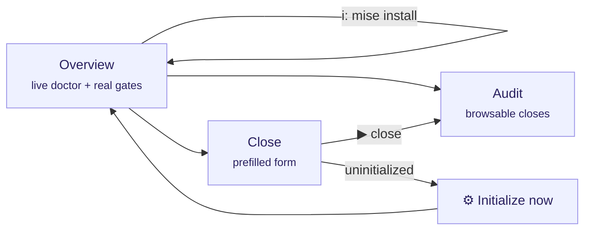

# The interface (TUI) explained

`tramalia ui` opens the terminal dashboard (Textual). This page explains **every element** of the interface, what it means and what you can do from it.



## Language

The interface shows in **your language** automatically (system locale; Spanish and English included). To force it:

```bash
TRAMALIA_LANG=en tramalia ui        # per session
```

…or permanently per project in `.tramalia/config.json`: `"language": "en"` (or `"es"` / `"auto"`). Adding a new language = adding a JSON in `tramalia/i18n/` — no code changes.

## Global shortcuts

| Key | Action |
|---|---|
| `q` | quit |
| `r` | refresh everything (doctor, audit, form) |
| `i` | **install missing tools** (see below) |
| `s` | **sync declared skills** (Skills tab) |
| `d` | open the selected tool's **documentation** |
| `c` | **cancel** the running install (moves on to the next) |
| `Esc` | **close** the install/skills panel if it's left open |

## Overview tab

- **Header**: the project's **full path** (so you always know where you are), the detected stack, and the state — `initialized` or `NOT initialized`.
- **Project gates**: the **real** gates read from your `mise.toml` (`build · test · lint · security…`). If there's no `mise.toml`, it tells you to run `init`.
- **Last close**: the most recent one from the audit, with its status.
- **Tools table** (the live doctor), **grouped** into sections — base (bootstrap) · project stack · gates & features · agent CLIs — with four columns:
  - *tool* — the command.
  - *what for* — its role (security gate, context, agent CLI…).
  - *status* — `✓ ok` (installed, with version) · `○ optional` (only if you use that feature) · `✗ missing` (required).
  - *detail / how to get it* — detected version or the exact install command.

The table also includes the **agent CLIs detected** on your machine (claude, codex, antigravity, opencode, openclaw, hermes) — detection only: Tramalia never configures them.

### Installing from the interface (`i`)

Press `i` and a **multi-selector** opens with the missing tools that can be installed automatically on **your system** (space marks, enter confirms). Each one installs through its best available route — winget/brew for binaries, `mise use` for gates, `uv tool` for Python, `npm` only when Node is present. Tools without an automated route show their manual command in the table's *detail* column.

Output streams **line by line, live**, in a panel beside the table — if an install gets stuck or asks for permissions, you see it instantly:

- **`c` cancels** the current tool and **moves on to the next** in your selection (a stuck one no longer blocks the rest).
- Each tool has a **time limit**; on expiry the process is terminated and the queue continues.
- If the error smells like permissions (winget/choco), the panel says it plainly: *"seems to need an ADMINISTRATOR terminal"*.

When it finishes, the table refreshes **for real** — the doctor also detects what isn't on PATH:

| Installed via | Why `which` misses it | How the doctor finds it |
|---|---|---|
| **mise** | shims off PATH until `mise activate` | queries `mise which` |
| **uv** | `~/.local/bin` never enters PATH on Windows (even after restart) unless `uv tool update-shell` | checks the folder directly |
| **Serena** (uvx) | never installed: ephemeral | `✓ via uvx — no install needed` |

Per-OS routes: [Installation](instalacion.md#automated-installation-per-system). The **`d`** key opens the selected tool's official documentation in your browser (a brief toast, no panel involved); **Esc** closes the install panel if it's left open.

## Skills tab

Manage skills without editing files by hand (the visual counterpart of [the skills guide](skills-guia.md)):

- **Grouped table**: the **16 own** skills (repo workflows, with their description) and the **external** ones from the `skills.toml` catalog — including the **commented** ones, shown as `○ available`.
- **Enter on an external one** toggles it (comments/uncomments its block in `skills.toml` conservatively: if the block isn't recognized with certainty, nothing is touched and it says so).
- **`s` key** syncs: clones/updates the declared ones from their repos (`git`), with live results (`clonada` / `actualizada` / `error`).
- States: `✓ installed` (folder present) · `◍ declared` (enabled, needs sync) · `○ available` (in catalog).

There's also a **URL input**: paste any skill's git URL and Enter adds it to the manifest (then `s` clones it).

CLI equivalents: `tramalia skills list` · `enable <name>` · `disable <name>` · `add <url>` · `sync`.

## Audit tab

- **Uninitialized project** → says so explicitly (there's no audit to show) and points you to the Initialize button.
- **No closes** → invites you to close your first task.
- **With closes** → a browsable table (close · status · agent and model); **Enter** on a row shows its full `metadata.json` on the right.

## Close tab

- **Uninitialized project** → the form hides and the **"⚙ Initialize now"** button appears, which runs the equivalent of `tramalia init` and refreshes. Closing is **blocked** until initialized (governing without a convention makes no sense).
- **Initialized project** → the form comes **prefilled with the project's real values** (not examples):
  - *task* ← the ID from `.tramalia/current-task.md` (if you declared it);
  - *executing agent* and *reviewer* ← `config.json → agents.primary/reviewer`;
  - *model* ← optional, recorded in the audit.
- As you type a task ID, the interface **looks it up in `specs/tasks.md` and shows its description** (scope, applicable gates). If it doesn't exist, it warns you to add it — so the close stays traceable.
- **▶ Run close** runs the full ritual and streams the gate-by-gate output. The final message is honest:
  - `✓ closed with verifiable evidence` — green gates;
  - `○ closed with a documented EXCEPTION` — no mise, gates didn't run (install it for real validation);
  - `✗ BLOCKED` — a gate failed.

## Relationship with the CLI

Everything the interface does also exists as a command (`close`, `log`, `doctor`, `init`, `mise install`) — the TUI **only reads and invokes the core**, it never has its own logic. You can switch between both freely.
