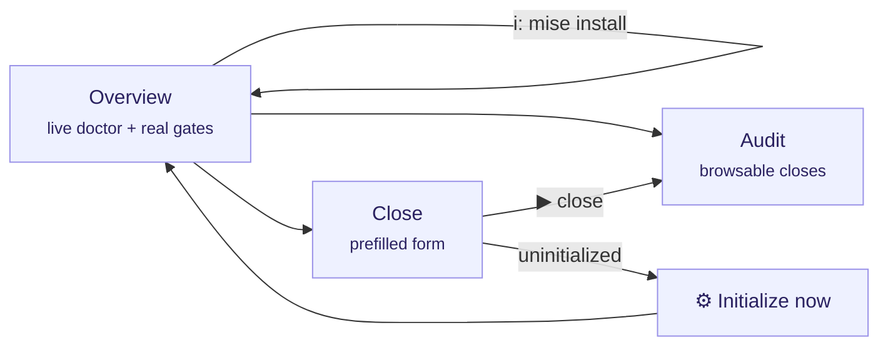

# The interface (TUI) explained

`tramalia ui` opens the terminal dashboard (Textual). This page explains **every element** of the interface, what it means and what you can do from it.



## Language

The interface shows in **your language** automatically (system locale; Spanish and English included). To force it:

```bash
TRAMALIA_LANG=en tramalia ui        # per session
```

…or permanently per project in `.tramalia/config.json`: `"language": "en"` (or `"es"` / `"auto"`). Adding a new language = adding a JSON in `tramalia/i18n/` — no code changes.

## Global shortcuts

| Key | Action |
|---|---|
| `q` | quit |
| `r` | refresh everything (doctor, audit, form) |
| `i` | **install missing tools** (see below) |

## Overview tab

- **Header**: the project's **full path** (so you always know where you are), the detected stack, and the state — `initialized` or `NOT initialized`.
- **Project gates**: the **real** gates read from your `mise.toml` (`build · test · lint · security…`). If there's no `mise.toml`, it tells you to run `init`.
- **Last close**: the most recent one from the audit, with its status.
- **Tools table** (the live doctor), **grouped** into sections — base (bootstrap) · project stack · gates & features · agent CLIs — with four columns:
  - *tool* — the command.
  - *what for* — its role (security gate, context, agent CLI…).
  - *status* — `✓ ok` (installed, with version) · `○ optional` (only if you use that feature) · `✗ missing` (required).
  - *detail / how to get it* — detected version or the exact install command.

The table also includes the **agent CLIs detected** on your machine (claude, codex, antigravity, gemini, opencode) — detection only: Tramalia never configures them.

### Installing from the interface (`i`)

Press `i` and a **multi-selector** opens with the missing tools that can be installed automatically on **your system** (space marks, enter confirms). Each one installs through its best available route — winget/brew for binaries, `mise use` for gates, `uv tool` for Python, `npm` only when Node is present — and the output streams live in a panel **inside Overview** (no more tab jumping). Tools without an automated route show up in the panel with their manual command.

When it finishes, the table refreshes for real: tools installed by mise live behind its **shims** (not on PATH until `mise activate` or a terminal restart), and the doctor now detects them anyway by querying `mise which` — you'll see *"installed via mise (shims)"* instead of a false "missing". Per-OS routes: [Installation](instalacion.md#automated-installation-per-system).

## Audit tab

- **Uninitialized project** → says so explicitly (there's no audit to show) and points you to the Initialize button.
- **No closes** → invites you to close your first task.
- **With closes** → a browsable table (close · status · agent and model); **Enter** on a row shows its full `metadata.json` on the right.

## Close tab

- **Uninitialized project** → the form hides and the **"⚙ Initialize now"** button appears, which runs the equivalent of `tramalia init` and refreshes. Closing is **blocked** until initialized (governing without a convention makes no sense).
- **Initialized project** → the form comes **prefilled with the project's real values** (not examples):
  - *task* ← the ID from `.tramalia/current-task.md` (if you declared it);
  - *executing agent* and *reviewer* ← `config.json → agents.primary/reviewer`;
  - *model* ← optional, recorded in the audit.
- As you type a task ID, the interface **looks it up in `specs/tasks.md` and shows its description** (scope, applicable gates). If it doesn't exist, it warns you to add it — so the close stays traceable.
- **▶ Run close** runs the full ritual and streams the gate-by-gate output. The final message is honest:
  - `✓ closed with verifiable evidence` — green gates;
  - `○ closed with a documented EXCEPTION` — no mise, gates didn't run (install it for real validation);
  - `✗ BLOCKED` — a gate failed.

## Relationship with the CLI

Everything the interface does also exists as a command (`close`, `log`, `doctor`, `init`, `mise install`) — the TUI **only reads and invokes the core**, it never has its own logic. You can switch between both freely.
