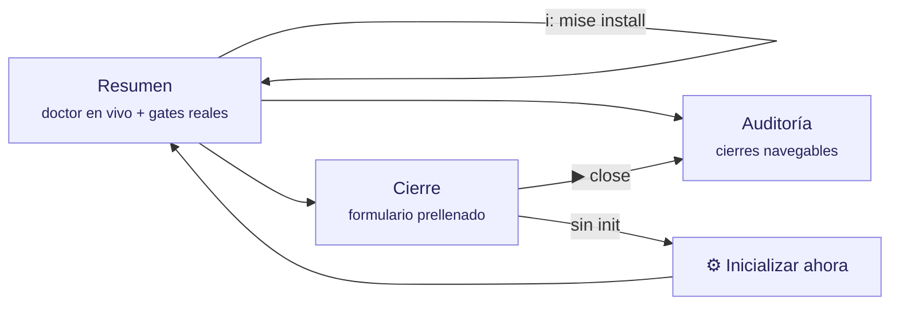

# La interfaz (TUI) explicada

`tramalia ui` abre el dashboard en la terminal (Textual). Esta página explica **cada elemento** de la interfaz, qué significa y qué puedes hacer desde ella.



## Idioma

La interfaz se muestra en **tu idioma** automáticamente (locale del sistema; español e inglés incluidos). Para forzarlo:

```bash
TRAMALIA_LANG=en tramalia ui        # por sesión
```

…o de forma permanente por proyecto en `.tramalia/config.json`: `"language": "es"` (o `"en"` / `"auto"`). Agregar un idioma nuevo = agregar un JSON en `tramalia/i18n/` — sin tocar código.

## Atajos globales

| Tecla | Acción |
|---|---|
| `q` | salir |
| `r` | refrescar todo (doctor, auditoría, formulario) |
| `i` | **instalar herramientas faltantes** (ver abajo) |
| `s` | **sincronizar skills** declaradas (pestaña Skills) |
| `d` | abrir la **documentación** de la herramienta seleccionada |
| `c` | **cancelar** la instalación en curso (sigue con la próxima) |
| `Esc` | **cerrar** el panel de instalación/skills si quedó abierto |

## Pestaña Resumen

- **Cabecera**: la **ruta completa** del proyecto (para saber siempre dónde estás), el stack detectado y el estado — `inicializado` o `SIN inicializar`.
- **Gates del proyecto**: los gates **reales** leídos de tu `mise.toml` (`build · test · lint · security…`). Si no hay `mise.toml`, te indica ejecutar `init`.
- **Último cierre**: el más reciente de la auditoría, con su estado.
- **Tabla de herramientas** (el doctor en vivo), **agrupada por dominio** — base (bootstrap) · stack del proyecto · **contexto · memoria · seguridad · base de datos · UX/UI · analítica** · convención · agentes CLI — con cuatro columnas:
  - *herramienta* — el comando.
  - *para qué* — su rol (gate de seguridad, contexto, agente CLI…).
  - *estado* — dice claramente si está o no: `✓ instalada` (con su versión) · `○ no instalada (opcional)` · `✗ no instalada (requerida)`.
  - *detalle / cómo obtenerla* — versión detectada o el comando de instalación exacto.

La tabla incluye también los **agentes CLI detectados** en tu máquina (claude, codex, antigravity, opencode, openclaw, hermes) — solo detección informativa: Tramalia nunca los configura.

### Instalar desde la interfaz (`i`)

Pulsa `i` y se abre un **selector múltiple** con **todas** las herramientas faltantes (espacio marca, enter confirma). Las **automatizables en tu sistema** aparecen marcables — cada una por su mejor vía (winget/brew para binarios, `mise use` para gates, `uv tool` para Python, `npm` solo si Node está presente); las que **solo tienen vía manual** (p. ej. codegraph, hermes) aparecen listadas aparte con su comando, para que ninguna se omita en silencio. Si el PATH de uv necesita configurarse, el selector incluye también esa acción (`uv tool update-shell`).

La salida corre **línea a línea en vivo** en un panel al costado de la tabla — si una instalación se queda pegada o pide permisos, lo ves al instante:

- **`c` cancela** la herramienta en curso y **sigue con la siguiente** de tu selección (una pegada ya no bloquea al resto).
- Cada herramienta tiene **tiempo límite**; al expirar, el proceso se termina y se continúa.
- Si el error huele a permisos (winget/choco), el panel te lo dice claro: *"parece requerir una terminal como ADMINISTRADOR"*.

Al terminar, la tabla se refresca **de verdad** — el doctor detecta también lo que no está en el PATH:

| Cómo se instaló | Por qué `which` no la ve | Cómo la detecta el doctor |
|---|---|---|
| vía **mise** | shims fuera del PATH hasta `mise activate` | consulta `mise which` |
| vía **uv** | `~/.local/bin` no entra al PATH en Windows (ni reiniciando) salvo `uv tool update-shell` | revisa la carpeta directamente |
| **Serena** (uvx) | no se instala: es efímera | `✓ vía uvx — no requiere instalación` |

Detalle de vías por SO: [Instalación](instalacion.md#instalacion-automatizada-por-sistema). Con la tecla **`d`** abres la documentación oficial de la herramienta seleccionada en el navegador (aviso breve, no ocupa panel); con **Esc** cierras el panel de instalación si quedó abierto.

## Pestaña Skills

Administra las skills sin editar archivos a mano (la contraparte visual de [la guía de skills](skills-guia.md)):

- **Tabla agrupada**: las **16 propias** (workflows del repo, con su descripción) y las **externas** del catálogo `skills.toml` — incluidas las **comentadas**, que aparecen como `○ disponible`.
- **Enter sobre una externa** la activa/desactiva (comenta/descomenta su bloque en `skills.toml` de forma conservadora: si el bloque no se reconoce con certeza, no toca nada y lo dice).
- **Tecla `s`** sincroniza: clona/actualiza las declaradas desde sus repos (`git`), con el resultado en vivo (`clonada` / `actualizada` / `error`).
- Estados: `✓ instalada` (carpeta presente) · `◍ declarada` (activa, falta sync) · `○ disponible` (en catálogo).

Hay además un **input de URL**: pega la URL git de cualquier skill y Enter la agrega al manifiesto (luego `s` la clona).

Equivalentes CLI: `tramalia skills list` · `enable <nombre>` · `disable <nombre>` · `add <url>` · `sync`.

## Auditoría vs. Cierre (dos cosas distintas)

Se confunden fácil, pero son opuestos complementarios:

| | **Cierre** (pestaña Cierre) | **Auditoría** (pestaña Auditoría) |
|---|---|---|
| Qué es | una **acción**: cerrar una tarea | una **lectura**: el historial |
| Qué hace | corre gates → escribe evidencia → handoff, y **bloquea** si un gate falla | muestra los cierres pasados (`tramalia log`) para inspeccionarlos |
| Cuándo | al terminar una tarea | cuando quieres revisar qué se hizo y cómo quedó |
| Escribe | crea un evidence pack nuevo | no escribe nada (solo lee) |

En una frase: **Cierre produce la evidencia; Auditoría la consulta.**

## Pestaña Auditoría

- **Proyecto sin inicializar** → lo dice explícitamente (no hay auditoría que mostrar) y te dirige al botón Inicializar.
- **Sin cierres** → te invita a cerrar tu primera tarea.
- **Con cierres** → tabla navegable (cierre · estado · agente y modelo); **Enter** sobre una fila muestra su `metadata.json` completo a la derecha.

## Pestaña Cierre

- **Proyecto sin inicializar** → el formulario se oculta y aparece el botón **"⚙ Inicializar ahora"**, que ejecuta el equivalente a `tramalia init` y refresca. El cierre está **bloqueado** hasta inicializar (no tiene sentido gobernar sin convención).
- **Proyecto inicializado** → el formulario viene **prellenado con los valores reales** del proyecto (no ejemplos):
  - *tarea* ← el ID de `.tramalia/current-task.md` (si lo declaraste);
  - *agente ejecutor* y *revisor* ← `config.json → agents.primary/reviewer`;
  - *modelo* ← opcional, queda registrado en la auditoría.
- Al escribir un ID de tarea, la interfaz **busca esa tarea en `specs/tasks.md` y muestra su descripción** (alcance, gates aplicables). Si no existe, te avisa para que la agregues — así el cierre queda trazado.
- **▶ Ejecutar close** corre el ritual completo y muestra la salida gate por gate. El mensaje final es honesto:
  - `✓ cerrada con evidencia verificable` — gates verdes;
  - `○ cerrada con EXCEPCIÓN documentada` — sin mise, los gates no corrieron (instálalo para validación real);
  - `✗ BLOQUEADO` — algún gate falló.

## Relación con el CLI

Todo lo que hace la interfaz existe también como comando (`close`, `log`, `doctor`, `init`, `mise install`) — la TUI **solo lee e invoca el core**, nunca tiene lógica propia. Puedes alternar libremente entre ambas.
