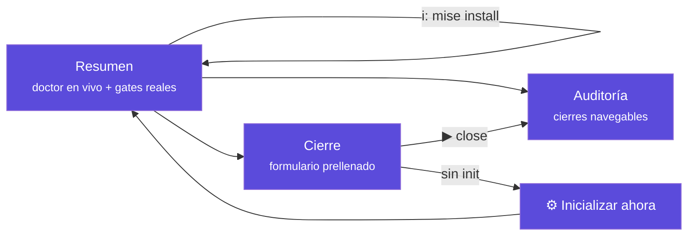

# La interfaz (TUI) explicada

`tramalia ui` abre el dashboard en la terminal (Textual; la **versión de Tramalia** aparece en el título de la cabecera). Esta página explica **cada elemento** de la interfaz, qué significa y qué puedes hacer desde ella.



## Idioma

La interfaz se muestra en **tu idioma** automáticamente (locale del sistema; español e inglés incluidos). Para forzarlo:

```bash
TRAMALIA_LANG=en tramalia ui        # por sesión
```

…o de forma permanente por proyecto en `.tramalia/config.json`: `"language": "es"` (o `"en"` / `"auto"`). Agregar un idioma nuevo = agregar un JSON en `tramalia/i18n/` — sin tocar código.

## Atajos globales

| Tecla | Acción |
|---|---|
| `q` | salir |
| `r` | refrescar todo (doctor, auditoría, formulario) |
| `i` | **instalar herramientas faltantes** (ver abajo) |
| `s` | **sincronizar skills** declaradas (pestaña Skills) |
| `d` | abrir la **documentación** de la herramienta seleccionada |
| `c` | **cancelar** la instalación en curso (sigue con la próxima) |
| `Esc` | **cerrar** el panel de instalación/skills si quedó abierto |
| `b` | elegir el **backend de contexto** activo del proyecto (ver abajo) |

## Pestaña Resumen

- **Cabecera**: la **ruta completa** del proyecto (para saber siempre dónde estás), el stack detectado y el estado — `inicializado` o `SIN inicializar`.
- **Gates del proyecto**: los gates **reales** leídos de tu `mise.toml` (`build · test · lint · security…`). Si no hay `mise.toml`, te indica ejecutar `init`.
- **Último cierre**: el más reciente de la auditoría, con su estado.
- **Tabla de herramientas** (el doctor en vivo), **agrupada por dominio** — base (bootstrap) · stack del proyecto · **contexto · memoria · seguridad · base de datos · UX/UI · analítica** · convención · agentes CLI — con cuatro columnas:
  - *herramienta* — el comando.
  - *para qué* — su rol (gate de seguridad, contexto, agente CLI…).
  - *estado* — dice claramente si está o no: `✓ instalada` (con su versión) · `○ no instalada (opcional)` · `✗ no instalada (requerida)`.
  - *detalle / cómo obtenerla* — versión detectada o el comando de instalación exacto.

La tabla incluye también los **agentes CLI detectados** en tu máquina (claude, codex, antigravity, opencode, openclaw, hermes) — solo detección informativa: Tramalia nunca los configura.

### Instalar desde la interfaz (`i`)

Pulsa `i` y se abre un **selector múltiple** con **todas** las herramientas faltantes (espacio marca, enter confirma). Las **automatizables en tu sistema** aparecen marcables — cada una por su mejor vía (winget/brew para binarios, `mise use` para gates, `uv tool` para Python, `npm` solo si Node está presente); las que **solo tienen vía manual** (p. ej. codegraph, hermes) aparecen listadas aparte con su comando, para que ninguna se omita en silencio. Si el PATH de uv necesita configurarse, el selector incluye también esa acción (`uv tool update-shell`).

**Prerequisitos de runtime**: algunas herramientas solo se automatizan con un runtime (p. ej. **engram** vía `go install` necesita **Go**; opencode/repomix vía npm necesitan **Node.js**). Si ese runtime falta, la herramienta aparece en la lista manual anotada como *«requiere Go»* y el selector **ofrece instalar el runtime** (⬇ instalar Go → habilita engram): lo instalas, vuelves a pulsar `i` y ahora la herramienta es automatizable. En la tabla del doctor, la columna *detalle* también marca *«· requiere Go/Node»* cuando el runtime no está.

La salida corre **línea a línea en vivo** en un panel al costado de la tabla — si una instalación se queda pegada o pide permisos, lo ves al instante:

- **`c` cancela** la herramienta en curso y **sigue con la siguiente** de tu selección (una pegada ya no bloquea al resto).
- Cada herramienta tiene **tiempo límite**; al expirar, el proceso se termina y se continúa.
- Si el error huele a permisos (winget/choco), el panel te lo dice claro: *"parece requerir una terminal como ADMINISTRADOR"*.

Al terminar, la tabla se refresca **de verdad** — el doctor detecta también lo que no está en el PATH:

| Cómo se instaló | Por qué `which` no la ve | Cómo la detecta el doctor |
|---|---|---|
| vía **mise** | shims fuera del PATH hasta `mise activate` | consulta `mise which` |
| vía **uv** | `~/.local/bin` no entra al PATH en Windows (ni reiniciando) salvo `uv tool update-shell` | revisa la carpeta directamente |
| **Serena** (uvx) | no se instala: es efímera | `✓ vía uvx — no requiere instalación` |

Detalle de vías por SO: [Instalación](instalacion.md#instalacion-automatizada-por-sistema). Con la tecla **`d`** abres la documentación oficial de la herramienta seleccionada en el navegador (aviso breve, no ocupa panel); con **Esc** cierras el panel de instalación si quedó abierto.

## Backend de contexto (tecla `b`)

Si tienes instaladas varias herramientas de navegación de código (Serena,
CodeGraph, codebase-memory-mcp, Graphify), la tecla `b` abre un selector
**único** (no múltiple, a diferencia del instalador) con:

- El **alcance** de cada una (qué hace exactamente) y su **caso de uso ideal**
  (para qué tipo de proyecto conviene), para elegir con información.
- Cuál está **instalada** (`✓`/`○`) y cuál es la **activa ahora** (marcada como
  "activo"). El `✓`/`○` usa la misma sonda que `doctor`, así que Serena —que
  corre efímera vía `uvx`— se muestra instalada si tienes `uv` (no como ausente).
- **Esc** cierra el selector (igual que Cancelar).

La elección se **guarda en el proyecto** (`.tramalia/config.json →
context.backend`) — no es una preferencia de tu máquina, viaja con el repo.
Una línea en el Resumen (*"backend de contexto: X (activo)"*) siempre muestra
cuál está fijada. Si eliges un backend que **no** tienes instalado, se fija igual
(es la preferencia del proyecto) y Tramalia te avisa cómo obtenerlo. Equivalente
CLI: `tramalia context set <backend>` / `context list`.

Repomix y markitdown no aparecen en este selector: son utilidades puntuales
(snapshot completo / ingesta de documentos), no compiten por el rol de backend.

## Pestaña Skills

Administra las skills sin editar archivos a mano (la contraparte visual de [la guía de skills](skills-guia.md)):

- **Tabla agrupada**: las **16 propias** (workflows del repo, con su descripción) y las **externas** del catálogo `habilidades.toml` — incluidas las **comentadas**, que aparecen como `○ disponible`.
- **Enter sobre una externa**: si no está, la **instala** en un paso (la declara y la clona); si ya está instalada, la **actualiza** (`git pull` de esa sola). La leyenda arriba recuerda los 3 estados y qué hace cada tecla.
- **Tecla `s`** actualiza **todas** las declaradas desde sus repos (`git`), con el resultado en vivo (`clonada` / `actualizada` / `error`) y un resumen `✓ n/total`.
- **Tecla `u`** comprueba en los remotos qué skills tienen una **versión más nueva** (`git ls-remote`) y marca las atrasadas con `⬆ actualizable`.
- **Tecla `d`** abre la documentación (repo de origen) de la skill seleccionada; para las propias, la guía de skills del sitio.
- Estados: `✓ instalada @sha` (carpeta presente + versión) · `◍ declarada` (en el manifiesto, aún sin clonar) · `○ disponible` (en el catálogo, ni declarada).
- Si detecta skills externas **commiteadas en git** (que no deberían subirse), lo **avisa** en amarillo con el remedio `git rm -r --cached`.

Hay además un **input de URL**: pega la URL git de cualquier skill y Enter la agrega al manifiesto (luego Enter sobre ella, o `s`, la clona).

> Las skills externas **no se suben al repo** (el `.gitignore` que deja `init` las excluye) pero **no se pierden**: el manifiesto `habilidades.toml` las re-hidrata con `tramalia skills` tras un `git clone`. Detalle en [la guía de skills](skills-guia.md).

Equivalentes CLI: `tramalia skills list` · `enable <nombre>` · `disable <nombre>` · `add <url>` · `sync [<nombre>]` · `outdated`.

## Auditoría vs. Cierre (dos cosas distintas)

Se confunden fácil, pero son opuestos complementarios:

| | **Cierre** (pestaña Cierre) | **Auditoría** (pestaña Auditoría) |
|---|---|---|
| Qué es | una **acción**: cerrar una tarea | una **lectura**: el historial |
| Qué hace | corre gates → escribe evidencia → handoff, y **bloquea** si un gate falla | muestra los cierres pasados (`tramalia log`) para inspeccionarlos |
| Cuándo | al terminar una tarea | cuando quieres revisar qué se hizo y cómo quedó |
| Escribe | crea un evidence pack nuevo | no escribe nada (solo lee) |

En una frase: **Cierre produce la evidencia; Auditoría la consulta.**

## Pestaña Auditoría

- **Proyecto sin inicializar** → lo dice explícitamente (no hay auditoría que mostrar) y te dirige al botón Inicializar.
- **Sin cierres** → te invita a cerrar tu primera tarea.
- **Con cierres** → tabla navegable (cierre · estado · agente y modelo); **Enter** sobre una fila muestra su `metadata.json` completo a la derecha.

## Pestaña Cierre

!!! info "Lo primero: `close` NO invoca a ningún agente"
    Es la confusión más común. Los campos *agente* y *revisor* son un **registro de auditoría** — anotan *quién hizo* el trabajo y *quién lo revisa*, para que quede en `metadata.json` y en el handoff. Tramalia **no elige ni ejecuta** una IA durante el cierre: quien corre son los **gates** (build/test/lint/security…) vía `mise`, que son herramientas de validación, no agentes. Da igual que tengas Claude y Codex instalados a la vez: el cierre no "usa" ninguno — tú ya trabajaste la tarea con el agente que quisiste, y aquí solo declaras cuál fue.

- **Proyecto sin inicializar** → el formulario se oculta y aparece el botón **"⚙ Inicializar ahora"**, que ejecuta el equivalente a `tramalia init` y refresca. El cierre está **bloqueado** hasta inicializar (no tiene sentido gobernar sin convención).
- **Proyecto inicializado** → el formulario viene **prellenado con los valores reales** del proyecto (no ejemplos):
  - *tarea* ← el ID de `.tramalia/current-task.md` (si lo declaraste);
  - *agente* y *revisor* ← `config.json → agents.primary/reviewer` — que `init` llena con los **agentes CLI que detectó instalados** en tu máquina, como sugerencia de registro (dos detectados → el primero queda anotado como ejecutor y el segundo como revisor; uno solo → ambos; ninguno → `codex`/`claude` como ejemplo editable). Si esta tarea la trabajaste con otro agente, simplemente escribe su nombre — es texto libre, no una selección;
  - *modelo* ← **opcional**: el nombre del modelo que usaste (ej. `claude-opus-4-8`), solo para que quede registrado en `tramalia log` — no bloquea el cierre si lo dejas vacío.
- Al escribir un ID de tarea, la interfaz **busca esa tarea en `specs/tasks.md` y muestra su descripción** (alcance, gates aplicables). Si no existe, te avisa para que la agregues — así el cierre queda trazado.
- **▶ Ejecutar close** corre el ritual completo y muestra la salida gate por gate. El mensaje final es honesto:
  - `✓ cerrada con evidencia verificable` — gates verdes;
  - `○ cerrada con EXCEPCIÓN documentada` — sin mise, los gates no corrieron (instálalo para validación real);
  - `✗ BLOQUEADO` — algún gate falló.

## Recorrido completo: de Cierre a Auditoría

Así se ve en la práctica, de principio a fin — la secuencia que vas a repetir en el día a día:

1. **Terminaste de trabajar una tarea con tu agente** (Claude, Codex…) — el código ya está escrito, falta cerrarla formalmente.
2. **Abres `tramalia ui`** y vas a la pestaña **Cierre**. Si el proyecto está inicializado, el formulario ya tiene *agente* y *revisor* prellenados (los que `init` detectó) — no escribes nada ahí salvo que quieras cambiarlos para este cierre puntual.
3. **Escribes el ID de la tarea** (p. ej. `TASK-007`) en el campo *tarea*. La interfaz busca ese ID en `specs/tasks.md` **en vivo** y muestra su descripción debajo — así confirmas que estás cerrando la tarea correcta antes de ejecutar nada. Si el ID no existe en `specs/tasks.md`, te avisa (agrégala ahí primero: así el cierre queda trazado contra un plan real, no un texto suelto).
4. **(Opcional) escribes el modelo** que usaste, solo si te interesa que quede en la auditoría qué modelo cerró esta tarea.
5. **Presionas ▶ Ejecutar close.** Ves la salida **gate por gate en vivo** (build, test, lint, security…) — no es una barra de progreso ciega, es la salida real de cada herramienta.
6. **El mensaje final es honesto**, uno de tres:
   - `✓ cerrada con evidencia verificable` — todos los gates pasaron limpio.
   - `○ cerrada con EXCEPCIÓN documentada` — no había `mise`, así que los gates no corrieron; queda registrado como excepción, **no** como éxito.
   - `✗ BLOQUEADO` — algún gate falló; la tarea **no** se considera cerrada (a menos que fuerces con `--allow-fail` y documentes por qué).
7. **Cambias a la pestaña Auditoría.** Ahí aparece, arriba de todo (más reciente primero), la fila de la tarea que acabas de cerrar — con su estado y su agente/modelo.
8. **Presionas Enter sobre esa fila.** A la derecha aparece el `metadata.json` completo del cierre: qué gates corrieron, sus exit codes, quién ejecutó y quién revisó, cuándo empezó y cuándo terminó.
9. **El evidence pack queda en disco**, en `.tramalia/evidence/<fecha>-TASK-007/`, con las salidas **crudas** de cada gate — esa es la evidencia verificable de la que habla todo el producto: no es un resumen reescrito, es la salida real de `mise run build/test/lint/security` tal cual salió.

Ese ciclo —Cierre escribe, Auditoría lee— es, en la práctica diaria, lo que significa "trabajar con Tramalia": cada tarea terminada pasa por ahí antes de darse por hecha, y queda un rastro que cualquiera (tú, un revisor, otro agente en otra sesión) puede reconstruir sin tener que confiar en la palabra de nadie.

## Relación con el CLI

Todo lo que hace la interfaz existe también como comando (`close`, `log`, `doctor`, `init`, `mise install`) — la TUI **solo lee e invoca el core**, nunca tiene lógica propia. Puedes alternar libremente entre ambas.
