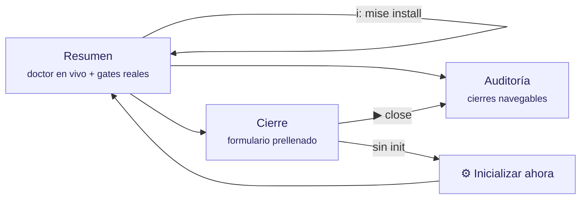

# La interfaz (TUI) explicada

`tramalia ui` abre el dashboard en la terminal (Textual). Esta página explica **cada elemento** de la interfaz, qué significa y qué puedes hacer desde ella.



## Idioma

La interfaz se muestra en **tu idioma** automáticamente (locale del sistema; español e inglés incluidos). Para forzarlo:

```bash
TRAMALIA_LANG=en tramalia ui        # por sesión
```

…o de forma permanente por proyecto en `.tramalia/config.json`: `"language": "es"` (o `"en"` / `"auto"`). Agregar un idioma nuevo = agregar un JSON en `tramalia/i18n/` — sin tocar código.

## Atajos globales

| Tecla | Acción |
|---|---|
| `q` | salir |
| `r` | refrescar todo (doctor, auditoría, formulario) |
| `i` | **instalar herramientas faltantes** (ver abajo) |

## Pestaña Resumen

- **Cabecera**: la **ruta completa** del proyecto (para saber siempre dónde estás), el stack detectado y el estado — `inicializado` o `SIN inicializar`.
- **Gates del proyecto**: los gates **reales** leídos de tu `mise.toml` (`build · test · lint · security…`). Si no hay `mise.toml`, te indica ejecutar `init`.
- **Último cierre**: el más reciente de la auditoría, con su estado.
- **Tabla de herramientas** (el doctor en vivo), **agrupada** en secciones — base (bootstrap) · stack del proyecto · gates y features · agentes CLI — con cuatro columnas:
  - *herramienta* — el comando.
  - *para qué* — su rol (gate de seguridad, contexto, agente CLI…).
  - *estado* — `✓ ok` (instalada y su versión) · `○ opcional` (solo si usas esa feature) · `✗ falta` (requerida).
  - *detalle / cómo obtenerla* — versión detectada o el comando de instalación exacto.

La tabla incluye también los **agentes CLI detectados** en tu máquina (claude, codex, antigravity, gemini, opencode) — solo detección informativa: Tramalia nunca los configura.

### Instalar desde la interfaz (`i`)

Pulsa `i` y se abre un **selector múltiple** con las herramientas faltantes que se pueden instalar automatizado en **tu sistema** (espacio marca, enter confirma). Cada una se instala por su mejor vía disponible — winget/brew para binarios, `mise use` para gates, `uv tool` para Python, `npm` solo si Node está presente — y la salida corre en vivo en un panel **dentro del Resumen** (ya no salta de pestaña). Las que no tienen vía automatizada aparecen en el panel con su comando manual.

Al terminar, la tabla se refresca de verdad: las herramientas que mise instala viven tras sus **shims** (no están en el PATH hasta `mise activate` o reiniciar la terminal), y ahora el doctor las detecta igual consultando `mise which` — verás *"instalada vía mise (shims)"* en vez de un falso "falta". Detalle de vías por SO: [Instalación](instalacion.md#instalacion-automatizada-por-sistema).

## Pestaña Auditoría

- **Proyecto sin inicializar** → lo dice explícitamente (no hay auditoría que mostrar) y te dirige al botón Inicializar.
- **Sin cierres** → te invita a cerrar tu primera tarea.
- **Con cierres** → tabla navegable (cierre · estado · agente y modelo); **Enter** sobre una fila muestra su `metadata.json` completo a la derecha.

## Pestaña Cierre

- **Proyecto sin inicializar** → el formulario se oculta y aparece el botón **"⚙ Inicializar ahora"**, que ejecuta el equivalente a `tramalia init` y refresca. El cierre está **bloqueado** hasta inicializar (no tiene sentido gobernar sin convención).
- **Proyecto inicializado** → el formulario viene **prellenado con los valores reales** del proyecto (no ejemplos):
  - *tarea* ← el ID de `.tramalia/current-task.md` (si lo declaraste);
  - *agente ejecutor* y *revisor* ← `config.json → agents.primary/reviewer`;
  - *modelo* ← opcional, queda registrado en la auditoría.
- Al escribir un ID de tarea, la interfaz **busca esa tarea en `specs/tasks.md` y muestra su descripción** (alcance, gates aplicables). Si no existe, te avisa para que la agregues — así el cierre queda trazado.
- **▶ Ejecutar close** corre el ritual completo y muestra la salida gate por gate. El mensaje final es honesto:
  - `✓ cerrada con evidencia verificable` — gates verdes;
  - `○ cerrada con EXCEPCIÓN documentada` — sin mise, los gates no corrieron (instálalo para validación real);
  - `✗ BLOQUEADO` — algún gate falló.

## Relación con el CLI

Todo lo que hace la interfaz existe también como comando (`close`, `log`, `doctor`, `init`, `mise install`) — la TUI **solo lee e invoca el core**, nunca tiene lógica propia. Puedes alternar libremente entre ambas.
