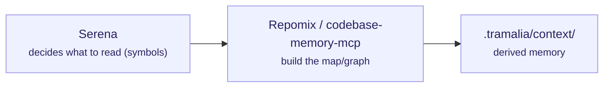

# Context & code intelligence

These tools help the agent **understand the code without reading it whole** (token saving). Tramalia orchestrates them from `tramalia context` and/or wires them as MCP servers.



## Repomix — packaged snapshot

- **What it is / scope:** packages the repo into a single AI-friendly file (snapshot).
- **Requires:** **Node**.
- **Install:** `mise use npm:repomix` · direct: `npm i -g repomix` · without installing: `npx repomix`.
- **Tramalia uses it in:** `context` — if present, it generates the snapshot; if not, Tramalia falls back to a stdlib tree.
- **Interacts with:** feeds `.tramalia/context/`; complements Serena (snapshot vs. live navigation).

## Serena — live semantic navigation (MCP)

- **What it is / scope:** an MCP toolkit that uses *language servers* (LSP) so the agent reads only the **exact symbol** it's about to touch — surgical navigation, always fresh.
- **Requires:** **uv** + Python (runs via `uvx`, no global install needed).
- **Install / wire:** `tramalia init` already puts it in `.mcp.json`:
  ```json
  "serena": { "command": "uvx",
    "args": ["--from","git+https://github.com/oraios/serena","serena","start-mcp-server"] }
  ```
- **Tramalia uses it in:** it wires it into `.mcp.json`; the **agent** consumes it via MCP. The CLI doesn't invoke it directly.
- **Interacts with:** it decides *what to read* before Repomix/codebase-memory build context; it reduces tokens during live work.

## codebase-memory-mcp — structural code graph (MCP)

- **What it is / scope:** indexes the code into a **persistent knowledge graph** (158 languages, hybrid LSP + tree-sitter): `get_architecture`, call graphs, impact analysis. ~99% fewer tokens than reading file by file. A more powerful alternative to Serena/Repomix as a context backend.
- **Requires:** nothing (static binary, C/C++).
- **Install:** binary from the repo's *releases*. **Important:** use `--skip-config` so it does **not** configure agents or write instructions outside Tramalia.
- **Tramalia uses it in:** optional `context` backend / query MCP server.
- **Interacts with / caution:** **only its query tools**. Its `manage_adr` and agent auto-configuration **must not** be used: ADRs live in `docs/ai/05` and rules in `AGENTS.md` (Tramalia's governance).

## CodeGraph — pre-indexed graph with auto-sync (CLI + MCP)

- **What it is / scope:** a **pre-built** dependency graph in SQLite (FTS5): the `codegraph_explore` tool returns *"verbatim source + call flow + blast radius"* in **a single call**, 20+ languages, with file-watchers keeping the index current.
- **Requires:** nothing (binary; official installer in its repo).
- **Install:** see [colbymchenry/codegraph](https://github.com/colbymchenry/codegraph); `codegraph init` in the project. **Caution:** its `codegraph install` auto-configures agents — as with codebase-memory-mcp, use only its query MCP server and leave the rules to `AGENTS.md`.
- **Tramalia uses it in:** `doctor` detects it (feature `context`); alternative/complement to Serena and codebase-memory-mcp.

## Graphify — knowledge graph from code/docs/schemas (CLI + MCP + skill)

- **What it is / scope:** turns code, SQL, scripts, docs, papers, images or videos into a **queryable graph** (HTML visualization + markdown report + JSON). It's a CLI, an MCP server, **and** a skill at once.
- **Requires:** nothing extra (Python via `uv tool`).
- **Install:** `uv tool install graphifyy` then `graphify install` (registers the skill). Used with `/graphify .`.
- **Tramalia uses it in:** `doctor` detects it (feature `context`); alternative/complement to Serena, codebase-memory-mcp and CodeGraph in the same slot.

## markitdown — document ingestion to Markdown (CLI + MCP)

- **What it is / scope:** converts PDF, Word, Excel, PowerPoint, images (OCR), audio, HTML and EPub to **LLM-friendly Markdown** (Microsoft, MIT). CLI + MCP server (`markitdown-mcp`, a single tool: `convert_to_markdown`).
- **Requires:** Python ≥ 3.10.
- **Install:** `pip install "markitdown[all]"` · MCP: `pip install markitdown-mcp`.
- **Tramalia uses it in:** `doctor` detects it (feature `context`). Its role is **ingestion**: bringing into the Markdown world the knowledge that lives in formats the agent doesn't read well — the PRD in `.docx`, the reference Excel, the client's PDF: `markitdown requirements.docx -o docs/ai/09-specs-origin.md`.
- **Interacts with:** it competes with no one — it's the **entry gate**. It feeds what Serena and the graphs then navigate.

## notebooklm-mcp — curated external knowledge (MCP, cloud)

- **What it is / scope:** an MCP server that lets the agent "ask" a **Google NotebookLM** notebook loaded with documentation — answers grounded in the sources you uploaded (no hallucination). It automates a real Chrome (Patchright) with your Google session.
- **Requires:** Node ≥ 18 + Chrome + a **Google account** (data goes to Google).
- **Wire (manually, never by default):**
  ```json
  "notebooklm": { "command": "npx", "args": ["notebooklm-mcp@latest"] }
  ```
- **Tramalia and the hard rule:** it does **not** appear in `doctor` nor in the generated `.mcp.json` (it runs via `npx` and is a cloud service). Use it **only with public third-party documentation** — never upload private code, evidence or repo secrets. It's a different slot: not repo context nor memory — it's *what others documented*.

## The criterion: which to mount and which to use

Three axes, in this order:

**1 · What question does it answer?** Each tool lives in a slot; choose by the question, not by fame:

| The question you have | Tool | Note |
|---|---|---|
| "Which exact symbol do I touch?" (live) | **Serena** | default — `init` already wires it |
| "Full snapshot of the repo for a prompt" | **Repomix** | one-off, not persistent |
| "What do I break if I touch X?" (impact, architecture) | **CodeGraph** *or* **codebase-memory-mcp** | tiebreaker below |
| "Code + docs + schemas in a single graph" | **Graphify** | multi-format |
| "This PDF/Word/Excel → context in Markdown" | **markitdown** | ingestion |
| "How is library X used per its official docs?" | **notebooklm-mcp** | external knowledge (cloud) |

**2 · Local first.** Local tools (Serena, graphs, markitdown, `.tramalia/context/`) save tokens **and** keep privacy. The agent should query the derived context and the local MCP tools before reading whole files — and only go to the cloud (NotebookLM) for public external knowledge.

**3 · No overlap + graceful degradation.** At most **one graph** at a time (CodeGraph, codebase-memory-mcp and Graphify compete for the same slot). And if a slot is empty, work **continues normally**: `context` falls back to a stdlib tree, the agent reads files directly — none of these tools is a requirement, all are accelerators.

**Graph tiebreaker** (when you could mount more than one):

- **CodeGraph** — if you work in the repo daily and want the surgical answer in **one call** (SQLite index with file-watcher auto-sync), and your language is among its 20+.
- **codebase-memory-mcp** — if the repo is **polyglot** or uses less common languages (158 languages, hybrid LSP), or you need architecture views (`get_architecture`).
- **Graphify** — if the value lies in joining **code + docs + schemas** into one queryable graph, more than in impact analysis.
- If **two or more are already installed**: use CodeGraph for day-to-day impact and codebase-memory-mcp for architecture analysis — and write the choice down in `AGENTS.md` so every agent follows the same one.

Tramalia doesn't compete with them: it declares them, detects them (`doctor`) and consumes their output in `.tramalia/context/` or via MCP. You choose which one(s) to mount.
