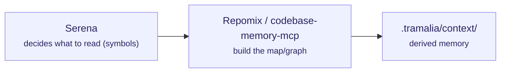

# Context & code intelligence

These tools help the agent **understand the code without reading it whole** (token saving). Tramalia orchestrates them from `tramalia context` and/or wires them as MCP servers.



## Repomix — packaged snapshot

- **What it is / scope:** packages the repo into a single AI-friendly file (snapshot).
- **Requires:** **Node**.
- **Install:** `mise use npm:repomix` · direct: `npm i -g repomix` · without installing: `npx repomix`.
- **Tramalia uses it in:** `context` — if present, it generates the snapshot; if not, Tramalia falls back to a stdlib tree.
- **Interacts with:** feeds `.tramalia/context/`; complements Serena (snapshot vs. live navigation).

## Serena — live semantic navigation (MCP)

- **What it is / scope:** an MCP toolkit that uses *language servers* (LSP) so the agent reads only the **exact symbol** it's about to touch — surgical navigation, always fresh.
- **Requires:** **uv** + Python (runs via `uvx`, no global install needed).
- **Install / wire:** `tramalia init` already puts it in `.mcp.json`:
  ```json
  "serena": { "command": "uvx",
    "args": ["--from","git+https://github.com/oraios/serena","serena","start-mcp-server"] }
  ```
- **Tramalia uses it in:** it wires it into `.mcp.json`; the **agent** consumes it via MCP. The CLI doesn't invoke it directly.
- **Interacts with:** it decides *what to read* before Repomix/codebase-memory build context; it reduces tokens during live work.

## codebase-memory-mcp — structural code graph (MCP)

- **What it is / scope:** indexes the code into a **persistent knowledge graph** (158 languages, hybrid LSP + tree-sitter): `get_architecture`, call graphs, impact analysis. ~99% fewer tokens than reading file by file. A more powerful alternative to Serena/Repomix as a context backend.
- **Requires:** nothing (static binary, C/C++).
- **Install:** binary from the repo's *releases*. **Important:** use `--skip-config` so it does **not** configure agents or write instructions outside Tramalia.
- **Tramalia uses it in:** optional `context` backend / query MCP server.
- **Interacts with / caution:** **only its query tools**. Its `manage_adr` and agent auto-configuration **must not** be used: ADRs live in `docs/ai/05` and rules in `AGENTS.md` (Tramalia's governance).

## How the three fit together

- **Serena** = *what* to read (symbols, live).
- **Repomix** = full *snapshot* when you need a picture.
- **codebase-memory-mcp** = persistent *structural graph* (architecture, impact).

Tramalia doesn't compete with them: it declares them, detects them (`doctor`) and consumes their output in `.tramalia/context/` or via MCP. You choose which one(s) to mount.
