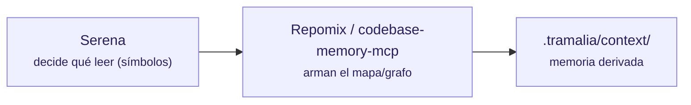

# Contexto e inteligencia de código

Estas herramientas ayudan al agente a **entender el código sin leerlo entero** (ahorro de tokens). Tramalia las orquesta desde `tramalia context` y/o las cablea como servidores MCP.



## Repomix — snapshot empaquetado

- **Qué es / alcance:** empaqueta el repo en un único archivo amigable para IA (snapshot).
- **Requiere:** **Node**.
- **Instalar:** `mise use npm:repomix` · directa: `npm i -g repomix` · sin instalar: `npx repomix`.
- **Tramalia la usa en:** `context` — si está, genera el snapshot; si no, Tramalia cae a un árbol stdlib.
- **Interactúa con:** alimenta `.tramalia/context/`; complementa a Serena (snapshot vs. navegación viva).

## Serena — navegación semántica viva (MCP)

- **Qué es / alcance:** toolkit MCP que usa *language servers* (LSP) para que el agente lea solo el **símbolo exacto** que va a tocar — navegación quirúrgica, siempre fresca.
- **Requiere:** **uv** + Python (se ejecuta vía `uvx`, no requiere instalación global).
- **Instalar / cablear:** `tramalia init` ya la deja en `.mcp.json`:
  ```json
  "serena": { "command": "uvx",
    "args": ["--from","git+https://github.com/oraios/serena","serena","start-mcp-server"] }
  ```
- **Tramalia la usa en:** la cablea en `.mcp.json`; el **agente** la consume por MCP. No la invoca el CLI directamente.
- **Interactúa con:** decide *qué leer* antes de que Repomix/codebase-memory armen contexto; reduce tokens en el trabajo vivo.

## codebase-memory-mcp — grafo estructural del código (MCP)

- **Qué es / alcance:** indexa el código en un **grafo de conocimiento persistente** (158 lenguajes, LSP híbrido + tree-sitter): `get_architecture`, call graphs, análisis de impacto. ~99% menos tokens que leer archivo por archivo. Alternativa más potente a Serena/Repomix como backend de contexto.
- **Requiere:** nada (binario estático, C/C++).
- **Instalar:** binario de los *releases* del repo. **Importante:** usar `--skip-config` para que **no** configure agentes ni escriba instrucciones por fuera de Tramalia.
- **Tramalia la usa en:** backend opcional de `context` / servidor MCP de consulta.
- **Interactúa con / cuidado:** **solo sus tools de consulta**. Su `manage_adr` y su auto-configuración de agentes **no** deben usarse: los ADR viven en `docs/ai/05` y las reglas en `AGENTS.md` (gobierno de Tramalia).

## CodeGraph — grafo pre-indexado con auto-sync (CLI + MCP)

- **Qué es / alcance:** grafo de dependencias **pre-construido** en SQLite (FTS5): la tool `codegraph_explore` devuelve *"código exacto + call flow + blast radius"* en **una sola llamada**, 20+ lenguajes, con file-watchers que mantienen el índice al día.
- **Requiere:** nada (binario; instalador oficial en su repo).
- **Instalar:** ver [colbymchenry/codegraph](https://github.com/colbymchenry/codegraph); `codegraph init` en el proyecto. **Cuidado:** su `codegraph install` auto-configura agentes — igual que con codebase-memory-mcp, usa solo su servidor MCP de consulta y deja las reglas a `AGENTS.md`.
- **Tramalia la usa en:** `doctor` la detecta (feature `context`); alternativa/complemento de Serena y codebase-memory-mcp.

## Graphify — grafo de conocimiento desde código/docs/schemas (CLI + MCP + skill)

- **Qué es / alcance:** convierte código, SQL, scripts, docs, papers, imágenes o videos en un **grafo consultable** (visualización HTML + reporte + JSON). Es CLI, servidor MCP **y** skill a la vez.
- **Requiere:** nada extra (Python vía `uv tool`).
- **Instalar:** `uv tool install graphifyy` y luego `graphify install` (registra la skill). Se usa con `/graphify .`.
- **Tramalia la usa en:** `doctor` la detecta (feature `context`); alternativa/complemento a Serena, codebase-memory-mcp y CodeGraph en el mismo slot.

## markitdown — ingesta de documentos a Markdown (CLI + MCP)

- **Qué es / alcance:** convierte PDF, Word, Excel, PowerPoint, imágenes (OCR), audio, HTML y EPub a **Markdown pensado para LLMs** (Microsoft, MIT). CLI + servidor MCP (`markitdown-mcp`, una sola tool: `convert_to_markdown`).
- **Requiere:** Python ≥ 3.10.
- **Instalar:** `pip install "markitdown[all]"` · MCP: `pip install markitdown-mcp`.
- **Tramalia la usa en:** `doctor` la detecta (feature `context`). Su rol es la **ingesta**: traer al mundo Markdown el conocimiento que vive en formatos que el agente no lee bien — el PRD en `.docx`, el Excel de referencia, el PDF del cliente: `markitdown requisitos.docx -o docs/ai/09-specs-origen.md`.
- **Interactúa con:** no compite con nadie — es la **puerta de entrada**. Alimenta lo que Serena y los grafos luego navegan.

## notebooklm-mcp — conocimiento externo curado (MCP, cloud)

- **Qué es / alcance:** servidor MCP que deja al agente "preguntarle" a un notebook de **Google NotebookLM** cargado con documentación — respuestas ancladas a las fuentes que subiste (no alucina). Automatiza un Chrome real (Patchright) con tu sesión de Google.
- **Requiere:** Node ≥ 18 + Chrome + **cuenta Google** (los datos suben a Google).
- **Cablear (manual, nunca por defecto):**
  ```json
  "notebooklm": { "command": "npx", "args": ["notebooklm-mcp@latest"] }
  ```
- **Tramalia y la regla dura:** **no** aparece en `doctor` ni en el `.mcp.json` generado (corre vía `npx` y es un servicio cloud). Úsalo **solo con documentación pública de terceros** — jamás subas código privado, evidencia ni secretos del repo. Es otro slot: no es contexto del repo ni memoria — es *lo que otros documentaron*.

## El criterio: cuál montar y cuál usar

Tres ejes, en este orden:

**1 · ¿Qué pregunta responde?** Cada herramienta vive en un slot; elige por la pregunta, no por la fama:

| Pregunta que tienes | Herramienta | Nota |
|---|---|---|
| "¿Qué símbolo exacto toco?" (vivo) | **Serena** | default — `init` ya la cablea |
| "Foto completa del repo para un prompt" | **Repomix** | puntual, no persistente |
| "¿Qué rompo si toco X?" (impacto, arquitectura) | **CodeGraph** *o* **codebase-memory-mcp** | desempate abajo |
| "Código + docs + schemas en un solo grafo" | **Graphify** | multi-formato |
| "Este PDF/Word/Excel → contexto en Markdown" | **markitdown** | ingesta |
| "¿Cómo se usa la librería X según su doc oficial?" | **notebooklm-mcp** | conocimiento externo (cloud) |

**2 · Local primero.** Las herramientas locales (Serena, grafos, markitdown, `.tramalia/context/`) ahorran tokens **y** mantienen la privacidad. El agente debe consultar primero el contexto derivado y las tools MCP locales antes de leer archivos completos — y solo salir a cloud (NotebookLM) para conocimiento público externo.

**3 · Sin solape + degradación normal.** Máximo **un grafo** a la vez (CodeGraph, codebase-memory-mcp y Graphify compiten por el mismo slot). Y si un slot está vacío, el trabajo **sigue con normalidad**: `context` cae a árbol stdlib, el agente lee archivos directo — ninguna de estas herramientas es requisito, todas son aceleradores.

**Desempate del grafo** (cuando podrías montar más de uno):

- **CodeGraph** — si trabajas a diario en el repo y quieres la respuesta quirúrgica en **una llamada** (índice SQLite con auto-sync por file-watchers), y tu lenguaje está entre sus 20+.
- **codebase-memory-mcp** — si el repo es **políglota** o usa lenguajes menos comunes (158 lenguajes, LSP híbrido), o necesitas vistas de arquitectura (`get_architecture`).
- **Graphify** — si el valor está en unir **código + docs + schemas** en un solo grafo consultable, más que en el análisis de impacto.
- Si ya hay **dos o más instalados**: usa CodeGraph para el impacto del día a día y codebase-memory-mcp para el análisis de arquitectura — y deja la elección escrita en `AGENTS.md` para que todos los agentes sigan la misma.

Tramalia no compite con ellas: las declara, las detecta (`doctor`) y consume su salida en `.tramalia/context/` o vía MCP. Tú eliges cuál(es) montar.
