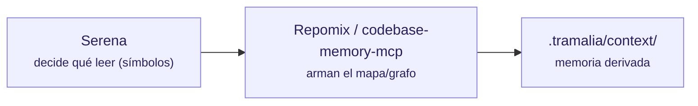

# Contexto e inteligencia de código

Estas herramientas ayudan al agente a **entender el código sin leerlo entero** (ahorro de tokens). Tramalia las orquesta desde `tramalia context` y/o las cablea como servidores MCP.



## Repomix — snapshot empaquetado

- **Qué es / alcance:** empaqueta el repo en un único archivo amigable para IA (snapshot).
- **Requiere:** **Node**.
- **Instalar:** `mise use npm:repomix` · directa: `npm i -g repomix` · sin instalar: `npx repomix`.
- **Tramalia la usa en:** `context` — si está, genera el snapshot; si no, Tramalia cae a un árbol stdlib.
- **Interactúa con:** alimenta `.tramalia/context/`; complementa a Serena (snapshot vs. navegación viva).

## Serena — navegación semántica viva (MCP)

- **Qué es / alcance:** toolkit MCP que usa *language servers* (LSP) para que el agente lea solo el **símbolo exacto** que va a tocar — navegación quirúrgica, siempre fresca.
- **Requiere:** **uv** + Python (se ejecuta vía `uvx`, no requiere instalación global).
- **Instalar / cablear:** `tramalia init` ya la deja en `.mcp.json`:
  ```json
  "serena": { "command": "uvx",
    "args": ["--from","git+https://github.com/oraios/serena","serena","start-mcp-server"] }
  ```
- **Tramalia la usa en:** la cablea en `.mcp.json`; el **agente** la consume por MCP. No la invoca el CLI directamente.
- **Interactúa con:** decide *qué leer* antes de que Repomix/codebase-memory armen contexto; reduce tokens en el trabajo vivo.

## codebase-memory-mcp — grafo estructural del código (MCP)

- **Qué es / alcance:** indexa el código en un **grafo de conocimiento persistente** (158 lenguajes, LSP híbrido + tree-sitter): `get_architecture`, call graphs, análisis de impacto. ~99% menos tokens que leer archivo por archivo. Alternativa más potente a Serena/Repomix como backend de contexto.
- **Requiere:** nada (binario estático, C/C++).
- **Instalar:** binario de los *releases* del repo. **Importante:** usar `--skip-config` para que **no** configure agentes ni escriba instrucciones por fuera de Tramalia.
- **Tramalia la usa en:** backend opcional de `context` / servidor MCP de consulta.
- **Interactúa con / cuidado:** **solo sus tools de consulta**. Su `manage_adr` y su auto-configuración de agentes **no** deben usarse: los ADR viven en `docs/ai/05` y las reglas en `AGENTS.md` (gobierno de Tramalia).

## CodeGraph — grafo pre-indexado con auto-sync (CLI + MCP)

- **Qué es / alcance:** grafo de dependencias **pre-construido** en SQLite (FTS5): la tool `codegraph_explore` devuelve *"código exacto + call flow + blast radius"* en **una sola llamada**, 20+ lenguajes, con file-watchers que mantienen el índice al día.
- **Requiere:** nada (binario; instalador oficial en su repo).
- **Instalar:** ver [colbymchenry/codegraph](https://github.com/colbymchenry/codegraph); `codegraph init` en el proyecto. **Cuidado:** su `codegraph install` auto-configura agentes — igual que con codebase-memory-mcp, usa solo su servidor MCP de consulta y deja las reglas a `AGENTS.md`.
- **Tramalia la usa en:** `doctor` la detecta (feature `context`); alternativa/complemento de Serena y codebase-memory-mcp.

## Graphify — grafo de conocimiento desde código/docs/schemas (CLI + MCP + skill)

- **Qué es / alcance:** convierte código, SQL, scripts, docs, papers, imágenes o videos en un **grafo consultable** (visualización HTML + reporte + JSON). Es CLI, servidor MCP **y** skill a la vez.
- **Requiere:** nada extra (Python vía `uv tool`).
- **Instalar:** `uv tool install graphifyy` y luego `graphify install` (registra la skill). Se usa con `/graphify .`.
- **Tramalia la usa en:** `doctor` la detecta (feature `context`); alternativa/complemento a Serena, codebase-memory-mcp y CodeGraph en el mismo slot.

## Cómo encajan los cinco

- **Serena** = *qué* leer (símbolos, vivo).
- **Repomix** = *snapshot* completo cuando se necesita una foto.
- **codebase-memory-mcp** = *grafo estructural* persistente (arquitectura, impacto).
- **CodeGraph** = grafo pre-indexado con auto-sync (respuesta quirúrgica en una llamada).
- **Graphify** = grafo de conocimiento multi-formato (código + docs + schemas juntos).

Tramalia no compite con ellos: los declara, los detecta (`doctor`) y consume su salida en `.tramalia/context/` o vía MCP. Tú eliges cuál(es) montar.
