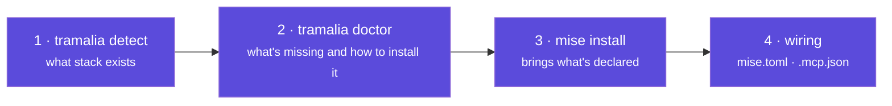
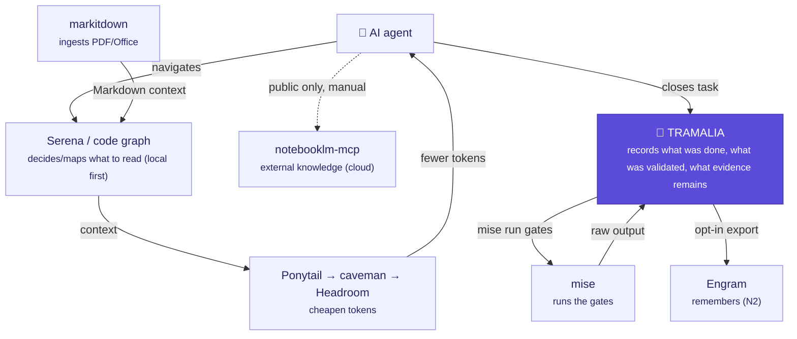

# Integrations: how it all fits together

Tramalia **doesn't reimplement** the ecosystem tools: it **detects, wires and invokes** them as separate programs. This section explains, tool by tool, **what it is, how it's installed, what it requires and how it interacts** with Tramalia and with the others.

## What Tramalia requires (and what each tool requires)

| | Requirement | Notes |
|---|---|---|
| **Tramalia (core)** | **Python 3.10+ only** | `init`, `doctor`, `close`, `log`, `evidence`, `handoff` run with nothing else |
| Pretty mode | `rich`, `questionary` | extra `pip install ".[pretty]"` |
| MCP façade | `mcp` (SDK) | extra `pip install ".[mcp]"` |
| **Each external tool** | its own runtime | binary, Python or **Node** — `doctor` tells you per project |

> Golden rule: the **core governs with Python only**. External tools are **optional interop**; if missing, Tramalia still governs and records it as a documented exception.

## The integration model in 4 steps

1. **`detect`** identifies the stack → decides which gates/tools apply.
2. **`doctor`** classifies each tool (**bootstrap** / **stack** / **feature**) and shows the exact install command.
3. **`mise install`** brings everything declared in `mise.toml` (most of it).
4. Tramalia **wires** them: commands in `mise.toml` (gates), servers in `.mcp.json` (Serena/Engram/…).

## How each tool is installed (two ways)

Most are installed in **two equivalent ways**: directly (their official installer) or **via mise** (recommended — it's declared and auto-updates):

- **Via mise (recommended):** `mise use npm:repomix`, `mise use pipx:semgrep`, etc. It stays in `mise.toml` and `mise upgrade` maintains it.
- **Direct:** each tool's official installer (npm, pip, brew, binary…).

`tramalia doctor` always shows the recommended way for *your* project.

## How they interact with each other (through Tramalia)

In words: **Serena/the code graph** decide what to read, **markitdown** ingests documents, **Ponytail→caveman→Headroom** cheapen tokens in that order, **mise** runs the gates, **Engram** remembers, **notebooklm-mcp** answers with external documentation (cloud, manual, never with private data) — and **Tramalia** records what was done, what was validated and what evidence remains. Each actor does its part; Tramalia governs them, always applying the same [criterion: local first, graceful degradation](interop-contexto.md#the-criterion-which-to-mount-and-which-to-use).

## The detail pages

- [Execution & gates](interop-ejecucion.md) — mise, git, uv, Semgrep, Gitleaks, SQLFluff, Lighthouse, Playwright, axe.
- [Context & code intelligence](interop-contexto.md) — Serena, Repomix, CodeGraph, codebase-memory-mcp, Graphify, markitdown, notebooklm-mcp — and the criterion for choosing between them.
- [Memory & efficiency](interop-memoria.md) — Engram, basic-memory, mem0, Ponytail, caveman, Headroom.
- [Rules, skills & agents](interop-agentes.md) — rulesync, copier, Spec Kit, Gentle-AI, AI agents.
- [Models & effort per host](multi-host.md) — matrix per CLI and detection of installed agents.
- [Analytics (Python/Databricks)](analitica.md) — data gates (`bundle`, notebooks, SQL).
