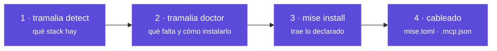
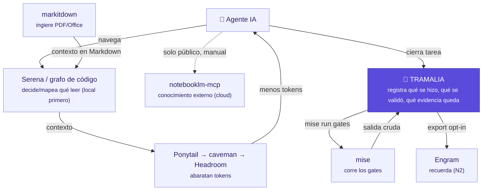

# Integraciones: cómo encaja todo

Tramalia **no reimplementa** las herramientas del ecosistema: las **detecta, cablea e invoca** como programas separados. Esta sección explica, herramienta por herramienta, **qué es, cómo se instala, qué requiere y cómo interactúa** con Tramalia y con las demás.

## Qué requiere Tramalia (y qué requiere cada herramienta)

| | Requisito | Notas |
|---|---|---|
| **Tramalia (núcleo)** | **solo Python 3.10+** | `init`, `doctor`, `close`, `log`, `evidence`, `handoff` corren sin nada más |
| Modo bonito | `rich`, `questionary` | extra `pip install ".[pretty]"` |
| Fachada MCP | `mcp` (SDK) | extra `pip install ".[mcp]"` |
| **Cada herramienta externa** | su propio runtime | binario, Python o **Node** — `doctor` te lo dice por proyecto |

> Regla de oro: el **núcleo gobierna con solo Python**. Las herramientas externas son **interop opcional**; si faltan, Tramalia sigue gobernando y lo registra como excepción documentada.

## El modelo de integración en 4 pasos

1. **`detect`** identifica el stack → decide qué gates/herramientas aplican.
2. **`doctor`** clasifica cada herramienta (**bootstrap** / **stack** / **feature**) y muestra el comando exacto de instalación.
3. **`mise install`** trae todo lo declarado en `mise.toml` (la mayoría).
4. Tramalia las **cablea**: comandos en `mise.toml` (gates), servidores en `.mcp.json` (Serena/Engram/…).

## Cómo se instala cada herramienta (dos vías)

La mayoría se instala de **dos formas equivalentes**: directa (su instalador oficial) o **vía mise** (recomendado, queda declarado y se auto-actualiza):

- **Vía mise (recomendado):** `mise use npm:repomix`, `mise use pipx:semgrep`, etc. Queda en `mise.toml` y `mise upgrade` la mantiene.
- **Directa:** el instalador oficial de cada una (npm, pip, brew, binario…).

`tramalia doctor` siempre muestra la vía recomendada para *tu* proyecto.

## Cómo interactúan entre sí (a través de Tramalia)

En palabras: **Serena/el grafo de código** deciden qué leer, **markitdown** ingiere documentos, **Ponytail→caveman→Headroom** abaratan tokens en ese orden, **mise** corre los gates, **Engram** recuerda, **notebooklm-mcp** responde con documentación externa (cloud, manual, nunca con datos privados) — y **Tramalia** registra qué se hizo, qué se validó y qué evidencia queda. Cada actor hace lo suyo; Tramalia los gobierna, aplicando siempre el mismo [criterio: local primero, degradación normal](interop-contexto.md#el-criterio-cual-montar-y-cual-usar).

## Las páginas de detalle

- [Ejecución y gates](interop-ejecucion.md) — mise, git, uv, Semgrep, Gitleaks, SQLFluff, Lighthouse, Playwright, axe.
- [Contexto e inteligencia de código](interop-contexto.md) — Serena, Repomix, CodeGraph, codebase-memory-mcp, Graphify, markitdown, notebooklm-mcp — y el criterio para elegir entre ellas.
- [Memoria y eficiencia](interop-memoria.md) — Engram, basic-memory, mem0, Ponytail, caveman, Headroom.
- [Reglas, skills y agentes](interop-agentes.md) — rulesync, copier, Spec Kit, Gentle-AI, agentes IA.
- [Modelos y esfuerzo por host](multi-host.md) — matriz por CLI y detección de agentes instalados.
- [Analítica (Python/Databricks)](analitica.md) — gates de datos (`bundle`, notebooks, SQL).
