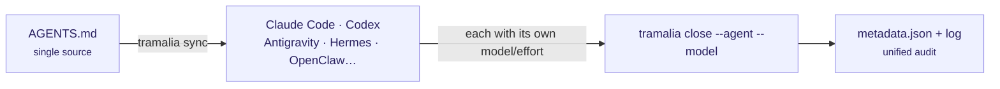

# Models and effort per host

Tramalia is **host-neutral**: the convention (standard `AGENTS.md`), the fan-out (`sync`) and the audit (`close --agent/--model` records any combination) work the same with any agent. But **each host controls model and effort its own way** — here's the matrix:



| Host | Reads AGENTS.md | Model selection | Effort / reasoning | Subagents with model |
|---|---|---|---|---|
| **Claude Code** (CLI/app) | ✅ native | `/model`, `opusplan` (Opus plans, Sonnet executes) | `ultrathink` (one turn) · `/effort ultracode` (session + auto-orchestration) | ✅ native (`.claude/agents/`, Tramalia's 5) |
| **Codex** (CLI/app) | ✅ native | `/model` + **profiles** in `config.toml` (`codex --profile`) | `model_reasoning_effort`: minimal → high, per profile | simulated via rulesync |
| **Antigravity** (CLI/IDE, absorbing Gemini CLI) | ✅ | per-session selector | model's thinking budget | `antigravity-cli` / `antigravity-ide` targets in rulesync |
| **Hermes** | via rulesync (`hermesagent` target) | gateway profile | API params per request | converted |
| **OpenClaw** and multi-model API gateways | AGENTS.md is plain Markdown: they read it if their config points to it | gateway profiles / API keys | `reasoning_effort` / thinking budget per request | manual |

!!! tip "Which agents do you have installed?"
    `tramalia doctor` (and the Overview tab of `tramalia ui`) now **detects the agent CLIs present** on your machine — claude, codex, antigravity, opencode, openclaw, hermes — with their version. Detection only: configuring them remains each agent's (or Gentle-AI's) territory.

## Desktop apps & IDEs

Everything above applies **equally** to the apps: Claude Code desktop uses the same engine as its CLI (reads `AGENTS.md`, `.mcp.json`, `.claude/agents/` and runs shell → `tramalia close` works identically); Codex desktop and Antigravity IDE read `AGENTS.md` natively and receive rules via `sync`. For GUIs without shell, the universal route is the **MCP façade** (`tramalia mcp`). That's the repo-first design paying off: governance lives in the repo, not in the host.

## The strategy in practice

1. **One source**: the rules live in `AGENTS.md`; the roles with model routing in `.claude/agents/`. `tramalia sync` propagates them to the other hosts.
2. **Each host applies its mechanism**: in Claude Code per-role routing is native; in Codex you use profiles (`--profile deep` with high effort for planning, a normal profile for execution); in Antigravity you select per session.
3. **The audit unifies**: whatever the host — `tramalia close --agent codex --model gpt-5.2-high` records in `metadata.json` *who* and *with what* closed. `tramalia log` shows the mixed history across all hosts.

## Cross-provider review

[codex-plugin-cc](https://github.com/openai/codex-plugin-cc) (official from OpenAI) brings Codex **inside** Claude Code:

```text
/plugin marketplace add openai/codex-plugin-cc
/codex:review      # Codex reviews your current work
/codex:transfer    # continue the session in Codex with the same context
```

It fits directly with Tramalia's `revisor` role: **two models from different providers reviewing the same evidence pack**, with both verdicts recorded in the handoff.

## Effort equivalences (cheat sheet)

| You want… | Claude Code | Codex CLI |
|---|---|---|
| reason harder on THIS problem | `ultrathink` in the prompt | profile with `model_reasoning_effort = "high"` |
| whole session at max | `/effort ultracode` | `codex --profile deep` |
| plan expensive / execute cheap | `/model opusplan` or subagents | two profiles (plan/exec) |
| record what was used | `tramalia close --model <m>` | `tramalia close --model <m>` |
