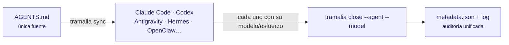

# Modelos y esfuerzo por host

Tramalia es **neutral al host**: la convención (`AGENTS.md` estándar), el fan-out (`sync`) y la auditoría (`close --agent/--model` registra cualquier combinación) funcionan igual con cualquier agente. Pero **cada host controla modelo y esfuerzo a su manera** — esta es la matriz:



| Host | Lee AGENTS.md | Selección de modelo | Esfuerzo / razonamiento | Subagentes con modelo |
|---|---|---|---|---|
| **Claude Code** (CLI/app) | ✅ nativo | `/model`, `opusplan` (Opus planea, Sonnet ejecuta) | `ultrathink` (un turno) · `/effort ultracode` (sesión + auto-orquestación) | ✅ nativo (`.claude/agents/`, los 5 de Tramalia) |
| **Codex** (CLI/app) | ✅ nativo | `/model` + **perfiles** en `config.toml` (`codex --profile`) | `model_reasoning_effort`: minimal → high, por perfil | simulados vía rulesync |
| **Antigravity** (CLI/IDE, absorbe Gemini CLI) | ✅ | selector por sesión | thinking budget del modelo | targets `antigravity-cli` / `antigravity-ide` en rulesync |
| **Hermes** | vía rulesync (target `hermesagent`) | perfil del gateway | parámetros API por request | convertidos |
| **OpenClaw** y gateways multi-modelo vía API | AGENTS.md es Markdown plano: lo leen si su config lo apunta | perfiles / API keys del gateway | `reasoning_effort` / thinking budget por request | manual |

!!! tip "¿Qué agentes tienes instalados?"
    `tramalia doctor` (y la pestaña Resumen de `tramalia ui`) ahora **detecta los agentes CLI presentes** en tu máquina — claude, codex, antigravity, opencode, openclaw, hermes — con su versión. Solo detección informativa: configurarlos sigue siendo territorio de cada agente (o de Gentle-AI).

## Apps de escritorio e IDEs

Todo lo anterior aplica **igual** a las apps: Claude Code desktop usa el mismo motor que su CLI (lee `AGENTS.md`, `.mcp.json`, `.claude/agents/` y ejecuta shell → `tramalia close` corre idéntico); Codex desktop y Antigravity IDE leen `AGENTS.md` nativo y reciben reglas vía `sync`. Para GUIs sin shell, la vía universal es la **fachada MCP** (`tramalia mcp`). Es la consecuencia del diseño repo-first: el gobierno vive en el repo, no en el host.

## La estrategia en la práctica

1. **Una sola fuente**: las reglas viven en `AGENTS.md`; los roles con ruteo de modelo en `.claude/agents/`. `tramalia sync` los propaga al resto de hosts.
2. **Cada host aplica su mecanismo**: en Claude Code el ruteo por rol es nativo; en Codex usas perfiles (`--profile deep` con effort high para planear, perfil normal para ejecutar); en Antigravity seleccionas por sesión.
3. **La auditoría unifica**: da igual el host — `tramalia close --agent codex --model gpt-5.2-high` deja en `metadata.json` *quién* y *con qué* cerró. `tramalia log` muestra la historia mezclada de todos los hosts.

## Revisión cruzada entre proveedores

[codex-plugin-cc](https://github.com/openai/codex-plugin-cc) (oficial de OpenAI) trae Codex **dentro** de Claude Code:

```text
/plugin marketplace add openai/codex-plugin-cc
/codex:review      # Codex revisa tu trabajo actual
/codex:transfer    # continúa la sesión en Codex con el mismo contexto
```

Encaja directo con el rol `revisor` de Tramalia: **dos modelos de proveedores distintos revisando el mismo evidence pack**, y ambos veredictos quedan en el handoff.

## Equivalencias de esfuerzo (chuleta)

| Quieres… | Claude Code | Codex CLI |
|---|---|---|
| razonar más en ESTE problema | `ultrathink` en el prompt | perfil con `model_reasoning_effort = "high"` |
| sesión entera en modo máximo | `/effort ultracode` | `codex --profile deep` |
| planear caro / ejecutar barato | `/model opusplan` o subagentes | dos perfiles (plan/exec) |
| registrar qué se usó | `tramalia close --model <m>` | `tramalia close --model <m>` |
