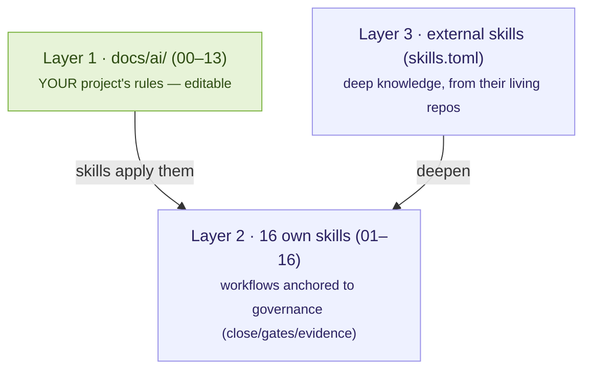

# Skills: management & catalog

*Skills* are workflows in the standard `SKILL.md` format that agents read to learn **how work is done in this repo**. Tramalia organizes them in **three layers** — which is also the criterion for deciding where each piece of knowledge lives:

**Golden rule**: an *own* skill exists only if it's **anchored to a Tramalia command, gate or evidence**. Deep knowledge (architecture patterns, exhaustive UX guides, detailed OWASP) comes from **specialized external repos** that update themselves — Tramalia doesn't freeze encyclopedias.

## What about the skills my CLI already has? (Claude Code, Codex…)

**Tramalia doesn't touch them, read them, or analyze them.** They're completely separate systems:

- **Native CLI skills/plugins** (e.g. Claude Code's plugin marketplace, or skills you installed with `/plugin`) live in *that tool's* own configuration (`~/.claude/`, etc.) and are managed by it — Tramalia never scans those folders or knows what you have installed there.
- **Tramalia's skills** are its own concept: versioned `SKILL.md` files **inside your repo**, in `.tramalia/skills/`, that any agent reads because `AGENTS.md` tells it to — independent of which CLI you use or its marketplace.

Why separate instead of integrated? Because **governance lives in the repo, not on your machine** (the repo-first principle behind the whole tool): if you switch CLIs or PCs tomorrow, Tramalia's skills travel with `git clone`; a skill installed only in your CLI's marketplace doesn't. Both systems **coexist without conflict** — you can have native Claude Code plugins *and* Tramalia's 16 skills at once; they simply don't mix or sync with each other.

## The 16 own skills, by area

| Area | Skills | Anchored to |
|---|---|---|
| Specs & planning | 01-spec-governance | `specs/tasks.md`, horizons |
| Memory & context | 02-federated-agent-memory · 03-context-token-saver | `.tramalia/context`, Engram |
| Development | 04-minimalist-engineering · 05-code-quality-review | `docs/ai/02`, lint/test gates |
| Security & cybersecurity | 06-security-gate · **16-threat-modeling** (STRIDE) | `security` gate, `docs/ai/04` |
| Database | 07-database-engineering | `database` gate, `.sqlfluff` |
| Execution & observability | 08-tool-execution-gate · 09-observability-first | mise, gates |
| Evidence & handoff | 10-evidence-and-handoff · 13-documentation-handoff | evidence pack, `docs/ai/07` |
| Legacy | 11-legacy-modernization | `docs/ai/01` |
| Multi-agent review | 12-multi-agent-review | evidence pack, `revisor` role |
| **Deploy** | **14-deploy-gate** | `docs/ai/12`, `close` as release |
| **Analytics/ML** | **15-analytics-governance** | `metrics.json`/`thresholds.json` |

## Managing them: the full flow

| Action | CLI | TUI (`tramalia ui`, **Skills** tab) |
|---|---|---|
| **See what's there** | `tramalia skills list` | the table groups own and external with their state |
| **Install an external one** | `tramalia skills enable <n>` + `tramalia skills` | **Enter** on it (declares and clones at once) |
| **Update one** | `tramalia skills sync <n>` | **Enter** on an already-installed one |
| **Update all** | `tramalia skills` (or `tramalia update`) | the **`s`** key |
| **See which have an update** | `tramalia skills outdated` | the **`u`** key (marks outdated ones `⬆`) |
| **Open one's docs** | — | the **`d`** key (opens its repo) |
| **Add by URL** | `tramalia skills add <url> [n]` | paste the URL in the input above |

Agents **discover them on their own**: `AGENTS.md` points them to `.tramalia/skills/`; `tramalia sync --features rules,subagents` propagates rules to Cursor/Copilot/Cline. **Add your own**: create `.tramalia/skills/17-my-skill/SKILL.md` with `name`/`description` frontmatter + Purpose · When to use · Workflow · Guardrails · Expected evidence sections.

### The 3 states (and what a "declared" skill is)

- **`✓ installed @a71792a`** — cloned into `.tramalia/skills/<name>/`. The `@sha` is the exact **version** you have (the short commit).
- **`◍ declared`** — it's **noted in the manifest** `.tramalia/skills.toml` (its `[[skill]]` block is active) **but hasn't been cloned to disk yet**. It's the in-between step: you *want* it, but it still needs fetching with `tramalia skills`. After a `git clone` of the repo, external skills always start here (the manifest travels, the folders don't) — a `tramalia skills` re-hydrates them.
- **`○ available`** — it's in the **commented catalog** of `skills.toml` (a curated suggestion), not even declared. Enable it and it becomes declared.

### Updating: installed vs. available

Each installed external skill shows its **installed version** (`@sha`). To see whether a newer one exists in its repo, `tramalia skills outdated` (or the **`u`** key in the TUI) runs a `git ls-remote` and marks the outdated ones with `installed → available`. Then you update **one** (`tramalia skills sync <name>` / Enter on it) or **all** of the project's (`tramalia skills` / the `s` key). It touches nothing else: it's a `git pull --ff-only` per skill.

### External skills are NOT committed to the repo (but aren't lost)

External skills can weigh hundreds of MB. `tramalia init` drops a block in `.gitignore` that **excludes** the external folders under `.tramalia/skills/` from the repo but **keeps the own ones** (numbered `NN-*`). The source of truth is the **manifest** `.tramalia/skills.toml` (that one IS versioned): whoever clones or downloads the repo just runs **`tramalia skills`** and they're **re-hydrated** locally. So the repo stays light and nobody loses anything.

> **Already committed them before this?** `.gitignore` doesn't untrack what's already in git. `tramalia skills` (and `list`/`update`) **warns** you if it detects committed external skills and gives the exact remedy: `git rm -r --cached .tramalia/skills/<name>` (removes from the index, not disk; `.gitignore` prevents re-adding).

## Which one to install? (decision by need)

| You need… | External source (in `skills.toml`) | Complements |
|---|---|---|
| Exhaustive UX/a11y guides (100+ rules) | **vercel-agent-skills** | `ux` gate, `docs/ai/11` |
| TDD & systematic debugging | **superpowers** | skills 05/08 |
| Advanced TypeScript + pre-implementation questioning | **mattpocock-skills** (grill-me) | skill 01 |
| Office/PDF documents, creative | **anthropic-skills** (official) | general use |
| Full team: Security OWASP+STRIDE, Release, QA | **gstack** (31 skills) | skills 14 & 16 |
| Visual craft / UI animation | **impeccable** · **emilkowalski-skills** | `ux` gate |
| Minimalism with its own MCP | **ponytail** (enabled by default) | skill 04 |
| Fewer output tokens | **caveman** (`lite` level) | [efficiency criterion](interop-memoria.md#the-criterion-which-to-mount-and-which-to-use) |

Same criterion as tools: **choose by the question it answers**; don't install to hoard — every cloned skill is context the agent may read, and context costs tokens.

## Relationship with `docs/ai/`

`docs/ai/00–13` are **the rules** (what's required); skills are **the workflows** (how it's met). The rules are born with seed content **according to your stack** — `init` detects Angular/.NET/Postgres/SQL Server/notebooks and generates specific sections — and they're yours: edit them, the idempotent `init` never overwrites them.
