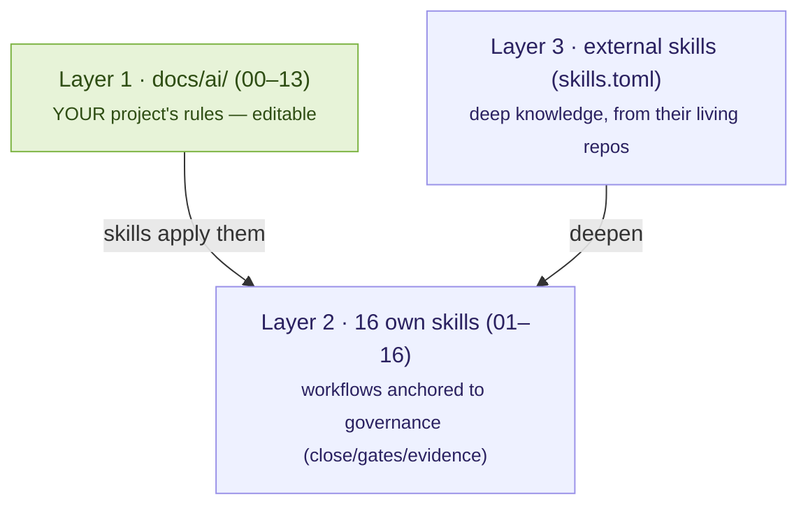

# Skills: management & catalog

*Skills* are workflows in the standard `SKILL.md` format that agents read to learn **how work is done in this repo**. Tramalia organizes them in **three layers** — which is also the criterion for deciding where each piece of knowledge lives:

**Golden rule**: an *own* skill exists only if it's **anchored to a Tramalia command, gate or evidence**. Deep knowledge (architecture patterns, exhaustive UX guides, detailed OWASP) comes from **specialized external repos** that update themselves — Tramalia doesn't freeze encyclopedias.

## The 16 own skills, by area

| Area | Skills | Anchored to |
|---|---|---|
| Specs & planning | 01-spec-governance | `specs/tasks.md`, horizons |
| Memory & context | 02-federated-agent-memory · 03-context-token-saver | `.tramalia/context`, Engram |
| Development | 04-minimalist-engineering · 05-code-quality-review | `docs/ai/02`, lint/test gates |
| Security & cybersecurity | 06-security-gate · **16-threat-modeling** (STRIDE) | `security` gate, `docs/ai/04` |
| Database | 07-database-engineering | `database` gate, `.sqlfluff` |
| Execution & observability | 08-tool-execution-gate · 09-observability-first | mise, gates |
| Evidence & handoff | 10-evidence-and-handoff · 13-documentation-handoff | evidence pack, `docs/ai/07` |
| Legacy | 11-legacy-modernization | `docs/ai/01` |
| Multi-agent review | 12-multi-agent-review | evidence pack, `revisor` role |
| **Deploy** | **14-deploy-gate** | `docs/ai/12`, `close` as release |
| **Analytics/ML** | **15-analytics-governance** | `metrics.json`/`thresholds.json` |

## Managing them: the full flow

1. **See what's there**: `tramalia skills list` (or the **Skills** tab of `tramalia ui`) — shows the 16 own skills and the full external catalog with states: `✓ installed` · `◍ declared (needs sync)` · `○ available`.
2. **Enable an external one**: `tramalia skills enable <name>` (or Enter on it in the **Skills** tab of `tramalia ui`, or uncomment its `[[skill]]` block by hand — all three are equivalent).
3. **Clone/update**: `tramalia skills` (or `tramalia update`, which also updates mise tools) — each source is cloned to `.tramalia/skills/<name>/` from its repo.
4. **Agents discover them** on their own: `AGENTS.md` points them to `.tramalia/skills/`; `tramalia sync --features rules,subagents` propagates rules to Cursor/Copilot/Cline.
5. **Add your own**: create `.tramalia/skills/17-my-skill/SKILL.md` with `name`/`description` frontmatter + Purpose · When to use · Workflow · Guardrails · Expected evidence sections. If it's anchored to `close`/gates, it's a legitimate governance skill.

## Which one to install? (decision by need)

| You need… | External source (in `skills.toml`) | Complements |
|---|---|---|
| Exhaustive UX/a11y guides (100+ rules) | **vercel-agent-skills** | `ux` gate, `docs/ai/11` |
| TDD & systematic debugging | **superpowers** | skills 05/08 |
| Advanced TypeScript + pre-implementation questioning | **mattpocock-skills** (grill-me) | skill 01 |
| Office/PDF documents, creative | **anthropic-skills** (official) | general use |
| Full team: Security OWASP+STRIDE, Release, QA | **gstack** (31 skills) | skills 14 & 16 |
| Visual craft / UI animation | **impeccable** · **emilkowalski-skills** | `ux` gate |
| Minimalism with its own MCP | **ponytail** (enabled by default) | skill 04 |
| Fewer output tokens | **caveman** (`lite` level) | [efficiency criterion](interop-memoria.md#the-criterion-which-to-mount-and-which-to-use) |

Same criterion as tools: **choose by the question it answers**; don't install to hoard — every cloned skill is context the agent may read, and context costs tokens.

## Relationship with `docs/ai/`

`docs/ai/00–13` are **the rules** (what's required); skills are **the workflows** (how it's met). The rules are born with seed content **according to your stack** — `init` detects Angular/.NET/Postgres/SQL Server/notebooks and generates specific sections — and they're yours: edit them, the idempotent `init` never overwrites them.
