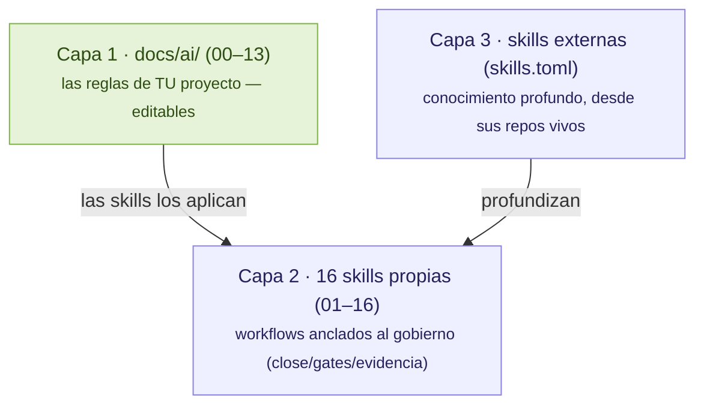

# Skills: administración y catálogo

Las *skills* son workflows en formato `SKILL.md` estándar que los agentes leen para saber **cómo se trabaja en este repo**. Tramalia las organiza en **tres capas** — y ese es también el criterio para decidir dónde vive cada conocimiento:

**Regla de oro**: una skill *propia* existe solo si está **anclada a un comando, gate o evidencia de Tramalia**. El conocimiento profundo (patrones de arquitectura, guías UX exhaustivas, OWASP detallado) viene de **repos externos especializados** que se actualizan solos — Tramalia no congela enciclopedias.

## ¿Y las skills que ya trae mi CLI? (Claude Code, Codex…)

**Tramalia no las toca, ni las lee, ni las analiza.** Son sistemas completamente separados:

- **Skills/plugins nativos del CLI** (p. ej. el marketplace de plugins de Claude Code, o skills que instalaste con `/plugin`) viven en la configuración de *esa herramienta* (`~/.claude/`, etc.) y las administra ella — Tramalia jamás escanea esas carpetas ni sabe qué tienes instalado ahí.
- **Las skills de Tramalia** son un concepto propio: archivos `SKILL.md` versionados **dentro de tu repo**, en `.tramalia/skills/`, que cualquier agente lee porque `AGENTS.md` se lo indica — no dependen de qué CLI uses ni de su marketplace.

¿Por qué separados y no integrados? Porque **el gobierno vive en el repo, no en tu máquina** (el principio repo-first de toda la herramienta): si mañana cambias de CLI o de PC, las skills de Tramalia viajan con el `git clone`; una skill instalada solo en el marketplace de tu CLI, no. Ambos sistemas **conviven sin conflicto** — puedes tener plugins nativos de Claude Code *y* las 16 skills de Tramalia a la vez; simplemente no se mezclan ni se sincronizan entre sí.

## Las 16 skills propias, por área

| Área | Skills | Ancladas a |
|---|---|---|
| Specs y planificación | 01-spec-governance | `specs/tasks.md`, horizontes |
| Memoria y contexto | 02-federated-agent-memory · 03-context-token-saver | `.tramalia/context`, Engram |
| Desarrollo | 04-minimalist-engineering · 05-code-quality-review | `docs/ai/02`, gates lint/test |
| Seguridad y ciberseguridad | 06-security-gate · **16-threat-modeling** (STRIDE) | gate `security`, `docs/ai/04` |
| Base de datos | 07-database-engineering | gate `database`, `.sqlfluff` |
| Ejecución y observabilidad | 08-tool-execution-gate · 09-observability-first | mise, gates |
| Evidencia y traspaso | 10-evidence-and-handoff · 13-documentation-handoff | evidence pack, `docs/ai/07` |
| Legacy | 11-legacy-modernization | `docs/ai/01` |
| Revisión multiagente | 12-multi-agent-review | evidence pack, rol `revisor` |
| **Deploy** | **14-deploy-gate** | `docs/ai/12`, `close` como release |
| **Analítica/ML** | **15-analytics-governance** | `metrics.json`/`thresholds.json` |

## Administrarlas: el flujo completo

1. **Ver qué hay**: `tramalia skills list` (o la pestaña **Skills** de `tramalia ui`) — muestra las 16 propias y el catálogo externo completo con estados: `✓ instalada` · `◍ declarada (falta sync)` · `○ disponible`.
2. **Activar una externa**: `tramalia skills enable <nombre>` (o Enter sobre ella en la pestaña **Skills** de `tramalia ui`, o descomenta su bloque `[[skill]]` a mano — las tres vías son equivalentes).
3. **Clonar/actualizar**: `tramalia skills` (o `tramalia update`, que además actualiza las tools de mise) — cada fuente se clona a `.tramalia/skills/<nombre>/` desde su repo.
4. **Los agentes las descubren** solos: `AGENTS.md` les indica consultar `.tramalia/skills/`; con `tramalia sync --features rules,subagents` se propagan las reglas a Cursor/Copilot/Cline.
5. **Agregar una por URL**: `tramalia skills add <url-git> [nombre]` (o pega la URL en el input de la pestaña Skills) — la declara en el manifiesto; `sync` la clona.
6. **Agregar una tuya**: crea `.tramalia/skills/17-mi-skill/SKILL.md` con frontmatter `name`/`description` + secciones Propósito · Cuándo usar · Workflow · Guardrails · Evidencia esperada. Si está anclada a `close`/gates, es una skill de gobierno legítima.

## ¿Cuál instalar? (decisión por necesidad)

| Necesitas… | Fuente externa (en `skills.toml`) | Complementa |
|---|---|---|
| Guías UX/a11y exhaustivas (100+ reglas) | **vercel-agent-skills** | gate `ux`, `docs/ai/11` |
| TDD y debugging sistemático | **superpowers** | skills 05/08 |
| TypeScript avanzado + preguntas pre-implementación | **mattpocock-skills** (grill-me) | skill 01 |
| Documentos Office/PDF, creativas | **anthropic-skills** (oficial) | uso general |
| Equipo completo: Security OWASP+STRIDE, Release, QA | **gstack** (31 skills) | skills 14 y 16 |
| Craft visual / animación de UI | **impeccable** · **emilkowalski-skills** | gate `ux` |
| Minimalismo con MCP propio | **ponytail** (activa por defecto) | skill 04 |
| Menos tokens de salida | **caveman** (nivel `lite`) | [criterio de eficiencia](interop-memoria.md#el-criterio-cual-montar-y-cual-usar) |

Mismo criterio que las herramientas: **elige por la pregunta que responde**, no instales por acumular — cada skill clonada es contexto que el agente puede leer, y el contexto cuesta tokens.

## Relación con `docs/ai/`

`docs/ai/00–13` son **las reglas** (qué se exige); las skills son **los workflows** (cómo se cumple). Las reglas nacen con contenido semilla **según tu stack** — `init` detecta Angular/.NET/Postgres/SQL Server/notebooks y genera secciones específicas — y son tuyas: edítalas, el `init` idempotente jamás las pisa.
