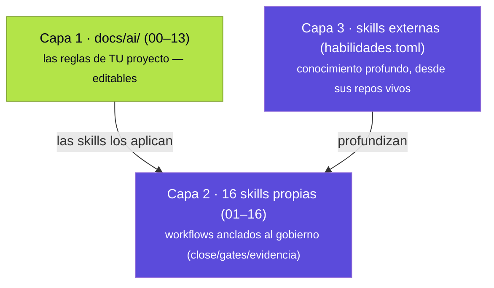

# Skills: administración y catálogo

Las *skills* son workflows en formato `SKILL.md` estándar que los agentes leen para saber **cómo se trabaja en este repo**. Tramalia las organiza en **tres capas** — y ese es también el criterio para decidir dónde vive cada conocimiento:

**Regla de oro**: una skill *propia* existe solo si está **anclada a un comando, gate o evidencia de Tramalia**. El conocimiento profundo (patrones de arquitectura, guías UX exhaustivas, OWASP detallado) viene de **repos externos especializados** que se actualizan solos — Tramalia no congela enciclopedias.

## ¿Y las skills que ya trae mi CLI? (Claude Code, Codex…)

**Tramalia no las toca, ni las lee, ni las analiza.** Son sistemas completamente separados:

- **Skills/plugins nativos del CLI** (p. ej. el marketplace de plugins de Claude Code, o skills que instalaste con `/plugin`) viven en la configuración de *esa herramienta* (`~/.claude/`, etc.) y las administra ella — Tramalia jamás escanea esas carpetas ni sabe qué tienes instalado ahí.
- **Las skills de Tramalia** son un concepto propio: archivos `SKILL.md` versionados **dentro de tu repo**, en `.tramalia/habilidades/`, que cualquier agente lee porque `AGENTS.md` se lo indica — no dependen de qué CLI uses ni de su marketplace.

¿Por qué separados y no integrados? Porque **el gobierno vive en el repo, no en tu máquina** (el principio repo-first de toda la herramienta): si mañana cambias de CLI o de PC, las skills de Tramalia viajan con el `git clone`; una skill instalada solo en el marketplace de tu CLI, no. Ambos sistemas **conviven sin conflicto** — puedes tener plugins nativos de Claude Code *y* las 16 skills de Tramalia a la vez; simplemente no se mezclan ni se sincronizan entre sí.

## Las 16 skills propias, por área

| Área | Skills | Ancladas a |
|---|---|---|
| Specs y planificación | 01-spec-governance | `specs/tasks.md`, horizontes |
| Memoria y contexto | 02-federated-agent-memory · 03-context-token-saver | `.tramalia/context`, Engram |
| Desarrollo | 04-minimalist-engineering · 05-code-quality-review | `docs/ai/02`, gates lint/test |
| Seguridad y ciberseguridad | 06-security-gate · **16-threat-modeling** (STRIDE) | gate `security`, `docs/ai/04` |
| Base de datos | 07-database-engineering | gate `database`, `.sqlfluff` |
| Ejecución y observabilidad | 08-tool-execution-gate · 09-observability-first | mise, gates |
| Evidencia y traspaso | 10-evidence-and-handoff · 13-documentation-handoff | evidence pack, `docs/ai/07` |
| Legacy | 11-legacy-modernization | `docs/ai/01` |
| Revisión multiagente | 12-multi-agent-review | evidence pack, rol `revisor` |
| **Deploy** | **14-deploy-gate** | `docs/ai/12`, `close` como release |
| **Analítica/ML** | **15-analytics-governance** | `metrics.json`/`thresholds.json` |

## Administrarlas: el flujo completo

| Vía | CLI | TUI (`tramalia ui`, pestaña **Skills**) |
|---|---|---|
| **Ver qué hay** | `tramalia skills list` | la tabla agrupa propias y externas con su estado |
| **Instalar una externa** | `tramalia skills enable <n>` + `tramalia skills` | **Enter** sobre ella (la declara y clona de una) |
| **Actualizar una** | `tramalia skills sync <n>` | **Enter** sobre una ya instalada |
| **Actualizar todas** | `tramalia skills` (o `tramalia update`) | tecla **`s`** |
| **Ver cuáles tienen update** | `tramalia skills outdated` | tecla **`u`** (marca `⬆` las atrasadas) |
| **Abrir docs de una** | — | tecla **`d`** (abre su repo) |
| **Agregar por URL** | `tramalia skills add <url> [n]` | pega la URL en el input de arriba |

Los agentes las **descubren solos**: `AGENTS.md` les indica consultar `.tramalia/habilidades/`; con `tramalia sync --features rules,subagents` se propagan las reglas a Cursor/Copilot/Cline. **Agregar una tuya**: crea `.tramalia/habilidades/17-mi-skill/SKILL.md` con frontmatter `name`/`description` + secciones Propósito · Cuándo usar · Workflow · Guardrails · Evidencia esperada.

### Los 3 estados (y qué es una skill "declarada")

- **`✓ instalada @a71792a`** — clonada en `.tramalia/habilidades/<nombre>/`. El `@sha` es la **versión** exacta que tienes (el commit corto).
- **`◍ declarada`** — está **anotada en el manifiesto** `.tramalia/habilidades.toml` (su bloque `[[skill]]` está activo) **pero todavía no se ha clonado a disco**. Es el paso intermedio: la *quieres*, pero falta traerla con `tramalia skills`. Tras un `git clone` del repo, las externas siempre arrancan aquí (el manifiesto viaja, las carpetas no) — un `tramalia skills` las re-hidrata.
- **`○ disponible`** — está en el **catálogo comentado** de `habilidades.toml` (una sugerencia curada), ni siquiera declarada. Actívala y se vuelve declarada.

### Actualizar: instalada vs. disponible

Cada skill externa instalada muestra su **versión instalada** (`@sha`). Para ver si hay una más nueva en su repo, `tramalia skills outdated` (o la tecla **`u`** en la TUI) hace un `git ls-remote` y marca las atrasadas con `instalada → disponible`. Luego actualizas **una** (`tramalia skills sync <nombre>` / Enter sobre ella) o **todas** las del proyecto (`tramalia skills` / tecla `s`). No toca nada más: es un `git pull --ff-only` por skill.

### Las skills externas NO se suben al repo (pero no se pierden)

Las skills externas pueden pesar cientos de MB. `tramalia init` deja en `.gitignore` un bloque que **excluye del repo** las carpetas externas de `.tramalia/habilidades/` pero **conserva las propias** (numeradas `NN-*`). La fuente de verdad es el **manifiesto** `.tramalia/habilidades.toml` (ese sí se versiona): quien clone o descargue el repo solo corre **`tramalia skills`** y se le **re-hidratan** localmente. Así el repo queda liviano y nadie pierde nada.

> **¿Ya las habías commiteado antes de esto?** `.gitignore` no destrackea lo que ya está en git. `tramalia skills` (y `list`/`update`) te **avisa** si detecta skills externas commiteadas y te da el remedio exacto: `git rm -r --cached .tramalia/habilidades/<nombre>` (borra del índice, no del disco; el `.gitignore` evita que se re-agreguen).

## ¿Cuál instalar? (decisión por necesidad)

| Necesitas… | Fuente externa (en `habilidades.toml`) | Complementa |
|---|---|---|
| Guías UX/a11y exhaustivas (100+ reglas) | **vercel-agent-skills** | gate `ux`, `docs/ai/11` |
| TDD y debugging sistemático | **superpowers** | skills 05/08 |
| TypeScript avanzado + preguntas pre-implementación | **mattpocock-skills** (grill-me) | skill 01 |
| Documentos Office/PDF, creativas | **anthropic-skills** (oficial) | uso general |
| Equipo completo: Security OWASP+STRIDE, Release, QA | **gstack** (31 skills) | skills 14 y 16 |
| Craft visual / animación de UI | **impeccable** · **emilkowalski-skills** | gate `ux` |
| Minimalismo con MCP propio | **ponytail** (activa por defecto) | skill 04 |
| Menos tokens de salida | **caveman** (nivel `lite`) | [criterio de eficiencia](interop-memoria.md#el-criterio-cual-montar-y-cual-usar) |

Mismo criterio que las herramientas: **elige por la pregunta que responde**, no instales por acumular — cada skill clonada es contexto que el agente puede leer, y el contexto cuesta tokens.

## Relación con `docs/ai/`

`docs/ai/00–13` son **las reglas** (qué se exige); las skills son **los workflows** (cómo se cumple). Las reglas nacen con contenido semilla **según tu stack** — `init` detecta Angular/.NET/Postgres/SQL Server/notebooks y genera secciones específicas — y son tuyas: edítalas, el `init` idempotente jamás las pisa.
